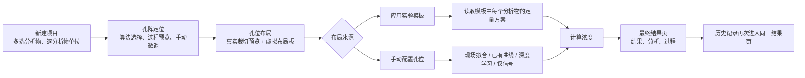

# FluoColor / FluoColorQuant

FluoColor 是一款基于 **Android + Jetpack Compose** 构建的**多模态生化检测应用**，面向 **比色检测、荧光检测、光谱检测** 三类场景，覆盖从图像采集、图像校正、深度学习识别、标准曲线定量、结果可视化到科研级报告归档的**完整端侧分析链路**。

当前用户体验回退与微流控能力保留的最终修改方向见 [用户体验回退与微流控能力保留方案](docs/2026-07-21-ux-rollback-and-microfluidic-retention-plan.md)。后续实现以实际代码、Git 基线和测试结果为准，不以外部 UI 生成记录作为验收依据。

96孔板现代化升级、8×12/12×8方向校正、圆孔版布局交互以及独立孔板结果页的后续实施依据见 [96孔板现代化升级完整计划](docs/superpowers/plans/2026-07-25-plate96-modernization-plan.md)。该计划明确96孔板与微流控只复用科学数据、布局和定量基础能力，结果页面分别实现。

圆孔板结果页、预测精度验证、Bland–Altman 与 CSV/PNG/PDF/ZIP 科研导出的实施依据见 [圆孔板结果、预测验证与科研导出优化计划](docs/superpowers/plans/2026-07-25-plate-result-validation-export-optimization-plan.md)。

PG-Grid 当前 Android 移植的算法等价性、合成金标准结果、真实场景风险和后续修复见 [PG-Grid Android 实现与用户可视化审计](docs/2026-07-22-pg-grid-android-audit.md)。审计后已经补齐七扰动设备语料、关键规则轴修复、帧级质量诊断和九步处理证据，并将用户提供的 6 张 10×10/15×15 实拍图纳入固定设备回归。当前 Android 仍是 Kotlin + OpenCV Java API 实现，不是迁移指南推荐的 C++ 核心 + JNI 架构；网格规格也仍由用户选择，因此不能宣称“完整复现全部内容”。

项目的核心不是给出单一“检测数值”，而是提供一条**可解释、可追溯、可复现**的实验分析流水线：所有计算（目标检测、颜色/光谱特征提取、曲线拟合、寻峰、报告生成）**全部在手机端离线完成**，无需服务器与网络依赖。

> 应用于肿瘤标志物等生化指标的智能定量检测，配套发明专利、软件著作权与 SCI 论文。

---

## 1. 亮点速览

| 维度 | 关键实现 |
| --- | --- |
| **端侧目标检测** | PyTorch Mobile（Lite Interpreter）部署 YOLOv8，**从零自研** letterbox 预处理、原始张量解码、NMS、坐标反投影全套后处理 |
| **精定位** | 96 孔板使用 YOLO + OpenCV 霍夫圆，微流控使用 PG-Grid 透视矫正与晶格平差；两者统一输出形状感知的紧致单元区域 |
| **定量内核** | 基于 Apache Commons Math3 的统一阵列拟合引擎；候选先通过定义域、参数有限性、标定区间单调性和稳定反算检查，再按 R² 降序推荐；Student-t鲁棒拟合、浓度水平留一、端点和复算指标继续用于数学验收与高级验证 |
| **颜色特征** | 根据载体 `siteShape` 使用圆形/方形/自定义前景掩膜，提取 **RGB / HSV / HSL / CIE-XYZ / CIE-Lab** 五套色彩空间统计特征 |
| **光谱算法栈** | OpenCV 轮廓检测自动分离 1~10 路轨道 → 逐列强度投影 → 二次多项式波长标定 → 综合质量评分 → 寻峰（FWHM/峰面积/SNR） |
| **质量诊断** | 光谱成像质量诊断；微流控帧级过曝、欠曝、模糊、光照不均、透视与几何 RMSE 诊断。保守阈值只提示复核，不再隐藏或丢弃已经形成完整晶格的分析结果；自动标定质量评分分为优/可用/待复核三级 |
| **科研级留档** | 原生 PdfDocument 报告 + CSV/PNG 导出 + **可复现 ZIP 归档**（报告+数据+溯源清单+原图+逐孔裁切图）+ Bland–Altman 一致性分析 |
| **工程架构** | Kotlin + Compose + MVVM + Hilt + Room + CameraX + Coroutines/Flow，140+ 源文件，纯离线运行 |
| **多模态重构基础** | Room 18、10×10/15×15 PG-Grid、模态专用光度链、逐位点信号/浓度/区间快照、追加式验证修订与阵列导出继续保留；普通用户流程已恢复为直接新建、自动拟合和直接编辑/删除 |

---

## 2. 三种检测模式

| 模式 | 目标对象 | 主要输入 | 主要输出 | 技术重点 |
| --- | --- | --- | --- | --- |
| **比色检测** | 显色反应的颜色变化 | 孔板或微流控规则阵列终点图 | 浓度、热力图、趋势图、验证分析 | 白平衡、参考校正与多色彩空间特征 |
| **荧光检测** | 荧光信号强度 | 孔板或微流控规则阵列终点图 | 浓度、热力图、趋势图、验证分析 | 暗背景抑制、背景扣除与弱信号质量控制 |
| **光谱检测** | 连续光谱信号 | 宽带光谱图像 | 波长-强度曲线、峰值指标、多视图 | 轨道分离、波长标定、寻峰分析 |

### 2.1 比色检测
- 基于 YOLOv8 孔位识别结果做单孔裁切与浓度分析
- 支持**深度学习模型预测**与**标准曲线拟合**两类定量路径
- 提供热力图、数值图、浓度趋势图、标准曲线与验证分析多视图
- 结果页集中展示实拍缩略图、分析方案、可靠范围与试剂信息

### 2.2 荧光检测
- 与比色模式共用孔位识别链路；传统光度层使用局部背景扣除后的净强度、积分强度、SNR与可配置荧光通道
- 固定 8×12 圆孔板的深度学习链暂时在比色与荧光场景共用 `improved_concentration_model_lite.ptl`，两种模式都保持模型原始的128×128 RGB与ImageNet归一化输入，不在推理前逐孔改写颜色
- 内置模型的训练标签语义按 `0～100%` 解释，并线性映射到分析物冻结的浓度范围；但 PTL 最后一层是无 Sigmoid/Clamp 的线性回归，数学上不保证输出必然落在 `0～100%`
- `grid-deep-learning-quantifier-v4` 只换算声明域内的百分比。小于0或大于100的有限输出按位点冻结为 `OUTPUT_OUT_OF_DECLARED_RANGE`，不会撤销同批其他有效孔；模型文件、校验和、分割或推理基础设施失败仍整批失败。所有离域值都禁止截断到0/100，也不能解释成 `<下限`、`>上限` 或精确浓度
- 内置 PTL 的旧训练和生产输入均为96孔圆形裁切。15×15方形微流控实拍回归的225个输出全部为 `134.74～172.87`，证明该固定语料整体离开模型声明域。产品不再把“未经验证”误作“技术上不可运行”：微流控仍可在查看适用条件并显式确认后实验性试用，真实输出继续接受0～100声明域校验；正式定量优先使用现场标定、已验证标准曲线或载体专用模型
- 分析模型库已接通自训练 `.ptl` 导入：文件复制到应用私有目录，SHA-256自动计算，导入时验证PyTorch Lite格式，发布时按声明的NCHW尺寸和归一化执行零图标量输出试运行；用户还需明确载体、模态、分析物、可靠浓度范围、训练数据版本以及直接浓度/0～100百分比/0～1比例输出语义。通过发布的模型会进入对应项目选择器并完整冻结到运行快照

### 2.3 光谱检测
- 支持 1~10 通道光谱采集、展示与多通道叠加对比
- 支持自动标定与手动标定，附标定质量诊断、标定对照与残差明细
- 提供原始曲线、经典曲线、基线对照、增强分析四种视图
- 支持多峰检测、峰面积、半高宽（FWHM）、信噪比（SNR）等指标
- 支持 CSV / PNG / PDF 导出
- 新生成结果会冻结波长范围、平滑等级、寻峰灵敏度和处理器版本；结果页快速调整仅在当前查看会话生效，不修改全局默认值或历史快照
- Room 15→16 只为光谱结果追加可空快照字段。旧结果不会使用设备当前设置回填，而是明确显示兼容说明并采用固定 Legacy 配置，避免设置变化导致历史曲线漂移
- Room 16→17 为每条光谱结果追加独立的采集光源快照。旧结果保持未知，不从可变的项目字段或当前设置回填；新结果从项目创建时确认的光源冻结，只用于追溯、兼容判断和报告，不参与自动光谱校正

### 2.4 自定义规则阵列

- 直接新建的自定义阵列可显式选择“圆形孔”或“方形单元”；PG-Grid 只根据用户输入的行列数恢复晶格，不负责从图片猜测位点形状
- 所选形状冻结在 `CarrierProfile.siteShape`，决定后续圆形/方形分割和采样掩膜。圆形自定义阵列仍使用 `MICROFLUIDIC_CHIP + PG-Grid`，不会误入仅接受固定 8×12 的 96 孔板路由
- 旧版行为对应默认“方形单元”；`POINT/CUSTOM` 因缺少普通新建页可声明的专用定位协议，仍会在创建边界被拒绝

### 2.5 设置生产契约

- 默认检测方式与默认浓度单位已接入直接新建项目；默认单位同时继续供模板和标准曲线创建使用
- 光谱波长范围、平滑等级和寻峰灵敏度只作为“下一次生成结果”的默认值，并在结果生成时冻结；质量检查开关由拍摄/标定质量门控消费
- 默认自定义阵列行列已按“设置页原子保存 → 新建页首次预填 → 用户可覆盖 → 创建后冻结到 `CarrierProfile`”接通；固定 96 孔板不读取该默认值，后续设置变化不修改已有项目
- 默认光源已按“光谱设置页保存 → 新建光谱项目首次预填并允许确认/覆盖 → 保存到 `Project.lightSource` → 生成结果时冻结到 `SpectrumResult.lightSourceSnapshot`”接通。光源只作为采集元数据用于追溯与报告，不参与波长、平滑、寻峰或强度校正
- 像素提取方式、通用预处理开关和光谱默认/最大通道数仍不作为全局设置公开：像素提取由形状感知掩膜、信号特征和处理器版本共同决定，预处理由各模态版本化管线负责，通道数由分析物映射和页面能力边界决定
- `VisibleSettingProductionContracts` 与 JVM 契约测试要求每个可见设置至少声明一个真实生产消费者；新增设置必须先明确读取者和快照边界
- 光谱波长上下限现在在同一 DataStore 事务内写入；结果生成从单个 `SpectrumProcessingPreferences` 发射一次性读取波长、平滑和寻峰灵敏度，禁止冻结到跨设置版本的混合参数。旧的非法偏好值会在读取边界恢复为稳定默认值
- 光谱设置页的自动寻峰灵敏度使用等宽仪器式三档卡：过滤、均衡和弱峰分别配语义图标及短标签，选中态同时使用描边、底色和单选语义；360dp、深色模式和 1.3 倍字体下均不会再把高灵敏度说明挤成三行按钮

### 2.6 账户、备份与项目文件边界

- 新密码使用随机 16 字节盐和 210000 次 PBKDF2；优先 HMAC-SHA256，旧系统缺少 provider 时显式回退 HMAC-SHA1，摘要同时保存算法、迭代次数、盐和结果。比较使用常量时间，旧明文只在成功登录后升级，失败登录不会改库
- 默认账户也只写版本化摘要。未知 PBKDF2 版本和损坏摘要失败闭合；旧明文密码即使包含冒号仍可认证后迁移
- `allowBackup=false`，API 31+ 云备份、设备迁移以及旧 full-backup 规则均全域排除数据库、偏好、内部文件和应用外部专属文件，科研原图、运行证据和账户摘要不会进入系统备份
- 删除项目时先在 Room 事务内收集项目图、运行目录、过程图、光谱结果/标定裁切和旧孔位裁切引用，再级联删除数据库。事务提交后只清理应用私有 `files/cache/externalFiles/externalCache`；`content://`、公共相册、网络 URI、越界 canonical path、路径穿越和仍被其他项目引用的文件一律保留
- 应用所有分析均在端侧完成，已移除 Retrofit、OkHttp、日志拦截器和 `INTERNET` 权限；Gson 作为本地快照序列化依赖显式保留

### 2.7 目录职责与本轮结构拆分

- `domain` 必须保留，它承载与页面和存储方式无关的科学规则、拟合/定量算法、稳定契约、不可变运行快照及可测试策略；删除该目录只会把业务判断重新散落到 ViewModel、Room 和 Composable 中
- `data` 负责 Room、DataStore、仓库、密码摘要和受限文件清理；`ui` 负责 Compose、ViewModel、导航与 Android 图表渲染；`di` 只负责依赖组装。平台文件、数据库事务和 `Context` 不应下沉为纯领域规则
- 本轮已抽出 `SpectrumSignalProcessor`、`GridDetectionContracts`、`GridDetectionUiContracts`、`GridLayoutDraftStore`、`application/detection/GridConfigurationResourceCoordinator`、`GridDetectionPersistenceAssembler`、`domain/detection/quantification/GridOnsiteCalibrationService`、结果首屏、热力图展示、现场拟合编辑/结果审阅和旧报告图表渲染。新增资源协调器统一处理兼容模板/模型筛选、内置模型首次落库、现场曲线内容去重发布和模板冻结发布，`GridDetectionViewModel` 不再直接拼装这些 Room 外键关系并从约1976行降至约1621行；现场拟合的开始、成功、失败、候选选择、应用和失败恢复已收敛为纯状态转换，过期异步回调不会覆盖新的拟合或编辑。持久化组装器接管 `DetectionRun`、原图/过程附件、载体几何和位点QC汇总的确定性构造；现场标定服务接管标准孔筛选、模态专用信号矩阵、候选拟合、输入指纹和已选曲线冻结，明确保证应用阶段不重新拟合。`GridDetectionCoordinator` 因此从约1820行降至约1452行。`GridQuantitationComponents` 从约2586行降至约1016行，`ArrayResultScreen` 从约1717行降至约1319行，`ExportViewModel` 从约2287行降至约1919行，`SpectrumResultViewModel` 从约1177行降至约814行
- 当前 `domain/detection/GridDetectionCoordinator` 仍同时依赖 Bitmap、仓库和持久化模型，严格说属于应用流程编排而非纯领域对象。为避免本轮全仓搬包破坏 Hilt、测试和历史链路，暂不做高风险迁移；后续应按定位、光度、定量、持久化逐步下沉服务，再将协调器迁到 `application/usecase`
- 本轮从新增职责开始建立 `application/detection` 边界：`GridConfigurationResourceCoordinator` 属于应用流程编排，不再放入纯科学领域目录。现有大协调器仍按低风险原则留在原包；后续迁移只能改变依赖组装，不能改变模板冻结摘要、现场曲线内容指纹、资源缺失失败闭合和历史读取契约
- 生产导航现在只生成 `direct_create_project` 与 `result/{runId}`；`quick_create_project` 和 `new_result/{runId}` 仅作为旧返回栈/深链入站别名，不再维护重复页面或 Screen 类型
- 项目分析方式仍以 `SIGNAL_ONLY`、`TEMPLATE_MANAGED` 等稳定编码持久化，但历史摘要、筛选、项目详情和分析方案统一通过 UI 展示映射读取；当前编码有明确中英文文案，未知未来编码显示“历史分析方式”，不会把机器值泄漏给用户，也不会改写历史数据库

报告本地化同时修复：`ExportViewModel` 注入的是不随 Activity 语言变化的 `ApplicationContext`，此前即使应用界面为中文，传统 PDF、光谱 PDF 和离屏图表仍会按英文系统资源生成。现在导出开始时按 `AppLanguageStore` 的应用语言构造并缓存报告专用 Context，语言切换后自动重建；光源快照 `MERCURY` 等稳定编码继续保留用于追溯，面向用户的报告则映射为当前语言名称。

本轮最终验证：436 项 Debug JVM 测试全部通过。新增3项配置资源契约覆盖模板冻结摘要、损坏载体失败闭合以及模态/协议/规格/分析物兼容筛选；新增1项持久化组装契约覆盖实际配置快照、长期原图优先级、圆孔/方阵几何键隔离、诊断附件同运行归属和损坏QC兼容；新增1项现场拟合状态机契约覆盖迟到成功/失败回调丢弃以及应用失败后恢复同一候选和资源保存选择。现场标定服务拆分后，既有协调器契约继续覆盖多分析物独立曲线、标准水平不足、无参考孔候选降级、输入指纹、项目量程与标定范围隔离以及资源模型ID同步。`compileDebugKotlin`、`compileDebugAndroidTestKotlin`、`assembleDebug` 与 `git diff --check` 均通过，最终 APK 已在 API 35 模拟器覆盖安装并冷启动，`MainActivity` 保持前台且 Crash Buffer 为空。此前 API 35 模拟器 Room 迁移测试 8/8 通过，覆盖 15→16 处理参数快照与 16→17 光源快照且确认旧结果不回填；光谱图表/PDF 设备测试 7/7 通过。ADB 在 360dp 下实际验证“保存 7×11 → 新建自定义阵列预填 7×11”“默认卤素灯 → 新建光谱项目预填 → 项目页覆盖为汞灯 → 再次新建仍保持默认卤素灯”；真实项目 `E2E_Spectrum_20260817` 的中文历史摘要已由 `SIGNAL_ONLY` 修正为“仅信号”，重新导出的 3 页 PDF 包含“光谱分析报告 / 采集光源 / 汞灯”且不含英文标题或 `Mercury Lamp`，逐页渲染未见字符缺失、裁切、重叠和空白页。中文/英文、浅色/深色及 1.3 倍字体页面均无关键控件截断；中英文字符串各 2930 项，ID 和格式化占位符完全一致。

现场标定服务与状态机拆分后重新启动 `Medium_Phone_API_35` AVD 验证：最新 APK 覆盖安装、冷启动和崩溃缓冲检查通过；15×15 实拍图片的“定位—现场拟合—曲线资源发布—模板复用定量—历史恢复”设备用例 1/1 通过，协调器定位、过程证据、损坏快照阻断和比色参考校正设备集成用例 5/5 通过。

深度学习百分比输出边界修复后的最终回归：Debug JVM 测试 441/441 通过，真实 PTL + 15×15 实拍输入设备专项 1/1 通过，确认模型原始输出超过声明的 `0～100%` 时返回 `OUTPUT_OUT_OF_DECLARED_RANGE`，不截断、不生成端点浓度。API 35 模拟器恢复项目 `321` 的历史数据库后，CEA 与 CYFRA21-1 在中英文界面均实际显示“仅信号 / Signal only”和对应信号热力图，不再显示 `>100 ng/ml`；页面明确说明旧运行没有冻结可验证的原始百分比或浓度。中英文字符串各 2932 项，ID 与格式化占位符完全一致；Crash Buffer 为空，`git diff --check` 通过。

微流控荧光无浓度问题继续用真实 PTL 根因复验：15×15 实拍图的225个模型原始输出全部落在 `134.7382～172.8663`，不是结果页漏画，也不是少量离群孔。第一版修复曾把内置模型对微流控完全禁用，后续根据科研试用需求改为“可执行范围”和“已验证范围”分离：固定8×12圆孔板属于已验证范围；微流控配置页仍展示该模型，下拉摘要标记“超范围试用”，选择时通过弹窗确认风险，不再重复显示常驻说明卡。确认后真实执行，逐孔离域值继续冻结且不截断为浓度。自训练模型则通过分析模型库导入、摘要、Lite格式、输入输出契约和发布校验后进入项目选择器。已完成的仅信号运行不会在历史页重新推理或伪造浓度。

本轮最终把上述交互和自训练模型入口落实为可验证闭环：内置共享模型在未验证载体上保持可点击，页面不常驻重复警告，用户选择后才查看固定8×12圆孔板适用条件并显式确认，再进入真实推理；模型选择器及确认流程在 API 35 模拟器专项 `7/7` 通过。分析模型库支持系统文件选择器导入 `.ptl`、应用私有目录持久副本、SHA-256 自动去重、Lite 格式加载、发布前 NCHW RGB/归一化/有限标量输出试运行及输出语义冻结；模型库 Compose 专项 `2/2`、真实 PTL 导入与运行契约设备专项 `2/2` 通过。结果页的模型输出离域卡默认只显示“模型输出范围不匹配”，用户点击后再展开位点计数、声明范围、异常原始输出和处置建议，避免诊断文字挤占热力图首屏；结果页 Compose 专项 `11/11` 通过，并输出折叠态与展开态截图完成 360dp 视觉自审。Debug JVM 回归为 `81` 个套件、`462` 项、`0` 失败；AndroidTest 编译、Debug APK 构建与 `git diff --check` 均通过，中英文字符串各 `2987` 项且 ID 完全一致。

96孔板导出继续以微流控引入前的 `3eb07a9` 报告为信息基线恢复专业内容，但不回退新版冻结快照和质量契约。此前单独 PNG 使用 `HeatmapColorUtil` 的蓝—青—绿—黄—红色带，PDF 又维护了一套蓝—橙—红插值和独立量程判断，导致同一冻结浓度看起来像两份不同结果；现在两者共用同一导出量程解析、单侧界限投影和色带函数。PDF 同时恢复冻结标准曲线、公式参数、R²、标准点与逐孔附录，附录逐行给出孔号、真实裁切图、样本/角色、分析物、浓度或参考值、冻结信号和质量状态。标定范围改为严格从冻结标准点求最小/最大值，不再误用可能被验证流程收窄的模型可靠范围；没有标准点的深度学习模型不伪造标定区间。历史运行缺少原图或裁切边界时明确写“未记录”，不会重新定位或生成替代图片。

本轮 PDF 专项在 API 35 `Medium_Phone_API_35` 模拟器执行 `ArrayResultExportTest 7/7` 通过，覆盖 CSV/PNG/PDF/ZIP 四入口、圆孔/方格、PDF 与 PNG 实际渲染颜色一致、验证页、圆孔正圆比例、方阵非正方形图片原始比例以及96个真实裁切 Bitmap 全部进入 PDF。8×12 测试报告共15页（5页主体 + 10页逐孔附录），使用 PyMuPDF 逐页渲染检查封面、摘要、热力图、冻结曲线、追溯和首/中/末附录页，未发现空白、乱码、裁切或重叠；Debug JVM 回归 `81` 个套件、`462` 项、`0` 失败，`compileDebugAndroidTestKotlin` 与 `assembleDebug` 通过。

2026-08-21 修复逐孔 PDF 附录的裁切图纵向畸变。根因是图片列宽50pt、数据行高60pt，旧实现扣除边距后把任意 Bitmap 强制拉伸进36×46pt矩形，并把圆孔边框也画成同尺寸椭圆。现在每个图片单元先建立居中的正方形显示框，再按原始 Bitmap 宽高比执行 `FIT_CENTER` 缩放；圆形载体使用正圆框，方形载体使用圆角方框，冻结图片、定位边界和定量结果均不改动。设备测试进一步从实际 PDF 渲染页测量目标孔图的像素包围框，要求圆孔宽高差不超过2px，避免以后只验证“存在图片”却再次引入比例回归。

同日完成最低系统版本兼容性收口，并决定继续支持 Android 5.1（API 22），不为三个可局部兼容的平台接口无必要地提高最低版本。阵列 ZIP 改用从 API 1 起可用且同样采用 UTF-8 条目名的单参数 `ZipOutputStream`；共享 PDF 折行在 API 23 以上使用 `StaticLayout.Builder`、API 22 使用相同对齐/行距/留白语义的旧构造；标准曲线重复点编号改用 Kotlin Map 下标读取，不再调用 API 24 的 `Map#getOrDefault`。ZIP 回归增加中文附件名 UTF-8 往返断言。`lintDebug` 从 `4 errors / 974 warnings` 降为 `0 errors / 974 warnings`，没有通过 baseline 或全局 suppress 隐藏问题；Debug JVM `81` 个套件、`462` 项全部通过，阵列 PDF 设备专项 `7/7` 通过，`assembleDebug` 构建成功。

---

## 3. 核心算法详解

> 本节说明项目真正的技术深度，代码依据见每小节末尾。

### 3.1 孔位检测：YOLOv8 端侧推理全链路（自研后处理）

模型 `best_lite.ptl`（YOLOv8）通过 **PyTorch Mobile Lite Interpreter** 加载，整套推理与后处理**不依赖任何检测框架封装**，逐步手写实现：

1. **letterbox 预处理**：等比缩放 + 灰边填充到 1280×1280，记录缩放比与偏移量用于反投影
2. **张量归一化**：`TensorImageUtils.bitmapToFloat32Tensor`（mean=0，std=1/255）
3. **前向推理**：`model.forward(IValue.from(inputTensor))`
4. **原始输出解码**：按 `[center_x, center_y, w, h, confidence, class]` 格式解析张量，置信度阈值 `conf=0.25`
5. **非极大值抑制（NMS）**：自实现 IoU 计算与抑制，`IoU 阈值=0.45`
6. **坐标反投影**：将 1280 空间的检测框映射回原图坐标
7. **精定位**：叠加 OpenCV 霍夫圆变换与透视校正做亚像素级孔位对齐

96孔板现代化链正在按独立领域服务迁移：`Plate96YoloDetector`只产生候选框，
`Plate96CircleRefiner`负责霍夫圆/轮廓圆心，`Plate96OrientationResolver`比较8×12与12×8，
`Plate96GridAssembler`最终固定生成A1～H12的96个圆孔及原图/标准图双坐标。对称圆阵无法单独
证明A1角落，系统会保留用户确认入口，不会把横竖方向判断伪装成A1识别。当前这些新服务和
方向/圆孔设备回归、圆孔定位确认页、圆形孔位布局页和新运行持久化已经接入生产导航。
新96孔板运行不再写入旧 `WellResult`，而是原子保存 `DetectionRun + CaptureArtifact +
SiteMeasurement`，并在 `frameQcJson.plate96Geometry` 中冻结标准8×12方向、正逆坐标矩阵、
96个圆孔中心/半径/边界、定位来源和人工微调标记。定位确认页支持校正图/原图切换、A1方向
确认、孔位联动以及单孔圆心和半径微调；人工
调整会同步重建圆形裁切、前景掩膜和局部背景环，不会重复执行YOLO或霍夫圆。布局页复用
微流控已经稳定的多笔画笔、孔位保护、实验模板和逐分析物定量工作台，只通过视觉策略将
真实裁切和虚拟位点渲染为圆孔；96孔在360dp下完整显示，A10～A12和H12不会换行或截断。
独立96孔板结果页现使用结果、分析、验证、过程四个一级页，分别承载圆形浓度热力图/数值图、
标准曲线与重复孔/行列/边缘统计、预测回归与Bland–Altman，以及原图方向、YOLO、霍夫圆、晶格、
裁切和定量证据。样本浓度表只在孔板分析页出现；PDF会依据载体形状绘制圆孔，微流控
`ArrayResultScreen`仍保持独立。新96孔板检测完成后由结果网关按冻结载体协议进入
`Plate96ResultScreen`；应用重启和历史重开只读取运行快照，不重新定位、裁切、拟合或计算。
旧 `WellResult` 历史现由只读 `LegacyPlateRunAdapter` 映射到同一套圆孔结果体验：适配器固定沿用
旧版本当时的8×12、行优先语义，只读取旧浓度、信号、曲线参数和已有附件，不重新判断图片方向、
定位、裁切、拟合或计算。旧数据没有保存量程方向时保持“方向未知”，不会把单一越界布尔值伪造成
“低于量程”或“高于量程”。新旧96孔板均由结果网关进入独立 `Plate96ResultScreen`，旧历史缺失的
过程证据会如实隐藏并显示轻量兼容说明。

当前设备实拍探针中，一张真实横向8×12圆孔板首轮YOLO形成64个唯一孔位；定位器随后利用
已形成的晶格只在弱位点附近做第二遍局部圆检测。初始统计曾达到95个圆形候选，但实拍叠加
目检发现其中包含孔内反光小圆。最终组装增加“圆心距晶格中心不超过0.20倍孔距、半径为全板
中位半径0.70～1.35倍”的几何复核后，稳定输出96/96位点，其中88个真实圆形精定位、8个
晶格几何兜底。视觉准确性优先于虚高的精定位数量；兜底孔仍使用稳定晶格中心和中位半径，
并在诊断中如实标记。

> 代码：`ui/viewmodels/DetectionViewModel.kt`（`prepareInputBitmap` / `parseRawDetections` / `applyNMS` / `scaleBoxes`）、`ImageCorrectionViewModel.kt`

### 3.2 比色/荧光特征提取：多色彩空间

阵列单元不再统一假设为圆形。载体档案的 `siteShape` 会明确选择圆形、方形、点或自定义前景：96 孔板继续在内缩至孔径 0.9 的圆形掩膜内统计；方形微流控单元使用逐单元 Otsu 分割得到的紧致框；自定义形状可传入真实前景掩膜。当前覆盖五套色彩空间以适配不同显色/荧光反应：

- **RGB**：均值 R/G/B 及 RGB 平均
- **HSV / HSL**：色调、饱和度、明度/亮度
- **CIE-XYZ / CIE-Lab**：通过 OpenCV `cvtColor` 转换后在掩膜内求均值

旧 96 孔板的 `PixelType` 键继续按 Legacy 语义原样保存，保证历史曲线不会因为处理器升级而改变结果；同一孔位 JSON 同时追加 `pixel.v2.*` 稳定编码供新曲线使用。V2 使用 sRGB/D65 标准 Lab 数值、Hue 圆周均值、明确的 Y/Cb/Cr 顺序，并对低饱和度 Hue、低分母通道比率返回无效状态而不是伪造 0。新建旧孔板曲线会冻结信号编码和 `pixel-feature-v2` 处理器版本，保存曲线再次使用时直接执行冻结参数，不重新拟合。

微流控的比色/荧光基础采样已从固定圆形 ROI 升级为“紧致单元前景 + 单元外背景环”：前景只读取真实分割出的方块/圆孔本体，背景仍从独立环带估计，不会因为裁切收紧而失去背景扣除。显示增强图不进入定量。比色模式使用统一参考位白平衡、ΔE2000和相对光密度，禁止逐 ROI 灰世界归一化。旧96孔板深度学习模型当前共用统一输入，不再用临时颜色增强制造模态差异。

> 代码：`domain/detection/segmentation/`、`domain/detection/photometry/PgQuantSampler.kt`、`utils/PixelExtractionUtils.kt`

### 3.3 标准曲线拟合引擎（项目数学内核）

基于 **Apache Commons Math3 3.6.1** 的 `LevenbergMarquardtOptimizer`，实现了一个 ImageJ 级别的曲线拟合引擎，内置**近 20 种**模型，且**为每个非线性模型手工实现 `ParametricUnivariateFunction` 的解析梯度（Jacobian）** 以保证收敛稳定：

- **基础模型**：线性、多项式、指数、幂函数、对数
- **剂量-响应/生长模型**：Rodbard 4PL、Rodbard NIH、5PL Logistic、Hill、Gompertz、General Gompertz、Richards、Gamma-Variate、Custom Log
- **信号模型**：Gaussian、带偏移指数、指数恢复、插值

96孔板、微流控现场标定和标准曲线库现在共用同一候选生成入口。普通“自动推荐”默认比较线性、二次、指数、对数、幂函数、4PL、5PL七种常用函数：所有候选先检查定义域、参数有限性、实验范围单调性和反算能力；线性、4PL、5PL继续使用成熟的多权重与标准点反算验收内核，二次、指数、对数和幂函数使用统一单函数拟合并通过相同的R²与安全门槛。5PL只有在有效浓度水平充足且复杂模型确有收益时才优先，不能仅凭更高参数自由度获选。专家手动模式继续支持全部既有函数，并允许用户多选本次参与比较的函数集合。

普通创建页把“自动推荐”固定在函数下拉首项；专家函数名称按当前语言本地化，候选公式和拟合结果都通过 `jlatexmath-android` 真正排版，不向用户暴露 `\\frac`、`\\cdot` 等 LaTeX 控制符源码。标准曲线图围绕真实标定点自动确定坐标范围，并明确区分标定点与拟合曲线。

2026-07-26 起，现场自动标定使用 V2 安全候选族：线性基线、具备零浓度/物理零点证据时启用的约束 Hill 3PL、约束4PL和对不对称参数收缩的正则化5PL。固定自由度 `ν=4` 的 Student-t 迭代重加权用于降低偶发异常标准孔的影响；完整浓度水平留一、端点反算、标准浓度复算和参数稳定性继续作为数学验收与高级验证证据。通过 Hessian/SVD 稳定性、确定性参数采样、区间宽度和渐近线距离门槛后，标定范围外可输出带95%区间的 `ESTIMATED`；证据不足、严重饱和或只能形成单侧界限时分别保存为 `UNAVAILABLE` 或 `BOUND_ONLY`，浓度最终出口强制非负。

2026-08-18 起，推荐策略 schema 升级到 V3，普通现场标定默认使用 `R_SQUARED_FIRST`：只有定义域、参数、标定区间单调性和反算能力全部成立的候选才进入推荐区，并严格按 R² 从高到低显示“推荐1、推荐2……”；R² 极接近时优先参数更少、稳定性更好的函数。数学上不可执行的函数不会被隐藏，而是保留失败原因并排到末尾。二次、指数、对数、幂函数等标定区间单调函数使用统一有界数值反算；区间内存在转折、信号不可达或定义域错误时失败闭合。普通首屏只显示真实 R²、公式、曲线、标准点数、标定范围和项目量程；标准浓度复算、留一、端点与可信扩展只在有真实值时进入“高级验证”，空指标不渲染。未知样品及其越界数量始终不参与曲线推荐。

#### 多数样品越界的动态量程复核

- 只统计冻结布局中的未知 `SAMPLE`，标准、空白、参考和质控位不进入覆盖率；有效样品至少6个且越界比例达到50%才触发。
- 没有独立质控锚点时只生成批次诊断，保留原浓度和单侧界限；未知样品分布不会反推增益、偏移或把结果强制压入用户区间。
- 至少两个独立正/负质控锚点可使用 Theil-Sen 稳健仿射校正；比例、偏移及质控复算误差全部通过门槛后才应用。校正前后数值、状态、参数和 `range-review-v1` 版本均冻结到运行快照。
- 校正后重新汇总“定量/估计/单侧界限/不可用/项目量程外”计数。仍越过项目硬量程的值降为 `<下限` 或 `>上限`，不保存与项目边界矛盾的伪精确浓度；结果页通过低饱和卡片说明诊断、已应用或已拒绝状态。

> 代码：`utils/math/CalibrationModelSelector.kt`、`FittingEngine.kt`、`FittingResult.kt`、`data/enums/FittingFunctions.kt`

### 3.4 光谱算法栈

从一张宽带光谱图像到可分析的波长-强度曲线与峰值指标，完整算法链如下：

**(1) 轨道分离**
- OpenCV：灰度化 → 对比度增强 → 阈值二值化 → 膨胀 → 轮廓检测，自动分离 1~10 路光谱轨道
- 代码：`utils/math/SpectrumCVUtils.kt`（`detectSpectrumTracks`）

**(2) 强度/颜色剖面提取**
- 逐列投影提取亮度剖面，并生成红/绿/蓝/紫增强剖面
- 平滑 + 归一化到 0~1，避免局部跳变
- 代码：`SpectrumCVUtils.kt`（`extractIntensityProfileByColumns` / `extractColorProfilesByColumns` / `smoothAndNormalizeProfile`）

**(3) 波长标定**
- 自动标定：拟合二次多项式 `λ = a·t² + b·t + c`（t 为归一化纵坐标）
- 质量诊断：计算拟合 RMSE、平均/最大绝对残差、逐参考点残差明细
- **综合标定质量评分（0–100）**：融合峰匹配完整度、RMSE 分级、有效高度覆盖率与回退对齐惩罚，映射为 **优（EXCELLENT）/ 可用（USABLE）/ 待复核（REVIEW）** 三级，并汇总诊断原因
- 代码：`utils/math/SpectrumCalibrationMath.kt`（`evaluatePolynomial` / `calculateFitRmse` / `buildResidualPoints` / `calculateAutoCalibrationQualityScore` / `resolveAutoCalibrationQualityLevel`）

**(4) 寻峰与峰指标**
- 波长升序整理并合并过近点（防止曲线垂直跳变）
- **半高宽（FWHM）**：半高位置左右侧线性插值求交点波长
- **峰面积**：以基线为参考的梯形积分（保证非负）
- **信噪比（SNR）** 等指标计算
- 代码：`utils/math/SpectrumPeakMetrics.kt`、`MetricsCalculator.kt`

**(5) 成像质量门控**
- 采集后即时检测：过曝、欠曝、模糊（方差）、倾斜、通道粘连、背景不均
- 输出评分与决策 **PASS / REVIEW / RETAKE**（仅提示不强制拦截）
- 代码：`utils/math/SpectrumImageQuality.kt`

### 3.5 微流控 PG-Grid 当前 Android 实现边界

当前生产链由 `OpenCvPgGridLocator.kt` 使用 Kotlin 与 OpenCV Android Java API 执行芯片区域检测、候选提取、透视矫正、规则晶格拟合、局部定位、光度采样和帧级 QC。

2026-07-26 已对齐参考工程 [`xiewangzhenyan/pg_grid`](https://github.com/xiewangzhenyan/pg_grid) 主线（`bc9b9ef`）的 V2.1 区域仲裁，详见 [PG-Grid V2.1 区域仲裁上游对齐实施记录](docs/superpowers/plans/2026-07-26-pg-grid-v2-1-region-arbitration-port.md)。核心变化是主区域不再按固定优先级取一条：

- **三条区域路径 + 证据仲裁**：亮面板、微弱基底轮廓（荧光首选）、发光点云三条路径惰性枚举，每个假设各自走完晶格链路，再按 `0.45×包围率 + 0.35×支撑率 + 0.20×观测率 − 晶格残差` 择优；带切换保护（最小分差 `0.08`、最低证据线 `0.55`）与早停（包围率 ≥0.95 且支撑率 ≥0.90）。包围率在**原图**坐标系测量（降采样上限 1600px、按极性跨假设缓存）。
- **闸值按行列数锚定**：斑点几何闸值与轴间距区间换算到“等效 15×15 边长”，15×15 逐值不变，10×10 不再因隐含 `行列数≈15` 的历史公式而候选饥饿、退化为均分网格。
- **极性证据加权**：内部“均值 vs 中位数”提示带强度参与排序；候选路径两极都失败时，投影兜底用“点位 vs 间隙”对比度直接仲裁，避免反极性的规则间隙产生半格错位的自信结果。
- **幻影边缘一票否决**：`detectPhantomLatticeEdge` 用“外伸量 + 边缘行无支撑 + 内侧邻行有支撑 + 两轴间距失配”四条同时成立，识别支撑率/包围率/观测率结构性看不见的整格错位。
- **支撑率三态**：区分 `ok / inconclusive / unavailable`，检测器整体失效时不再把“检查手段缺席”误判为“网格错了”。
- 处理器版本升级为 `2.2.0` 并冻结进运行快照；`GridGeometryDiagnostics` 新增的诊断字段一律可空，历史运行读取到 `null` 表示“无此证据”，不补算、不重新定位。

与参考工程 `docs/android_migration.md` 推荐架构仍有的明确差距：

- **尚未完成 C++/JNI 迁移**：项目中没有 `libpggrid.so`、薄 JNI JSON 边界、CMake/NDK 核心或桌面 C++ parity 阶段；不能把当前 Kotlin 实现描述为迁移手册的 M1/M2 已完成。
- **OpenCV 版本尚未对齐**：Android 当前使用 OpenCV 4.5.3，Python 侧金标准使用 `opencv-python 4.10`，因此 parity 测试使用容差而非逐位相等，仍需依靠 Android 专项回归约束形态学和数值差异。
- **规格仍需用户选择**：直接新建项目时必须选择 10×10 或 15×15；定位器已经自动裁决暗单元/亮单元极性和主区域假设，但尚未并行尝试两种网格规格并自动评分。
- **现有语料尚不能证明本轮收益**：合成语料与七扰动 case 升级前后结果基本不变（这本身说明改动是保行为的），真正的增益场景是荧光基底不可见、自发光点云和区域框截断，尚未纳入 Android 回归。
- **实拍质量采用软提示**：只要定位器已经返回通过结构契约的完整可信晶格，过曝、模糊、光照不均或透视等帧级风险会被持久化并展示给用户复核，不再直接跳转“需要重新拍摄”。图片解码失败、定位异常或坐标契约损坏仍会阻止生成结果。
- **真实回归集已建立**：`app/src/androidTest/assets/pg_grid/real_v1/` 固定保存用户提供的 2 张 10×10 和 4 张 15×15 原始 JPEG；文件字节未改，只将文件名转为 ASCII。六张图片均应自动识别为亮背景上的暗单元，并形成完整可信晶格。
- **紧致单元裁切已移植**：`OpenCvArrayUnitSegmenter` 对齐 Python `pg_unit_export.py` 的 0.45×pitch 局部窗口、极性感知 Otsu、3×3 开运算、连通域选择、两遍中位尺寸/中心偏移校验与中位几何兜底。15×15 主实拍图达到 `225/225` 真实分割、零兜底，中位尺寸 `28×29 px`；10×10 主图为 `94/100` 真实分割、6 个中位盒兜底。输出区域同时供布局预览和 PG-Quant 科学采样使用。
- **圆形/方形共用裁切契约**：旧 96 孔板继续由 YOLO＋霍夫圆负责识别，检测圆外接框适配为圆形前景掩膜；微流控方块由局部分割生成紧致边界。两类裁切统一由 `ArrayUnitBitmapCropper` 处理，孔板裁切图改为 PNG 无损保存，避免 JPEG 块效应污染后续像素特征。

该实现是本轮解决真实用户流程的功能修复，不替代后续独立的 C++/JNI 正式迁移工作包。

---

## 4. 核心业务流程

比色/荧光规则阵列统一使用下列主流程。实验模板保存的是整套实验方案；标准曲线和
深度学习模型是模板中按分析物关联的定量工具，二者不与模板形成二选一关系。



光谱检测保持独立的“轨道识别 → 自动/手动波长标定 → 曲线处理与寻峰 → 光谱结果”链路，
并与阵列结果共用 CSV、PNG、PDF 和科研归档导出能力。

---

## 5. 技术架构

分层遵循 **MVVM + Repository**，依赖注入由 Hilt 统一管理：

```
UI (Jetpack Compose) ── ViewModel (状态/业务) ── Repository ── DAO (Room) ── SQLite
        │                      │
     导航/组件            算法工具 (utils/math, utils)
```

- **UI 层**：Compose 声明式界面，40 个业务页面，配套图表/表格通用组件、主题与导航
- **ViewModel 层**：持有 UI 状态与业务编排（检测、浓度、曲线、光谱、导出等），通过 Coroutines/Flow 做异步与状态流
- **Repository / DAO 层**：Room 持久化，仓库模式隔离数据源
- **utils 层**：`utils/math`（拟合、光谱、指标、标定数学）、`utils`（像素提取、热力图配色、相机、溯源、本地化、动画）
- **DI**：Hilt 提供数据库、DAO、仓库、SessionManager 等单例

---

## 6. 数据模型与持久化

Room 本地数据库当前为 **version 18**，共 **23 个实体 + 16 个 DAO**。版本 9→10、10→11、11→12、12→13、13→14、14→15、15→16、16→17、17→18 均使用显式迁移，禁止用 destructive fallback 掩盖未知 schema。Room 12～17 依次补齐逐位点定量、模板绑定、追加式验证、区间/删失、光谱处理参数和采集光源快照。按本次重新发布决策，17→18 是一次明确的数据代际切换：清退旧项目、运行、逐孔/光谱结果、模板、曲线、模型、载体和采集档案，但保留账户、分析物、试剂以及 DataStore 普通设置；默认载体和采集档案由数据库回调重新幂等播种。该清退是可测试的表级迁移，不是数据库损坏时的无条件整库删除。

首次进入 V2 数据代际时，应用先强制打开 Room 完成17→18，再只清理 `run_inputs`、`processing_evidence`、`wells`、`spectrum_channels` 和 `spectrum_calibrations` 五个应用私有科研目录。模型目录、DataStore、公共相册、导出目录和无关文件不在清单中；任一文件失败时不写完成标记，下次冷启动自动重试。

| 模型分组 | 说明 |
| --- | --- |
| `Project` / `DetectionRun` | 项目与单次运行；新增模板版本、不可变配置快照、实际采集元数据、处理器版本和 QC 快照字段 |
| `CarrierProfile` | 版本化实验载体档案，统一描述孔板、微流控芯片、自定义阵列的行列、位点形状、方向标记、ROI 与定位器配置 |
| `AcquisitionProfile` | 仅作为历史数据兼容结构保留，不再出现在普通设置或项目创建门槛中；真实手机与镜头参数由拍摄链自动记录 |
| `ExperimentTemplate` / `TemplateAnalyteConfig` / `TemplateSiteAssignment` | 模板主档、多分析物配置与通用阵列位点布局；普通界面使用直接保存、编辑和删除，历史项目依靠冻结快照保持不变 |
| `AnalysisModel` | 模态无关的分析模型主档，明确检测模态、输入协议、主特征、处理器版本、兼容载体/设备和可靠范围 |
| `StandardCurveDefinition` / `CalibrationPoint` | 传统标准曲线定义及其原始重复标定点；保留批次、排除标记与排除原因以支持复算 |
| `DeepLearningModelDefinition` | 端侧深度学习模型文件、校验和、输入尺寸、归一化规则与训练数据版本 |
| `CaptureArtifact` | 一次运行中的原始/派生采集附件；当前支持终点图和单图光谱，并为后续暗场、参考和 LSPR 前后配对保留明确角色 |
| `SiteMeasurement` | 统一的逐位点科学测量，分开保存原始信号、校正信号、主特征、背景、SNR、置信度、可靠性与处理器版本 |
| `ResultValidationRecord` | 运行后的预测精度验证修订；保存参考点、回归、Bland–Altman、输入指纹和处理器版本，不回写检测结果 |
| 旧模型 | `WellResult`、`SpectrumCalibration`、`SpectrumResult`、`CurveModel` 等表结构继续保留供代码兼容；V18 迁移会清空其旧科研记录，新发布后的运行统一按完整冻结快照重新开始 |
| 基础资源 | `Analyte`、`Reagent`、`ProjectAnalyteJoin`、`User` |

新增 DAO 包括 `CarrierProfileDao`、`AcquisitionProfileDao`、`AnalysisModelDao`、`CaptureArtifactDao` 和 `SiteMeasurementDao`；`ExperimentTemplateDao` 已支持事务式替换模板的多分析物与位点子项。复杂类型继续通过 `Converters` 或具备明确契约的版本化 JSON 存储。

> 当前进度：普通用户无需模板、采集设备档案或已发布模型即可直接创建 96 孔板、10×10、15×15 和自定义规则阵列项目。创建时在项目内部冻结载体、布局与仅信号/定量配置快照，不向资源表写入一次性档案。没有可执行模型时继续完成定位、信号、热力图、QC、保存和导出，但不伪造浓度。Room 18、PG-Grid、比色/荧光专用光度链、阵列结果、验证修订和科研导出继续保留；V18 之前的旧科研记录按发布决策清退，不再进入新结果页兼容分支。

### 6.1 标准曲线库

普通设置统一使用“标准曲线库”。微流控深度学习量化已经接通真实 PyTorch Lite 执行器；项目配置页只展示模型名称、版本、信号、范围和适用状态，不暴露文件技术细节。需要导入自训练模型的高级用户可在“分析模型库”选择 `.ptl`，SHA-256由应用自动计算，并显式配置输入尺寸、归一化、输出语义和验证范围。旧 `CurveModel` 只保留在历史兼容入口。

- **科学绑定**：每条曲线显式绑定分析物、比色/荧光模式、浓度单位、适用载体、主信号和处理器版本，禁止只凭曲线名称或像素类型模糊匹配
- **输入方式**：手工录入只面向已经拥有实测信号的高级场景；CSV 支持“一列浓度 + 多列候选信号”，自动识别中英文标题，未知列由用户确认映射，重复浓度按重复标准点原样保留
- **信号分流**：比色将经典灰度 `0.299R+0.587G+0.114B` 作为首要推荐信号，并按推荐、扩展、兼容、实验四级管理 RGB、HSV/HSL、CIE-XYZ/Lab、YCbCr、CMYK、通道比值及旧经验信号；荧光默认使用净荧光、积分荧光和 SNR。两种模式共用拟合引擎，但不共用同一条曲线实例
- **函数选择**：默认“自动推荐”比较线性、二次、指数、对数、幂函数、4PL、5PL七种常用函数；高级选择支持多选全部既有专家函数，不再把用户限制为单一函数下拉项
- **紧凑专业界面**：信号选择器仅显示复选框、低饱和度语义图标和短名称，经典灰度保留必要公式；详细定义、处理器版本和适用条件由曲线详情、运行快照及用户手册承担
- **移动端可读性**：中文界面显示“线性、四参数逻辑曲线（4PL）、五参数逻辑曲线（5PL）”等本地化名称；候选公式使用 `jlatexmath-android` 直接渲染为分式、上下标和指数，不显示 LaTeX 源码
- **结果展示**：自动计算参数并展示主题自适应标准曲线、LaTeX 参数公式以及 R²、RMSE、MAE、标准点接受率；ICH M10 风格裁决、权重与复杂度指标继续供内部自动择优和追溯使用，不直接增加普通用户认知负担
- **项目关联**：直接新建项目按分析物、模式、单位、载体、信号、处理器和发布状态筛选；唯一曲线自动选择，多条曲线由用户下拉选择，也可主动切换为仅信号
- **保存规则**：普通用户只执行保存、直接编辑和确认删除；项目创建时冻结函数、参数、标定点和模型元数据，因此资源库后续编辑或删除不会篡改历史结果

### 6.2 多分析物实验模板与虚拟布局

实验模板保留多分析物与虚拟阵列布局能力，但普通流程不再要求采集设备、模型发布态或版本生命周期操作。

- **载体决定几何**：模板只能选择已保存的载体档案，不能临时伪造行列；10×10、15×15 作为推荐芯片规格，4×4 与其他自定义规格位于“更多与旧规格”
- **多模态但不拆散载体**：比色、荧光默认规则位点阵列；光谱仍使用同一载体体系，只切换为光谱轨道、单区域或逐位点光谱读出
- **多分析物配置**：同一芯片可添加多个分析物；定量模型为可选项，未选择时明确保存为仅信号
- **单位与范围**：选择定量模型后才显示；单位读取检测设置中的同一列表，可靠范围实时过滤非法数字
- **阵列编辑器**：位点采用零基持久化与 `R01C01` 中性显示名；支持单点、多选、两点矩形框选、整行、整列、全选、清除和批量角色/分析物/浓度/重复组赋值
- **保存门控**：要求载体、分析物与物理位点布局完整；比色必须声明真实空白位或参考位，荧光可以使用局部背景环
- **普通操作**：新建、编辑、复制、删除；保存后立即可用于项目，历史项目读取创建时冻结的快照

---

## 7. 导出与科研级溯源

### 7.1 标准检测导出
- **CSV**：孔位与浓度结果，头部写入关键追溯信息（模板、曲线模型、像素特征等）
- **PNG**：热力图、趋势图、标准曲线、验证分析（回归 / Bland–Altman）图表
- **PDF**：封面统一复用 `res/layout/pdf_cover_page.xml`，后续内容由原生 `PdfDocument` + `Canvas` 生成；96孔板与规则阵列不再维护两套封面样式
- **ZIP 可复现归档**：一键打包
  - `report/report.pdf`、`report/results.csv`、`report/result_snapshot.png`
  - `manifest/traceability_manifest.json`（溯源清单）
  - `source/*`（原始图像）、`well_crops/*`（逐孔裁切图）

### 7.2 通用阵列快照导出
- **CSV v3**：每条位点测量一行，在保留运行/项目/载体、行列、样本、分析物、角色、信号、浓度、SNR、QC、处理器和冻结模型版本的基础上，增加 `QUANTIFIED / ESTIMATED / BOUND_ONLY / UNAVAILABLE`、浓度上下界、区间置信水平、删失方向和量化器版本；继续明确区分项目量程、曲线标定范围与测量质量，并使用 UTF-8 BOM 与 RFC 4180 转义
- **PNG**：从冻结数据离屏生成1600×1100无损热力图；圆孔板绘制圆孔，微流控绘制圆角方格，不截取手机界面；与 PDF 共用量程解析、单侧界限投影和 `HeatmapColorUtil` 色带，保证同一孔位颜色一致
- **PDF**：第一页使用既有 FluoColorQuant 封面模板，从第二页开始按所选运行的不可变快照生成项目/运行摘要、项目量程与真实标准点标定范围、逐分析物浓度或主特征热力图、冻结标准曲线、有效/建议复核/不可用三级统计和处理追溯；末尾按孔位列出保持原始宽高比的真实裁切图、样本/角色、分析物、结果/参考值、冻结信号和质量状态，存在验证修订时增加回归与Bland–Altman验证页
- **ZIP v3**：固定包含 `manifest.json`、CSV v3、PDF、逐分析物PNG、验证JSON和运行/模板/模型/设备/QC快照；逐文件记录SHA-256，原始或派生附件不可读时在清单中标记 `missing`
- **保存方式**：通过 Android 系统 `CreateDocument` 选择目标位置；ZIP 流式写入，避免在内存中同时保留全部附件与完整归档副本

> 代码：`domain/result/export/ArrayResultExporter.kt`、`ArrayResultPdfExporter.kt`、`ui/screens/result/array/ArrayResultExportSheet.kt`

### 7.3 光谱导出
- **CSV**：波长-强度数据（支持多通道）
- **PNG**：单通道或多通道合并曲线图
- **PDF**：封面 + 摘要页 + 单通道详情页

### 7.4 结果可追溯
- 相机拍摄参数写入图像旁路 JSON 元数据
- 新阵列运行会把真正参与定位与定量的未增强原始 Bitmap 无损保存到 `files/run_inputs/<runId>/endpoint_input.png`，并在终点附件中冻结 SHA-256；九张诊断过程图继续单独保存在 `files/processing_evidence/<runId>/`，不会用定位叠加图冒充原图
- 结果页可回看采集、推理阈值与处理参数摘要
- 每条结果溯源到实验模板 / 曲线模型 / 像素特征 / 模型版本

> 代码：`ui/viewmodels/ExportViewModel.kt`、`utils/ResultTraceabilityUtils.kt`、`utils/camera/CameraCaptureMetadataStore.kt`

---

## 8. 关键页面

- **直接新建项目页**：恢复旧版连续表单的清晰阅读顺序，将检测方式、载体规格、分析设置和图片集中为一张实验工作单；填写项目名称、分析物、浓度单位和图片即可创建，支持 96 孔板、10×10、15×15 和自定义规则阵列；图片入口保留“从相册选择 / 拍照”，相册入口内进一步提供“系统相册 / 文件”，既可使用 Android Photo Picker，也可通过系统 Files 自由浏览文件夹
- **实验模板页**：模板为可选的快速复用工具，保留多分析物和虚拟布局；普通操作为新建、编辑、复制和删除
- **系统设置页**：普通入口保留应用设置、检测设置、光谱设置、分析物、试剂、标准曲线和实验模板；载体库与采集设备档案不再干扰普通用户
- **标准曲线库**：绑定分析物、检测方式、单位、载体和信号；支持 CSV 宽表映射、候选信号比较、自动拟合、直接编辑/删除以及新建项目自动匹配，不允许手工填写参数 JSON
- **科研仪器式极简界面**：页面标题只负责定位，不在首屏重复展示大段说明；章节使用图标和短标题建立层级，方案、载体等长选项使用全宽底部选择面板，说明文字只保留在空状态、校验错误、质量控制和用户主动展开区域
- **相机拍摄页**：CameraX 实时预览，支持固定拍摄参数、双指缩放、点击对焦、采集参数调节与元数据写入；光谱模式拍摄后即时质量检查
- **比色/荧光结果页**：项目概览卡片、实拍缩略图与放大预览、可追溯卡片、分析方案卡片、分段按钮切换多视图、工具栏统一导出入口
- **通用阵列结果页**：收敛为“结果 / 分析 / 过程”三个等宽标签；“结果”逐分析物显示浓度或信号热力图、独立单位/色带和唯一一份样本结果表；“分析”集中展示冻结曲线、LaTeX 公式、拟合指标、重复孔 CV 与回收率，不再重复样本表；“过程”整合本次运行的长期原始输入与九张诊断证据。一级原图页和一级质控页已移除，定位与质量细节仍保留在过程证据、单孔详情、CSV/PDF/ZIP 导出中
- **光谱标定页**：上传标定图与参考波长，自动/手动标定，标定进度总览、质量评分、失败原因提示
- **光谱结果页**：多视图曲线切换、标定对照、残差明细、峰值结果、多通道叠加对比与快速调参
- **历史记录页**：实验留档与回看

---

## 9. 项目结构

```text
app/
├─ src/main/java/com/muc/fluocolorquant
│  ├─ application
│  │  └─ detection        模板/模型/现场曲线编排及运行持久化数据包组装
│  ├─ data
│  │  ├─ model            22 个 Room 实体 + 结果/溯源数据模型
│  │  ├─ dao              15 个 DAO
│  │  ├─ repository       仓库层
│  │  ├─ converters       Room 类型转换器
│  │  ├─ enums            像素类型、拟合函数、载体、输入协议、采集角色等稳定枚举
│  │  └─ migration        可测试、可审查的 Room 显式迁移
│  ├─ di                  Hilt 注入模块
│  ├─ domain              科学规则、冻结契约、定位、光度、拟合、定量与导出策略
│  ├─ ui
│  │  ├─ components        通用 Compose 组件、图表、表格
│  │  ├─ navigation        路由与页面导航
│  │  ├─ screens           40 个业务页面（detection/spectrum/result/settings/resources…）
│  │  ├─ theme             主题、颜色、字体
│  │  └─ viewmodels        MVVM 状态与业务逻辑
│  └─ utils
│     ├─ math             FittingEngine / SpectrumCVUtils / 标定与寻峰数学
│     ├─ camera           CameraEngine 与采集元数据
│     └─ ...              像素提取、热力图配色、溯源、本地化、动画
├─ src/main/assets/models  best_lite.ptl(YOLOv8) / improved_concentration_model_lite.ptl
├─ src/test/java           单元测试
└─ src/androidTest/java    仪表测试
```

---

## 10. 技术栈与版本

| 分类 | 技术 | 版本 |
| --- | --- | --- |
| 语言 | Kotlin | 1.9.22 |
| 构建 | Android Gradle Plugin | 8.7.2 |
| UI | Jetpack Compose (BOM) / Material 3 | 2024.04.01 / 1.2.0 |
| 编译器扩展 | Compose Compiler | 1.5.8 |
| 导航 | Navigation Compose | 2.7.7 |
| DI | Hilt | 2.48 |
| 持久化 | Room | 2.6.1 |
| 配置 | DataStore Preferences | 1.0.0 |
| 相机 | CameraX (core/camera2/lifecycle/view) | 1.3.4 |
| 端侧推理 | PyTorch Mobile Lite | 1.13.1 |
| 计算机视觉 | OpenCV (quickbirdstudios) | 4.5.3.0 |
| 数学计算 | Apache Commons Math3 | 3.6.1 |
| 数学公式排版 | jlatexmath-android | 0.2.0 |
| 图像加载 | Coil | 2.5.0 |
| 图像裁剪 | uCrop | 2.2.10 |
| 权限 | Accompanist Permissions | 0.32.0 |
| EXIF | AndroidX ExifInterface | 1.3.7 |

架构：**MVVM + Repository + Hilt DI**；异步：**Kotlin Coroutines / Flow**；全离线运行。

---

## 11. 模型文件

位于 `app/src/main/assets/models`：

- `best_lite.ptl`：YOLOv8 孔位检测模型（Lite 格式）
- `improved_concentration_model_lite.ptl`：当前固定8×12圆孔板的比色与荧光暂时共用的浓度预测模型（Lite 格式）；使用统一的128×128 RGB与ImageNet归一化输入。该条件是模型已验证范围；微流控或方形自定义阵列只能在明确风险确认后实验性试用

设备测试 `SharedConcentrationModelDeviceTest` 会从 APK assets 中真实提取该 PTL，构造确定性的 128×128 RGB 输入，按生产 mean/std 完成一次 PyTorch Mobile Lite 前向推理，并检查输出非空且全部为有限值；它不是只验证文件名的 JVM 假测试。`AndroidGridDeepLearningExecutorDeviceTest` 进一步使用用户实拍 15×15 芯片图，串联生产 PG-Grid 定位、225 个方块紧致分割、逐孔 RGB/ImageNet 预处理和 SHA-256 校验；固定语料的225个输出全部大于100，测试要求逐孔冻结 `OUTPUT_OUT_OF_DECLARED_RANGE` 且浓度数量为0，作为即使绕过前置载体门控也绝不伪造浓度的最后防线。

Room 15 之前的深度学习历史只保存 `BELOW_RANGE/ABOVE_RANGE` 和模型快照，没有保存逐孔原始模型百分比。由于同一状态既可能来自百分比模型离域，也可能来自旧版范围裁决，结果读取层不会把这些记录恢复为 `<下限` 或 `>上限`；历史页保留信号并明确说明缺少可验证的原始百分比/浓度，也不会打开页面时重新推理。需要浓度时必须从原始输入显式创建一次新分析，并由新版本冻结换算结果。

新微流控链路允许模型为空。缺少模型或模型输出离域时保留原始/校正信号并明确标记“仅信号”，继续提供定位、热力图、QC、保存和导出。内置共享模型在超出8×12圆孔板验证范围时仍可选择，但必须先查看风险并显式确认；该确认只允许真实试运行，不会放松文件摘要、输入契约或输出域校验。用户自训练模型通过“分析模型库 → 新建智能模型 → 选择PTL → 配置输入/输出契约与载体 → 保存草稿 → 发布”进入项目选择器；项目配置页不暴露路径、SHA-256或归一化JSON，只展示可理解的模型摘要和适用状态。

---

## 12. 构建与测试

```powershell
.\gradlew.bat clean assembleDebug
.\gradlew.bat installDebug
.\gradlew.bat test
.\gradlew.bat connectedAndroidTest
.\gradlew.bat lint
```

建议：
- 日常逻辑改动至少执行 `test`
- UI / 权限 / 导出相关改动建议执行 `:app:compileDebugKotlin` 与 `testDebugUnitTest`
- 所有前端页面改动必须在可用虚拟机或真机上通过 ADB 覆盖安装，进入目标页面截图检查首屏、滚动区、动态展开、弹窗和底部操作；发现断行、遮挡、密度失衡或语义图标错误时，应修改后重新截图复验
- 有设备或模拟器时再执行 `connectedAndroidTest`

PG-Grid 金标准可使用以下命令独立复验：

```powershell
python tools/pg_grid/export_v2_1_goldens.py `
  --reference-dir "D:\A-lunwen\8多模态手机方案\pg_grid_remote_check" `
  --output-dir "build\pg-grid-regenerated"

python tools/pg_grid/verify_v2_1_goldens.py `
  --expected-dir "app\src\test\resources\pg_grid\v2_1" `
  --actual-dir "build\pg-grid-regenerated"
```

七扰动族 Android/Python 对照语料可使用以下命令确定性重生成：

```powershell
python tools/pg_grid/export_perturbation_corpus.py `
  --reference-dir "D:\A-lunwen\8多模态手机方案\pg_grid_remote_check" `
  --output-dir "app\src\androidTest\assets\pg_grid\perturbation_v1"
```

首批语料包含 10×10、15×15 两种主规格，以及旋转、透视、模糊、光照梯度、遮挡、
高光、噪声七个中等强度扰动，共 14 个 case。每个 case 同时冻结输入 PNG、原图真值、
Python 定位结果、PG-Quant 结果和摘要指标；设备测试会重新校验输入 SHA-256、固定点数
与顺序、原图 `%pitch` 误差、候选支撑、补位比例、信号 Spearman 和可靠位点比例。

当前回归结果：Python PG-Grid 金标准 `42/42`、Android JVM 完整单元测试、既有 API 35
设备回归、新增七扰动语料 `14/14 case`、6 张用户实拍图回归、处理证据/QC/数据库/UI 专项、算法完整专项和 Debug 构建全部通过；本次实拍相关设备专项合计 `22/22`。10×10 定位
P50/P95 为 `84.09/89.51 ms`、峰值堆增量 `5.82 MB`；15×15 为
`259.12/283.84 ms`、`9.25 MB`，均低于 `1500 ms/160 MB`
门槛。（该组数字为 V2.1 区域仲裁**升级前**的基线，升级后的实测见第 12 节 2026-07-26 条目。）10×10/15×15 的坐标平均误差分别为 `0.00533/0.00127 pitch`，P95 为
`0.03578/0.00234 pitch`；冻结网格上的光度最大绝对差不超过 `0.362` 灰度单位。

2026-07-24 新增固定设备业务闭环 `ReusableQuantitationWorkflowDatabaseTest`，在真实 Room
事务中连续验证“保存并发布现场曲线 → 保存实验模板冻结摘要 → 新项目应用模板 → 使用冻结
参数反算浓度 → 原子保存 DetectionRun → 历史结果重开”。测试明确断言 `y=2x+1` 对信号
`51` 的反算浓度始终为 `25 ng/mL`，历史页面恢复的曲线函数、参数、单位和浓度与本次运行
完全一致。统一推荐器同时移除了跨信号原始 MAE 比较，跨量纲裁决只使用 R²、标准化 RMSE、
浓度反算误差和接受率。

同日新增实拍 15×15 组合闭环 `RealPhotoOnsiteQuantitationWorkflowTest`：同一张用户实拍图从
PG-Grid 定位、225 孔紧致裁切和真实荧光信号开始，完成现场线性拟合、曲线资源发布、实验模板
保存、新项目应用模板、冻结曲线定量、DetectionRun 保存和历史重开。`AndroidGridDeepLearningExecutorDeviceTest`
最初只验证同图 225 孔共享 PTL 能返回有限数值；后续审计确认该 PTL 末层不受0～100约束，现已升级为
真实离域保护回归，要求百分比越界时拒绝整批浓度而不是生成量程边界。四条实拍定位/裁切/现场拟合/PTL 组合回归 `4/4` 通过；共享模型、
旧 96 孔圆形信号、旧布局 UI 和 PDF 封面兼容设备回归共 `6/6` 通过。

同日修复“保存现场曲线并应用后无法开始检测”的冻结关系缺陷。现场曲线写入曲线库会生成新的
模型 ID，旧实现只替换分析模型数据包，没有同步模板分析物配置和运行定量快照中的资源来源，
导致预检将同一分析物判定为模型关系不一致。现在由统一领域函数原子同步配置模型 ID、实际模型、
可靠范围和运行快照来源，并在协调器冻结曲线时增加防御性同步。新增 JVM 回归明确覆盖旧模型 ID
切换到新曲线 ID 的场景；实拍设备闭环再次 `1/1` 通过，全量 JVM 测试、Debug APK、AndroidTest APK
构建及模拟器安装均成功。该修复没有修改首页、历史、关于或其他生产 UI。

2026-07-22 七扰动首轮测试首先发现 4 个整数格错位：10×10 模糊，以及 15×15 的
光照、遮挡和高光。Android 已把固定 K 的加权 k-means 规则轴替换为与 Python 同源的
“轴向聚簇 + 物理规则组合搜索”，并增加背景扣除后的行列投影初值；最终 14 个 case
全部通过。最终最差平均误差为 `0.00693 pitch`，最差 P95 为 `0.01492 pitch`，最低
信号 Spearman 为 `0.8277`，最低可靠位点比例为 `0.8533`。语料目录连续重生成的组合
SHA-256 均为 `F74898F3051C47180DAE801C12DAB40DA8032B0D26437487FA38559560A3E7B5`。

2026-07-20 在 API 35 模拟器完成一次用户界面端到端演示验收：模板新建项目成功进入
微流控 PG-Grid 路由，识别并保存 `100/100` 个位点，阵列结果页显示 `89` 个可靠结果和
`11` 个需关注位点，并可继续查看分析物浓度热力图、处理过程和单点追溯。
应用启动阶段现已统一加载 OpenCV，避免测试环境正常而生产页面首次创建 `Mat` 时崩溃。

同日在 `emulator-5554` 完成快速新建重构的 ADB 验收：完成登录并进入首页后，
已发布 10×10 荧光演示方案正确显示载体、CEA 与 Green 通道摘要，整芯片样本编号映射到
`99` 个样本位；点击“复制调整”会创建独立下一版本草稿并进入模板向导，旧发布版本
继续可用。专项 Room/Compose 仪器测试与完整设备回归均无失败。

2026-07-21 再次以实验员视角完成 ADB 逐页走查：根据后续用户反馈，首页恢复原有 Banner、
分段入场动画和功能说明卡片，新建项目仍进入快速新建主流程，历史入口仍直达真实记录。
快速新建方案摘要改为自动换行，模板向导的模态、试剂、模型、荧光通道和选区工具不再出现
半截选项。分析物库改为全宽底部选择器，10×10/15×15 阵列保留可读单元格并明确提示双向
浏览；历史空状态提供直接新建入口。额外以 360 dp 小屏宽度复验快速新建，按钮与关键字段
均可完整显示；会话失效后的入口也会清除无效首页并返回登录流程。

同日继续优化顶层信息架构：首页、历史、关于统一放入同一个 Compose `HorizontalPager`，
底部导航点击使用平滑滚动，用户也可以直接左右滑动切换，并叠加轻微缩放与透明度过渡。
历史页不再从首页跳转到第二个独立页面，而是直接复用真实 `HistoryViewModel` 数据；搜索、
时间、检测模式、分析方法、分析物筛选和排序能力保持不变，列表取消日期分组并压缩为科研
摘要卡。关于页改为应用图标、品牌摘要、2×2 核心能力和紧凑信息列表，减少说明文字与重复卡片。
该改动已在 `emulator-5554` 完成 ADB 交互复验：底栏点击历史不会创建新页面，历史向左滑动
可进入关于页，底栏选中态同步更新；关于页按系统返回键会平滑回到首页而不是直接退出应用。

关于页的信息列表随后升级为单项手风琴：实验室信息、公开联系邮箱、隐私说明、第三方组件
许可和版本信息均可点击展开，箭头旋转并配合高度与透明度过渡；切换到另一项时自动收起前一项。
页面只公开 `zxgeng@muc.edu.cn`，不展示手机号。版本号从已安装包动态读取；由于当前没有在线
更新服务、正式隐私政策文件或项目级开源许可证，页面会如实说明现状，不再写死“已是最新版”。

同日继续完成科研结果页的信息减负：首页、历史和关于保持不变；旧比色/荧光结果页改为
“项目摘要 → 分析物 → 核心图表 → 验证 → 方案与追溯”，项目、方案和追溯详情默认折叠。
阵列 QC 默认只显示问题名称、严重程度和阈值，排查建议点击展开；帧级阻断信息仍保持常驻。
光谱曲线模式说明与相机高级参数分组说明改由信息按钮打开，自动标定失败建议不再重复显示。
阵列热力图把可靠范围、观测范围或仅信号语义压缩为状态标签，大阵列缩放提示可以主动关闭；
阵列总览说明进一步压缩为“规格、可靠数、关注数、分析物分开显示”的单行状态摘要。

本轮随后在 `emulator-5554` 使用项目自带的 10×10 合成芯片图重新执行完整检测：PG-Grid
成功保存 `100/100` 个位点并进入阵列结果页，首屏统计显示 `89` 个可靠结果。ADB 逐页确认
总览和分析物热力图无重叠、状态标签完整，质量控制建议默认收起且点击后平滑展开，展开内容
可继续滚动，位点详情入口保持独立。相机页同步完成实机预览：高级设置不再重复常驻两段
设备能力说明，默认压缩为单行状态，详细兼容性解释通过信息按钮查看；缩放等参数卡只保留
标题、当前值、支持范围和控件，手势说明统一收进分组信息按钮。首页、历史和关于页面未在
本轮修改。

2026-07-21 根据用户体验回退方案完成普通流程第一轮实现：首页、历史、关于及其 Pager、
底部导航和动画保持不变。首页原新建入口改为直接新建，可在没有模板、采集设备档案和
定量模型时创建项目；96 孔板、10×10、15×15 与自定义规则阵列均会冻结项目专属快照。
实验模板恢复直接编辑/删除，设备与模型不再强制，保存后立即可用。曲线模型新增流程改为
两列标定点、CSV 导入、函数下拉和自动拟合，函数参数只读展示。相机旁路元数据自动记录
手机型号、Camera ID、ISO、曝光、镜头方向、可用焦距/光圈、对焦能力和缩放范围。

2026-07-22 参考 Git 旧版新建项目页重新整理直接创建界面：保留旧版从上到下填写的连续表单
节奏，并将当前微流控规格、仅信号模式和真实比色参考位能力融入统一实验工作单。检测方式改为
三等分选择，常用载体使用 2×2 规格网格，自定义行列和比色参考位仅在需要时展开；检测图片使用
完整比例预览并恢复相册/拍照双入口。创建逻辑、项目快照和结果路由未回退，首页、历史、关于页
及其 Pager、底部导航和动画没有修改。

同日完成微流控处理证据与帧级 QC 工作包：生产协调器会把九张诊断 PNG 与终点原图在同一运行中
持久化，每张证据带 SHA-256、稳定顺序和 `diagnostic_only` 科学用途标记；写图失败不会销毁已经
完成的原始测量。结果页现已收敛为“结果 / 分析 / 过程”三个等宽短标签，并将
`SignalOnlyCompleted`、`microfluidic-10x10` 等机器值映射为“仅信号”“微流控 10×10”等用户文案。
在 `emulator-5554` 使用项目冻结的 10×10 合成图重新完成真实应用内检测，保存 `100/100` 位点与
九张处理证据，逐步打开候选响应和 SNR 热图；截图复验未发现新的重叠、截断或底部遮挡。该图片仍是
确定性合成语料，不替代后续实验室真实芯片验证。

同日将直接新建页的图片导入改为稳定的两级来源选择：第一层继续保持“从相册选择 / 拍照”，点击
相册后显示“系统相册 / 文件”。系统相册使用 `PickVisualMedia(ImageOnly)`，文件使用
`OpenDocument(image/*)` 并进入 Android DocumentsUI，可浏览 Images、Downloads、设备存储与其他
文件提供方；两条导入路径统一进入现有 uCrop 裁剪链。ADB 复验确认系统相册启动 Photo Picker，
文件入口启动系统 Files，并从 Download 成功选择实拍 15×15 图片进入裁剪页。首页、历史、关于及其
Pager、底部导航和动画未修改。

同日使用用户在 `pg_grid_github_realcheck_20260722/examples` 提供的 6 张原始实拍图复核真实兼容性。
历史 15×15 配置把目标极性错误写成 `BRIGHT`，而当前 EL 背光实物实际是亮背景上的暗单元；定位器现会
同时检测暗/亮候选，并根据候选数量、灰度统计提示和晶格是否真正成立自动裁决极性，旧配置只能作为
最终平局偏好。6 张图片全部自动裁决为 `DARK`，候选支撑率为
`0.91 / 0.77 / 1.0 / 1.0 / 1.0 / 0.924444`。在 `emulator-5554` 从系统 Files 的 Download
目录导入真实 15×15 图片完成生产流程，保存 `225/225` 位点并得到 `211` 个可靠结果；帧级质量失败
改为风险提示和质控证据，不再强制重拍或隐藏热力图。首页、历史、关于及其 Pager、底部导航和动画
均未修改。

2026-07-23 完成多分析物统一阵列工作流：直接新建项目可同时选择多个分析物，并为每个
分析物分别冻结浓度单位；微流控检测改为“自动定位确认 → 真实芯片预览与虚拟孔位布局 →
现场自动拟合/定量 → 最终结果”。布局支持样本、标准品、空白、阴/阳性对照、参考位和禁用位，
并可批量填充未配置孔位。现场标准品达到两个不同浓度水平时，后台自动调用现有拟合引擎选择
曲线并冻结标准点、参数和单位；标准不足的分析物继续保留信号，不伪造浓度。同一运行中既有
浓度又有仅信号分析物时，结果状态显示为“部分定量”。

本轮同时修复了布局草稿恢复：孔位配置由 `GridDetectionViewModel` 持有，科学门控失败返回编辑、
页面重建和同规格重新定位均不会清空分析物、角色、标准浓度或样本编号；规格变化时才安全回到
新会话冻结布局。使用 Download 中的真实 15×15 芯片图片完成设备端复验，门控失败后 `225/225`
配置完整恢复；有效布局最终保存 `225` 个测量，CA125 生成 2 点现场线性曲线，CEA 按预期保持
仅信号，结果页显示“部分定量”和 `218` 个质量通过位点。整帧几何风险不再一票否决所有真实
观测点，模型补位仍保持不可靠标记。

结果热力图的大阵列交互也改为显式缩放模式：默认单指上下滑动继续浏览质量摘要、标准曲线和
角色分布；点击右上角缩放按钮后才启用缩放和平移，退出时恢复完整阵列。标准曲线卡使用
`jlatexmath-android` 排版运行冻结公式，并复用项目曲线组件展示真实标定点和拟合曲线。

同日继续完成微流控布局的实拍交互优化。直接新建页现在为每个分析物同时显示最大浓度和
浓度单位，二者分别保存，单位仍使用系统浓度单位下拉列表；输入只接受大于零的有限数值。
定位确认页删除“记录了 N 项保守质量提示”的占位信息。孔位布局从无增强透视矫正图按
PG-Grid 的真实定位中心裁切每个单元，10×10/15×15 阵列均使用 A1、A2……O15 坐标，
与虚拟布局板逐孔对应，不再把整张芯片图片当作“真实孔位预览”。

虚拟布局板在 15×15 及以下完整适配手机宽度，任一维度达到 16 才提供浏览/涂抹模式切换；
画笔会在一次手势结束后批量写入所有经过位点，避免连续重组和逐孔点击。分析物与样本、标准品、
空白、阴/阳性对照、参考、禁用及清除工具改为带主题色的 Compose 矢量卡片。结果页一级质控标签已
移除；质量信息按有效、建议复核、不可用三级进入热力图、单孔详情和科研导出，后台帧级 QC、
九张处理证据和科研导出契约继续保留。

上述界面在 `emulator-5554` 使用 Downloads 中用户实拍 15×15 芯片 `2.jpg` 完成两轮 ADB
复验：225 个真实裁切完整显示，`g/ml` 单位不再截断，一次从 A1 拖到 A15 成功连续标记
`15/225` 个孔位，定位页和最终质控页均未再出现帧级恐吓提示。首页、历史列表、关于页、
Pager、底部导航和动画均未修改。

同日继续修复布局画笔的跨手势状态问题：编辑页每笔只提交经过的位点与当前工具意图，ViewModel
在草稿仓库的最新完整布局上原子合并，连续第二笔、第三笔不会再使用旧 Compose 快照覆盖前一笔。已有孔位默认受保护，
切换分析物或角色后划过已分配孔位只会跳过并提示，必须先使用清除画笔才可重新分配；完全相同
的重复划过保持幂等。快速移动时还会对相邻触点做线段插值，防止 Android 合并触摸事件造成中间
漏格。一级角色工具栏精简为样本、标准品、空白、清除和更多，阴/阳性对照、参考位、禁用位保留
在更多菜单。直接新建页的最大浓度与浓度单位改为等宽、同标签结构和同高控件，消除两列错位。

`emulator-5554` 使用用户实拍 15×15 图片完成最终交互验收：A1～A5 与 B1～B5 两笔绘制后计数
从 `5/225` 累积到 `10/225` 且两行同时保留；切换到第二分析物划过已有位点不会覆盖；清除 A1
后可由第二分析物重新分配。更多角色菜单保留阴性/阳性对照、参考位和禁用。新建页通过 UIAutomator
核对最大浓度与单位两列控件顶部坐标完全一致，底部只差 1px 的边框抗锯齿量。

同日将孔位布局底部的“实验方案与定量方式”重构为单分析物配置工作台。页面不再同时展开
CA125、CEA 等重复卡片，而是通过分析物下拉切换，并使用完成数与线性进度条显示整体状态；
现场拟合、标准曲线、深度学习、仅信号统一为 2×2 短名称选择器。标准曲线和深度学习资源改为
卡内下拉字段，只展示名称、版本、主信号与可靠范围，不再通过二次弹窗或暴露文件技术参数。

标准品浓度也从布局画笔阶段移入现场标定面板：用户可以先自由标记标准孔，再按 A1、A2 等
物理坐标查看真实紧致裁切图并逐孔输入浓度；输入自动绑定当前分析物单位和最大浓度，支持梯度
批量填写、拟合函数下拉、候选信号高级选择、LaTeX 公式、曲线和 R²/RMSE/MAE/接受率复核。
每个分析物必须明确完成配置，修改其孔位、标准浓度、方式或资源后只撤销该分析物的确认；全部
完成后才允许计算结果和保存实验模板。首页、历史列表、关于页及 Pager/底栏仍未修改。

2026-07-24 完成真实 15×15 运行暴露的阵列定量与结果页综合修复。项目声明量程与曲线真实标定
范围分开冻结，现场标准点不再把项目最大浓度从 `100 g/ml` 错误缩小为 `28～34 g/ml`；有限信号
在项目量程内允许按冻结曲线外推，并明确标记曲线标定范围外状态，真正超出项目量程或数值不可执行
时才不生成浓度。拟合候选统一展示结构化失败原因，4PL/5PL 的点数、单调性、反算能力和数值收敛
不再混为“不可用”；R²与“标准点反算通过率”分开解释，低质量候选需要按系统策略复核。

同日将阵列结果页收敛为“结果 / 分析 / 过程”，样本结果表只在结果页显示一次，原图纳入过程页，
一级质控页移除。热力图与单孔详情统一采用 `VALID / REVIEW / UNAVAILABLE` 三级质量语义；普通光度
提示、低信号、曲线外推和项目量程方向保留为独立审计证据，不再改变测量质量等级，也不再统一画成
失败斜纹。只有当前维度没有有限值、`qualityReliable=false` 或严重饱和/裁切时才进入不可用或复核。
CSV 升级为
`array-measurements-csv-v2`，PDF 同步展示双量程与三级统计，并完成四页逐页渲染检查。

浓度热力图进一步将“数值状态”和“质量状态”拆开：颜色始终只表达浓度；曲线标定范围外保留实际
外推浓度并使用左下角低透明度微三角，低于/高于项目量程的位点分别使用项目下限/上限颜色和向下/
向上微三角，详情显示 `<下限` 或 `>上限`，不伪造范围外精确值。15×15 总览隐藏低信号逐格标记，
严重饱和或边界裁切只进入复核证据；只有当前维度确实无法计算时才保留浅灰单元。右上角缩放按钮
首次点击会立即放大到 `1.8×` 并开启拖动/双指缩放，再次点击恢复完整阵列。范围图例压缩为
“曲线外推 / 低于量程 / 高于量程”三列同排展示，完整科学语义继续保留在单孔详情中。

项目 `963` 的真实运行回归进一步固定了这一边界：`225/225` 位点均具有有限信号和可靠测量，定量
分布为 `61` 个曲线范围内、`127` 个曲线外推、`37` 个超出项目量程。旧页面把 `164` 个范围状态和
`25` 个普通光度提示合并成 `189` 个“建议复核”；当前“定量结果概览”改为分别显示上述四类统计，
测量质量复核数为 `0`。CSV/PDF 继续分别保存 `measurement_quality_level` 与
`reliable_range_status`，因此界面减负不会丢失科研审计信息。

新运行同时把实际参与分析的未增强输入保存到 `files/run_inputs/<runId>/endpoint_input.png` 并冻结
SHA-256，过程图继续独立存放。专项 JVM 测试、Android 测试编译以及五类设备测试合计 `18/18`
通过；恢复备份 Room 数据库后，模拟器可从历史页重新打开 225 位点运行，旧 `Completed` 但没有任何
浓度的运行会按真实数据显示为“仅信号”。本轮没有修改首页、历史列表、关于页、Pager 或底栏。

2026-07-25 完成96孔板现代化P7收尾。旧 `DetectionRun + WellResult` 通过只读适配器恢复A1～H12、
旧信号、旧浓度和冻结曲线参数，不写入新的 `SiteMeasurement`，也不使用当前算法补算历史过程。
结果网关会区分现代96孔板、旧96孔板、微流控阵列和其他旧结果；新旧96孔板均进入独立圆孔结果页。
孔位布局中的“复核定位”会回到同一运行的 `Plate96LocalizationScreen`，保留布局、模板来源、逐分析物
定量草稿、现场曲线和标准浓度，用户微调圆心或半径后只重建科学采样，不重复执行YOLO或霍夫圆。
旧 `CurveFitting` 导航、旧布局/拟合页面及其无调用方ViewModel已经删除，新96孔板生产链不会再进入
旧 `WellResult` 写入流程；旧表、DAO和历史读取能力继续保留。全量JVM测试、19项P7定向设备测试和
完整设备套件均通过；完整套件最终执行123项、0失败、10项按设计跳过。全量运行同时修正两项过时的
测试基线：处理证据数量改为跟随稳定角色枚举，窄屏角色工具栏断言改为真实的“清除/更多”短标签。
旧历史过程页完成ADB截图自审，页面只显示真实存在的附件和兼容说明。首页、历史列表、关于页、
Pager、底部导航和微流控独立结果页均未修改。

同日完成96孔板与微流控的统一信号/拟合候选升级。经典灰度
`0.299R+0.587G+0.114B` 固定为比色首要推荐信号；无参考孔时，RGB、灰度、Lab等直接观测
不会再被错误过滤。比色信号按推荐、扩展、兼容、实验四级管理，旧 `PixelType` 编码和历史曲线
继续兼容；现场标定和曲线库默认比较七种常用函数，专家函数仍全部可多选。信号与函数集合会进入
项目、模板及运行快照，最终定量直接使用冻结候选，不重新拟合。现场标定和系统设置中的信号列表
同步改为“复选框 + 低饱和度语义图标 + 短名称”，删除逐项长说明，仅经典灰度保留必要公式。
全量JVM测试共67个套件、338项、0失败、0跳过；中英文字符串资源2698/2698完整配对，最新APK
已覆盖安装到 `emulator-5554`，现场标定与曲线拟合设置弹窗均完成ADB截图自审。首页、历史、关于
页面未修改。

同日完成圆孔板结果、预测验证与科研导出升级。直接新建页的单位字段采用紧凑密度与自适应列宽，
现场标定函数候选改为横向列表并把首屏指标收敛为 R²、RMSE、MAE。独立圆孔板结果页升级为
“结果 / 分析 / 验证 / 过程”，圆孔热力图、行列标签、行列统计和边缘统计全部读取冻结行列，
可正确呈现6×8等自定义圆孔板；标准96孔板继续保持8×12。Room升级到14，预测精度验证使用追加式
修订保存参考浓度、回归和Bland–Altman，历史重开只读取保存结果，不重新预测或拟合。

通用阵列导出面板现统一提供 CSV、PNG、PDF、ZIP 四种带图标入口：PNG由冻结数据离屏生成，PDF在
存在验证时增加独立验证页，ZIP包含逐分析物PNG、验证JSON、冻结快照、附件清单及SHA-256。导出面板
打开时直接完整展开，并对小屏/大字体保留滚动兜底。英文360dp和深色模式ADB自审确认一级标签、
回归坐标轴（X=参考浓度、Y=预测浓度）、图表标题和四种导出入口均完整可读。首页、历史列表、
关于页、主页Pager、底部导航和微流控独立结果页未修改。

同日继续完成96孔板结果体验修复。直接新建页的最大浓度输入框与单位选择器统一为64dp紧凑控件，
消除两列底边错位。孔位布局页把“孔位布局”和“定量方案”拆成独立进度；标准曲线已经配置但仍为
`0/96`孔位时会显示明确原因，并为单分析物项目提供“全部设为样本”的显式快捷操作，Compose按钮和
ViewModel提交共用同一门控规则。样本孔未输入编号时，新运行以A1、A2等物理孔号冻结默认样本编号，
旧历史则在显示层回退为“样本A1”，不再把缺少样本名称误写成“未分配”。

现代96孔板结果会从`frameQcJson.plate96Geometry`读取冻结圆孔边界，优先使用标准方向图、其次原图生成
透明圆形缩略图；旧历史优先读取当时保存的`croppedImageIdentifier`。整图和逐孔缩略图均使用LRU缓存，
列表滚动不会重复解码原图；缺少证据时只显示占位符，禁止重新定位或生成虚拟图片。该真实缩略图已
接入分析样本表、参考浓度录入和单孔详情。参考浓度录入由窄AlertDialog升级为近全屏Material 3底部
面板，逐行显示圆孔图、孔号、样本、预测值、参考值与单位；96孔板结果、分析、验证、过程四页继续按
Stitch原型统一为冷白背景、科研蓝和淡紫蓝分区，微流控独立结果页未修改。

同日根据四张孔板结果原型再次重构独立96孔板结果体验。顶部载体摘要压缩为单行科研信息卡，
结果页保持圆孔热力图、量程图例和三项统计的连续视线；点击孔位后不再弹出遮挡孔板的底部面板，
而是在统计卡下方展开真实圆孔缩略图、孔号、分析物、角色、样本、浓度、信号和范围状态的内联
分析卡，热力图同步用克制描边标出当前孔位。分析页按“标准曲线—R²/RMSE/MAE—重复孔范围与CV—
行/列/边缘分布—可搜索筛选的样本浓度表”重新组织，样本行可直接展开信号和角色，并继续只读取
冻结快照，不在历史页面重新拟合或计算。验证页的追加式参考浓度与Bland–Altman逻辑、过程页的
真实附件证据和微流控独立结果页均未改变。

同日修复96孔板现场5PL曲线“拟合成功但整板无浓度”的定量回归。真实运行数据库显示曲线参数、
逐孔积分荧光信号和兼容关系均完整，但端点量化器把项目量程 `0～100 g/ml` 的下限0纳入严格定义域
检查后，沿用旧规则要求4PL/5PL最小浓度必须严格大于0，最终把数学上有效的正斜率逻辑曲线误判为
`INVALID_MODEL_DEFINITION`。现在4PL/5PL在 `x=0、b>0、c>0` 时允许使用有限渐近值，负浓度和零端点
非正幂仍会被拒绝；量化器版本升级为 `endpoint-quantifier-v3`。回归测试固定本次真实5PL参数，确认
信号 `756000` 可反算为约 `40.5872 g/ml`，并通过协调器批次测试验证范围内孔位正常保存浓度、真正
低于或高于项目量程的孔位仍只保留方向状态。错误历史运行不会在结果页静默重算，新运行使用修复后
冻结快照。

同日继续修复直接项目之间复用现场曲线时的采集档案兼容回归。直接新建项目过去使用
`direct-acquisition-<projectId>` 作为一次性采集会话ID，旧现场曲线却把它错误写成长效设备约束；
用户在同一手机新建下一个96孔板项目后，仅因项目UUID变化就触发
`ACQUISITION_PROFILE_MISMATCH`，96/96孔虽有信号仍整批降级为`SignalOnlyCompleted`。现在直接采集
会话统一按自动元数据协议兼容，新保存的现场曲线不再绑定项目UUID；用户维护的正式设备档案仍按
精确ID严格检查。96孔板结果页也将“信号可用”和“浓度已计算”分开统计，禁止再把信号色带显示为
浓度热力图。历史错误运行保持冻结，不在查看历史时偷偷补算；修复后需从孔位布局重新开始一次分析。

96孔板定位确认页现明确提供“自动融合 / 仅YOLO / YOLO+圆孔”三种算法。默认“自动融合”执行
YOLO候选检测、候选ROI内霍夫圆优先精定位、Otsu轮廓圆兜底、晶格方向裁决和缺孔附近第二轮圆检测；
“仅YOLO”使用检测框中心与估计半径；“YOLO+圆孔”保留YOLO加霍夫圆/轮廓圆精定位但不执行晶格引导
的第二轮缺孔恢复。运行快照会冻结实际模式和处理版本，便于结果过程页及历史记录追溯。

同日重构项目根目录`AGENTS.md`开发协作规范，统一明确Compose/Material 3、字符串资源化、自定义Toast、
冻结快照和测试要求；UI风格固定为专业科研、冷白底色、科研蓝主色、淡紫蓝低饱和分区。新增Icon
语义、尺寸与无障碍约束，并规定使用克制的内容展开、颜色过渡、进度和选择动画，避免装饰性动效干扰
科研数据阅读。后续新页面及页面重构均应同时验证360dp中英文、深色模式、大字体和长单位场景。

2026-07-26 完成标定 V2、可信扩展估计和不可定量分层的首期实现。Room 升级到15，逐孔冻结
`quantificationState`、浓度上下界、区间置信水平、删失方向和量化器版本；96孔板与微流控继续通过
同一 `ArrayCalibrationEngine + StandardCurveQuantifier + GridDetectionCoordinator` 领域链执行，定位、
载体结果页和模态专用光度处理仍保持独立。现场自动拟合并行比较线性、约束3PL、约束4PL和正则化5PL，
使用固定 `ν=4` Student-t 鲁棒目标、按浓度水平留一、端点优先排序、参数协方差和256组确定性参数采样。
可信扩展连续扫描到项目上限最多1.5倍；Hessian病态、样本反算率不足、区间过宽或接近渐近线时自动关闭。

结果页三项统计统一为“定量 / 估计 / 复测”，并保证三者之和等于当前分析物适用且已测位点数；估计值
显示 `≈`，单侧界限显示 `<`/`>`，真正不可用不再占用浓度色带。现场标定结果首屏直接显示“系统推荐的
拟合函数 + 信号特征 + 质量状态 + 反算误差 + 标定范围”，主操作为“应用推荐曲线”，公式、R²、留一误差、
端点误差和可信外推只在“其他曲线”中展示；可信外推未通过门槛时显示“未启用”，不再把内部参数面板作为
用户进入结果阶段后的首屏。CSV升级为v3，ZIP升级为v3，PNG/PDF离屏热力图同步保留 `≈/< />` 标记；端点
量化器升级为 `endpoint-quantifier-v4`。未知样品越界数量不会作为模型推荐KPI，也不会通过截断或伪造浓度
来降低界面中的异常数量。

2026-07-26 完成 PG-Grid V2.1 区域仲裁的上游对齐。参考工程主线自 Android 移植基线以来
`pg_grid.py` 增长 `+1044/−114` 行，`pg_quant.py` 零变更，因此本轮改动全部集中在定位器，
逐位点光度采样链不受影响。主区域由“固定优先级取一条”改为“惰性枚举三条路径 + 图像证据
仲裁”，并补齐闸值按行列数锚定、极性证据加权、支撑率三态与幻影边缘一票否决；同时纠正了
两处相对移植基线就已存在的偏差：主区域两档阈值过去只取第一档（Otsu 档永远不被评估），
以及支撑率缺少 `inconclusive` 三态。定位器处理器版本升级为 `2.2.0`，`detectionModelUsed`
改为跟随实际版本而不再硬编码。

金标准与七扰动语料已用“上游 `pg_grid.py` + 本地增强 `pg_quant.py`”重新导出并独立复现
`6/6` 一致，扰动输入 PNG 字节未变。升级前后同一输入的差异极小：10×10 合成图位点最大位移
`0.082 px`、15×15 为 `0.002 px`、七扰动 14 case 最大 `0.480 px`，极性、可信度与 QC 均不变。
4×4 旧规格出现实质变化——新的按行列数定义的间距区间首次接纳了它的真实间距，晶格 RMSE 由
`13.90` 改善到 `9.91`，但闸值锚定到 15×15 后该规格的大方块单元超出 `max_area`，候选数为 0，
因此如实标记为 `trusted=false` 并给出 `grid_support_low`，而不是沉默背书。

设备侧在 `emulator-5554` 完成定向回归 `16/16` 通过（金标准 parity、七扰动 14 case、6 张实拍图、
帧级 QC、性能门槛、PG-Quant 光度 parity、实拍紧致分割），JVM 单元测试 `385` 项 `0` 失败。
6 张实拍图极性全部自动裁决为 `DARK`，支撑率分别为 `0.87 / 0.75 / 1.0 / 1.0 / 1.0 / 1.0`，
观测率 `0.96～1.0`，全部 `trusted`。实拍紧致分割中 `real_15x15_01～04` 全部达到 `225/225`
真实分割、零兜底；`real_10x10_02` 由旧基线的 85+ 变为 `76`，同版本 Python 参考在同一张图上
同样输出 `76/100`，两端逐值一致，因此按参考实测值重新定基线并在测试中写明原因。
同日补齐**紧裁场景固定回归语料**。此前 6 张实拍语料全部是未裁切原图（芯片占比 11%~43%），
而首页相册与拍照两条导入路径都会经过 uCrop，用户贴着芯片裁切是常规操作，这一场景没有任何
测试覆盖。新增 `tools/pg_grid/export_cropped_real_corpus.py`，沿检测到的芯片边界外扩 4% 裁切
并按长边 1600px 降采样，确定性派生 6 张紧裁图冻结进 `real_v1`（语料由 11M 增至 13M，重复生成
逐字节一致，原有 6 张原图字节未动）。同时新增 `PgGridRealCorpusIntegrityTest` 补齐实拍语料的
SHA-256 校验——此前 manifest 记录了摘要却无人验证。

紧裁后芯片占比升到 `59.8%~83.1%`，Android 实测 6/6 自动裁决为 `DARK`、全部 `trusted`，
支撑率 `0.80~1.00`、观测率 `0.98~1.00`，紧致分割为 `93 / 85 / 225 / 225 / 225 / 225`。
选中的区域路径全部是 `opencv_bright_region_wide`（Otsu 面积无关档），正是旧实现永远走不到的
那一档。紧裁不但没有变差反而普遍更好：`real_10x10_02` 的紧致分割由原图的 `76/100` 提升到
`85/100`，支撑率由 `0.75` 升到 `0.80`。定位、金标准、扰动语料与光度 parity 合计 9/9 通过。

同日复测并优化了 V2.1 区域仲裁引入的定位耗时。多假设仲裁把 10×10 的端侧定位从升级前的
`84 ms` 推高到 `483 ms`、15×15 从 `259 ms` 推高到 `394 ms`——测试门槛是 1500 ms，因此这条
退化没有报警，是复盘性能基线时才发现的。两项**构造上结果等价**的优化：极性候选改为按需
求值（提示显著时排序只看提示，另一极性的六档多阈值检测完全不必执行），以及多阈值提取
共享同一份响应像素缓冲（此前每档阈值都把整幅响应图重新跨 JNI 读一遍）。优化后 10×10 为
`约 370 ms`、15×15 为 `约 330 ms`，定位、金标准、扰动语料、实拍与紧裁回归共 7/7 通过，
输出逐值未变。

剩余差距是 V2.1 设计的真实代价，不再是可无损消除的浪费：15×15 相对旧基线 `+27%`，来自原图
坐标系包围率测量、幻影边缘检查、支撑率三态和弱单元所需的多阈值提取；10×10 相对旧基线仍是
`4.4×`，因为它的候选支撑率 `0.87` 差 `0.03` 没够上短路门限 `0.90`，三个区域假设全部展开。
经核算，即便把短路条件换成"数学上可证明不会被推翻"的形式（首选得分 > `1 − 0.08`），该图得分
`0.9105` 仍然不满足，因此这一步无法在不改变科学行为的前提下省掉。晶格旋转搜索的免分配改写
经实测**不是热点**，wall-clock 落在测量噪声内，仅作为分配量的清理保留。

`AndroidGridDeepLearningExecutorDeviceTest`（225 孔共享 PTL 推理）本轮未跑完：测试进程两次被
系统以 `installPackageLI`/`deletePackageX` 杀死，logcat 显示 APK 在测试期间被并发重装，
需关闭 IDE 自动构建后补跑。首页、历史、关于页、Pager、底部导航和 96 孔板链路均未修改。

同日修复光谱通道数回归并下沉光谱 CSV 导出。`Project` 一直有 `spectrumColumnCount` 与
`spectrumColumnMappingJson` 两个字段，标定页也一直按 `project.spectrumColumnCount` 检测轨道、
按 `spectrumColumnMappingJson` 给每条通道绑定分析物——**断的只有创建这一环**：直接新建从未
写入这两个字段，只能落到默认值 1；模板路径写的是 `if (...) 1 else 1` 的恒等式，同样恒为
单通道。因此无论用户选了几个分析物，标定都只切出一条轨道，逐通道分析物归属全部丢失。

现在两条创建路径都按“光谱通道与分析物一一对应”写入：通道数取所选分析物数量，映射为
`{"1":分析物ID, ...}`（键必须是 1 基通道号字符串，`SpectrumCalibrationViewModel` 按
`analyteMapping[(index + 1).toString()]` 取用）。直接新建页新增光谱通道区块，明确展示
“通道 n ↔ 分析物”的绑定顺序；拍摄页的 `expectedSpectrumTracks` 也不再写死 1。

用户实拍的 9 通道光谱图（1184×864，2025-12-09 采集）已冻结为 `androidTest/assets/spectrum_v1/`
固定语料并带 SHA-256 校验。设备回归 `3/3` 通过：传 1 只切出 1 条、传 9 切出 9 条，9 条轨道
互不重叠且按左右有序，检出位置与 Python 侧独立分析逐条吻合（x=239/320/401/483/564/645/726/
807/889）。只要有人再把通道数写死，该用例立即失败。

光谱导出整体下沉完成。PDF 版式原语（页眉页脚、文本折行、三线表格、缩略图降采样加载、
页面几何常量）收敛为 `domain/export/pdf/PdfPageCanvas`，实现只保留一份；`ExportViewModel`
里的同名私有函数改为薄转发，80 个既有调用点一行未改，把回归面压到最小。光谱报告组页下沉为
`domain/spectrum/export/SpectrumPdfExporter`，文件写入与媒体扫描仍留在 ViewModel。

`ExportViewModel` 由 `3095` 行降到 `2400` 行（−22%），Canvas/PDF 绘制调用由 `229` 降到 `133`。
新增 4 个领域文件共 `1114` 行。摘要表刻意**没有**复用 `PdfPageCanvas.drawTable`：光谱摘要用的是
浅绿表头与更紧凑字号，与孔板报告的灰色三线表是两种版式，强行复用会让其中一方的既有版面
发生可见变化，而本轮目标是移动代码而不是改版。

新增 6 项设备渲染测试，本身即是下沉的收益证明——图表与 PDF 组页现在可以脱离 ViewModel、
Hilt 和整个依赖图直接调用：断言画布尺寸、非空白像素、空数据返回 null 而不是空白图、平坦
光谱不再因除零画不出来、PDF 页数为「封面 + 总览 + 逐通道」且写出的字节以 `%PDF-` 开头。

光谱曲线与合并对比图的绘制下沉为 `domain/spectrum/export/SpectrumChartRenderer`，坐标轴文案
沿用 `ArrayResultPdfLabels` 的约定由 UI 层解析后传入，渲染层不再持有 `Context`。过程中修掉一处
既有缺陷：原实现在 `xMax == xMin`（平坦光谱、单点通道或全零强度）时直接除零，得到 NaN 坐标，
画出的是空白或异常图形且不报错；现在跨度为零时落在轴中线，非有限值单独处理。超出坐标范围的
点**刻意不夹到边界**——画到绘图区外是看得见的异常信号，夹回轴上等于把数据悄悄搬家。
`ExportViewModel` 由 `3095` 行降到 `2827` 行。

光谱 CSV 生成同时下沉为 `domain/spectrum/export/SpectrumCsvExporter`，与 `ArrayResultExporter`
保持同一形态（零 Android 依赖），文件写入与 FileProvider 仍留在 ViewModel。新增 7 项 JVM 测试
覆盖长表结构、缺失值用短横线而非 0、区域无关的数值格式（德语区域会把小数点写成逗号并撑破
列结构）、RFC 4180 转义和非有限值处理——这些决定下游能否复现的约定此前没有任何直接测试。

同日修复 PDF 报告的本地化缺陷：`ExportViewModel` 中有 20 处硬编码中文会流进导出的 PDF
（原始数据附录表头、孔位角色标签、试剂信息、光谱页标题），英文界面导出的报告会大面积夹带
中文并随附件流入论文。全部资源化后该文件已无中文字面量。另清理一条只存在于中文资源、
未被任何代码引用的死字符串 `result_concentration_header`，中英文 ID 恢复完全对等（2829 条，
占位符 0 处不一致）。全量 JVM 测试 408 项 0 失败。

2026-07-27 完成中断工作区的构建与运行核查。生产 Kotlin、全量 Debug JVM 单测、AndroidTest
源码编译、Debug APK 与测试 APK 均可成功构建；APK 已覆盖安装到 API 35 模拟器并正常启动到
登录页，`MainActivity` 保持前台、应用进程存活且崩溃缓冲区为空。完整设备套件执行期间模拟器
进程在 86 项已记录用例后离线，已完成部分为 `0 failure / 0 error / 6 skipped`，因此该次任务失败
属于设备连接中断，不能记作全量设备回归通过。

同日修复现场标定应用后无法进入结果页及错误页返回死锁。模拟器生产数据库中的运行
`16269e6b-93e0-4dfa-841f-80caee939b75` 证明，写入端已经生成
`BELOW_TRUSTED_RANGE / ABOVE_TRUSTED_RANGE`，但冻结快照读取器仍只认识旧范围状态，导致4个合法的
`BOUND_ONLY + BELOW_TRUSTED_RANGE` 位点被误判为证据损坏。读取契约现在接受可信边界外的合法单侧
界限，同时继续禁止其携带伪精确浓度；通用阵列和96孔板的加载、空数据、数据库错误及损坏快照状态
均接入系统返回，并提供可见返回操作，不再把用户锁死在错误页。

该真实运行实际包含84个范围内定量、7个严重饱和后的范围内单侧下限、4个低于可信边界的单侧上限和
1个不可用位点。此前展示层把11个单侧界限都合并成“超出项目量程”，现在统计只读取冻结的
`BELOW_PROJECT_RANGE / ABOVE_PROJECT_RANGE`；可信边界、严重饱和和项目量程分别展示，单孔详情明确显示
“仅报告下限/仅报告上限”。修复后的同一冻结运行已在 `emulator-5554` 正常打开，系统返回可回到首页；
专项快照、热力图测试、全量 Debug JVM 回归、生产及 AndroidTest Kotlin 编译和 Debug APK 构建均通过。

核查同时发现新增 `AnalyteFieldAlignmentTest` 把左侧输入框本体与右侧“标签 + 选择控件”完整字段组
进行跨层级比较，错误得到 `192 px` 与 `274 px` 的高度差。生产页面实际两侧均为“外置标签 + 7dp
间距 + 64dp 控件”，无需修改业务 UI；测试现改为比较两个完整字段组，并补充中文注释固定语义边界。
冷启动模拟器后该定向 Compose 设备测试 `2/2` 通过。

同日修复浓度热力图因项目量程远大于本次样品分布而“几乎全蓝”的显示问题。96孔板与微流控结果页
默认使用“本次分布”色带：有限浓度不少于8个时采用P5～P95抑制单个离群值，少于8个时使用实际
最小值～最大值；用户可在同一卡片切换“项目量程”，继续按固定绝对尺度进行跨实验比较。该切换只
改变颜色归一化，不重新拟合、不截断浓度、不修改数据库或冻结快照。按照用户确认的“项目量程为
硬约束”显示语义，单侧上限孔投影到色带低端，单侧下限孔投影到色带高端；热图模式用方向箭头、
数值模式用 `<` / `>` 明确其不是精确点浓度。投影只存在于绘图模型，冻结的 `concentrationValue`
继续为空，真实浓度界限、删失方向和复测状态不变。

API 35 模拟器使用真实运行 `16269e6b-93e0-4dfa-841f-80caee939b75` 完成复验：本次分布色带为
`8.54～77.2 g/ml`，孔间颜色明显展开；切换项目量程后恢复 `0～200 g/ml`，页面按绝对尺度如预期
重新偏蓝。最终同一运行显示为84个正常着色孔、4个低端蓝色仅上限孔、7个高端红色仅下限孔，
只有1个真正不可用孔保持灰色；数值模式仅显示 `<` / `>`，不再与箭头重复。热力图专项 Compose 测试此前为 `5/5` 通过，
`ArrayHeatmapScaleTest` 已强制绕过缓存重跑通过，全量 Debug JVM 测试和 `assembleDebug` 构建成功。

2026-08-18 完成现场标定与动态量程复核 V3 收尾。标定策略 schema 升级为3，数学可执行候选按 R²
降序冻结，专家函数与兼容信号继续开放；现场标定首屏展示真实曲线、公式、标准点、R²、标定范围和
项目量程，无真实值的复算、留一、端点等指标不再渲染。通用有界反算覆盖标定区间内单调的二次、
指数、对数和幂函数，局部转折、定义域错误和信号不可达均失败闭合。

多数样品越界后会执行 `range-review-v1`：没有独立质控时只诊断，有合格正/负质控时才允许稳健
批次校正。结果页按分析物显示冻结复核卡；校正后重新汇总批次计数，仍超项目量程的点降为单侧界限，
并在逐孔 QC 中同时保存校正前后值。快照读取器校验 schema、算法版本、计数闭合、比例和分析物归属；
损坏的附加诊断只会被忽略，不会让原始运行整体不可读。

Room 升级到18并按发布决策清退 V18 之前的科研记录；首次启动只清理五个明确的应用私有科研目录，
账户、分析物、试剂、普通设置、模型目录、公共相册和导出目录不受影响。最终 Debug JVM 回归为
81个套件、454项、0失败；中英文字符串各2949项，ID与格式化占位符完全一致；
`compileDebugKotlin`、`compileDebugAndroidTestKotlin`、`assembleDebug` 和 `git diff --check` 通过。
API 35 模拟器上的17→18迁移专项 `1/1` 通过；阵列结果 Compose 专项在360dp中文浅色普通字体、
360dp英文深色1.3倍字体及默认配置下各 `10/10` 通过。Debug APK 覆盖安装并冷启动后
`MainActivity` 保持前台，Crash Buffer为空。

2026-08-21 修复多分析物现场标定后的定量回归。真实 15×15 运行表明问题不在深度学习模型：CEA
保存曲线时遗漏 `calibration-v2` 算法 schema 等验证元数据，导致内存拟合可用、发布资源后兼容校验
失败并整批退回仅信号；CYFRA21-1 则被端点量化器错误地用标准点范围 `32～75` 覆盖项目初始化量程
`0～100`，因此大于75或小于32即被误报为项目越界。现在现场曲线的内存应用、曲线库发布和模板冻结
共用同一组版本、指标与内容指纹元数据，保存前后执行语义一致。

项目初始化量程现为最终硬边界，标准点最小值/最大值只用于区分“标准范围内定量”和“项目范围内
外推估计”：例如项目 `0～100`、标准点 `32～75` 时，20和85仍保存浓度并分别标记低端/高端外推，
只有低于0或高于100才报告项目量程外的单侧界限。拟合候选还必须在完整项目量程内有定义、保持有限
且单调可反算；因此项目下限为0时，依赖 `ln(x)` 变换的当前对数/幂函数会在应用前淘汰，二次函数在
`0～100` 内发生回折也不会进入可用候选。系统不会为补齐0点而伪造标准信号，实际没有0浓度标准点的
区段会如实标记为外推。

逐分析物定量方式入口不再因当前没有已发布资源而静默变灰：第二分析物可以进入“标准曲线”或
“深度学习”，下拉框显示无兼容资源，确认按钮在选择当前分析物的真实资源前仍禁用，且继续禁止跨
分析物复用。荧光现场拟合恢复净强度、积分强度、SNR、灰度、R/G/B、平均RGB与L\*/a\*/b\*的默认
比较，R/G、R/B、G/B、HSV、HSL、XYZ和YCbCr等进入扩展组；预览和正式检测统一读取平场校正后的
生产光度处理器，不稳定比率返回不可用而不是伪造为0。标定设置 schema 升至V4，只把仍等于旧默认
三项的安装迁移到新推荐池，用户主动删减过的特征不会被覆盖。

本轮 Debug JVM 测试 `467/467` 通过，`compileDebugAndroidTestKotlin` 与 `assembleDebug` 通过；API 35
模拟器使用真实 15×15 图片完成“定位—现场拟合—资源发布—模板复用定量—历史恢复”设备回归 `1/1`，
225个位点在项目 `0～100` 内保留浓度，标准范围外只标记估计。修复仅作用于新拟合与新运行，历史
冻结结果不会在打开页面时重算。真实运行的 R² 约0.649与0.193仍属于低质量数据，扩展信号可增加找到
更合适特征的机会，但不能替代标准梯度、曝光和重复性质量，低质量确认与警告继续保留。多分析物
配置 Compose 设备专项 `8/8` 通过，覆盖第二分析物无已发布曲线时入口可点击、空资源可见且确认禁用。

---

## 13. 登录与会话行为

- 首页入口在检测到“未知用户”或会话失效时，会先提示重新登录，再跳转登录页
- 退出登录统一在会话清理完成后跳转登录页，避免“先变未知用户再二次退出”的异常流程
- 会话有效性以“能否获取到有效用户实体”为准；若只剩残留 `userId` 但用户记录已失效，系统会自动清理会话并停留在登录页

---

## 14. 当前优化方向

0. 补齐本轮 V2.1 区域仲裁的**收益语料**：现有合成与七扰动语料在升级前后结果基本不变，真正的增益场景（荧光基底不可见、自发光点云、区域框截断）来自参考工程 `examples/fluo/`，需要纳入 Android 回归；同时把本地增强版 `pg_quant.py`（`signal_detectable`、`config` 快照、可靠性 flag 分离）推送到 GitHub，否则该仓库无法独立复现 Android 当前的定量契约
1. 将现有 6 张真实芯片回归集扩展为多手机、多批次、多曝光和旋转/透视/污渍/遮挡条件的实验室金标准，并增加人工标注坐标与颜色定量真值
2. 独立实现网格规格自动识别：并行尝试 10×10/15×15，用晶格支撑率、候选数量吻合度和几何残差裁决，同时保留 UI 手动确认与兜底
3. 按 `android_migration.md` 启动 C++17 + OpenCV C++ + 薄 JNI 正式迁移，先完成桌面 C++ parity，再接 Android；同时升级并锁定两端 OpenCV 版本，禁止 `-ffast-math`
4. 继续量化比色与荧光的专业重复性：比色侧验证白平衡、参考色、ΔE/光密度，荧光侧验证暗场、背景扣除、积分强度和 SNR
5. 训练并验证微流控专用浓度模型后，将其设为该载体的正式推荐模型；当前共享模型只保留带明确风险确认的实验性入口。新模型必须明确训练标签、载体形状、采集条件、输出域和外部验证集。若仍需225孔端侧推理，应优先导出支持动态 batch 的模型、评估量化/NNAPI 或更轻量网络，并在真机建立延迟与内存基准
6. 为 4×4 旧规格只保留后台读取、固定点数和稳定顺序；若未来恢复为主规格，必须重新采集真实数据并单独发布定位/QC 门槛
7. 启动独立工作包 7，完成光谱/LSPR 成对采集、暗场/参考校正、波长位移标定和定量工作流
8. 持续补齐 Room 迁移与 Compose UI 回归，并逐步把旧 `DetectionViewModel`、`ConcentrationViewModel` 和 `ImageCorrectionViewModel` 的异常字符串迁到稳定错误码/`UiText`；内部日志、断言、CSV 协议列名和数值格式不做机械资源化
9. 继续拆分 `GridDetectionViewModel`、`GridDetectionCoordinator` 和旧 PDF 报告组页；迁移时保持运行快照、Room 事务、Hilt 注入和现有设备回归不变，禁止只为目录整齐进行一次性全仓搬包
