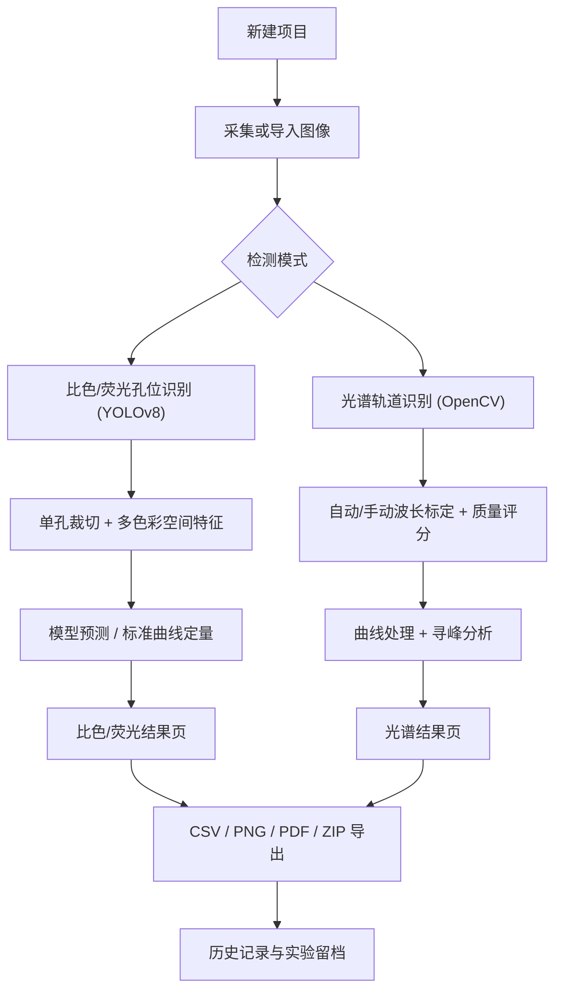

# FluoColor / FluoColorQuant

FluoColor 是一款基于 **Android + Jetpack Compose** 构建的**多模态生化检测应用**，面向 **比色检测、荧光检测、光谱检测** 三类场景，覆盖从图像采集、图像校正、深度学习识别、标准曲线定量、结果可视化到科研级报告归档的**完整端侧分析链路**。

项目的核心不是给出单一“检测数值”，而是提供一条**可解释、可追溯、可复现**的实验分析流水线：所有计算（目标检测、颜色/光谱特征提取、曲线拟合、寻峰、报告生成）**全部在手机端离线完成**，无需服务器与网络依赖。

> 应用于肿瘤标志物等生化指标的智能定量检测，配套发明专利、软件著作权与 SCI 论文。

---

## 1. 亮点速览

| 维度 | 关键实现 |
| --- | --- |
| **端侧目标检测** | PyTorch Mobile（Lite Interpreter）部署 YOLOv8，**从零自研** letterbox 预处理、原始张量解码、NMS、坐标反投影全套后处理 |
| **精定位** | OpenCV 霍夫圆变换 + 透视校正做孔位亚像素级精定位 |
| **定量内核** | 基于 Apache Commons Math3 的 **Levenberg–Marquardt** 拟合引擎，内置**近 20 种**剂量-响应模型，各模型**手工推导解析梯度（Jacobian）**，按 R² 自动优选最佳曲线 |
| **颜色特征** | 圆形 ROI 掩膜下提取 **RGB / HSV / HSL / CIE-XYZ / CIE-Lab** 五套色彩空间统计特征 |
| **光谱算法栈** | OpenCV 轮廓检测自动分离 1~10 路轨道 → 逐列强度投影 → 二次多项式波长标定 → 综合质量评分 → 寻峰（FWHM/峰面积/SNR） |
| **质量门控** | 光谱成像质量诊断（过曝/欠曝/模糊/倾斜/通道粘连）+ 自动标定质量评分（优/可用/待复核三级） |
| **科研级留档** | 原生 PdfDocument 报告 + CSV/PNG 导出 + **可复现 ZIP 归档**（报告+数据+溯源清单+原图+逐孔裁切图）+ Bland–Altman 一致性分析 |
| **工程架构** | Kotlin + Compose + MVVM + Hilt + Room + CameraX + Coroutines/Flow，140+ 源文件，纯离线运行 |

---

## 2. 三种检测模式

| 模式 | 目标对象 | 主要输入 | 主要输出 | 技术重点 |
| --- | --- | --- | --- | --- |
| **比色检测** | 显色反应的颜色变化 | 96 孔板孔位图像 | 浓度、热力图、趋势图、验证分析 | 白平衡与多色彩空间特征 |
| **荧光检测** | 荧光信号强度 | 暗背景孔位图像 | 浓度、热力图、趋势图、验证分析 | 暗背景抑制与弱信号增强 |
| **光谱检测** | 连续光谱信号 | 宽带光谱图像 | 波长-强度曲线、峰值指标、多视图 | 轨道分离、波长标定、寻峰分析 |

### 2.1 比色检测
- 基于 YOLOv8 孔位识别结果做单孔裁切与浓度分析
- 支持**深度学习模型预测**与**标准曲线拟合**两类定量路径
- 提供热力图、数值图、浓度趋势图、标准曲线与验证分析多视图
- 结果页集中展示实拍缩略图、分析方案、可靠范围与试剂信息

### 2.2 荧光检测
- 与比色模式共用孔位识别链路，但在推理预处理与默认特征上做了分流
- 支持暗背景抑制、弱信号增强等模式化预处理
- 优先加载荧光专用浓度模型，缺失时回退通用模型

### 2.3 光谱检测
- 支持 1~10 通道光谱采集、展示与多通道叠加对比
- 支持自动标定与手动标定，附标定质量诊断、标定对照与残差明细
- 提供原始曲线、经典曲线、基线对照、增强分析四种视图
- 支持多峰检测、峰面积、半高宽（FWHM）、信噪比（SNR）等指标
- 支持 CSV / PNG / PDF 导出

---

## 3. 核心算法详解

> 本节说明项目真正的技术深度，代码依据见每小节末尾。

### 3.1 孔位检测：YOLOv8 端侧推理全链路（自研后处理）

模型 `best_lite.ptl`（YOLOv8）通过 **PyTorch Mobile Lite Interpreter** 加载，整套推理与后处理**不依赖任何检测框架封装**，逐步手写实现：

1. **letterbox 预处理**：等比缩放 + 灰边填充到 1280×1280，记录缩放比与偏移量用于反投影
2. **张量归一化**：`TensorImageUtils.bitmapToFloat32Tensor`（mean=0，std=1/255）
3. **前向推理**：`model.forward(IValue.from(inputTensor))`
4. **原始输出解码**：按 `[center_x, center_y, w, h, confidence, class]` 格式解析张量，置信度阈值 `conf=0.25`
5. **非极大值抑制（NMS）**：自实现 IoU 计算与抑制，`IoU 阈值=0.45`
6. **坐标反投影**：将 1280 空间的检测框映射回原图坐标
7. **精定位**：叠加 OpenCV 霍夫圆变换与透视校正做亚像素级孔位对齐

> 代码：`ui/viewmodels/DetectionViewModel.kt`（`prepareInputBitmap` / `parseRawDetections` / `applyNMS` / `scaleBoxes`）、`ImageCorrectionViewModel.kt`

### 3.2 比色/荧光特征提取：多色彩空间

对每个孔位在**圆形 ROI 掩膜**（半径为孔径 0.9）内统计颜色特征，覆盖五套色彩空间以适配不同显色/荧光反应：

- **RGB**：均值 R/G/B 及 RGB 平均
- **HSV / HSL**：色调、饱和度、明度/亮度
- **CIE-XYZ / CIE-Lab**：通过 OpenCV `cvtColor` 转换后在掩膜内求均值

荧光模式在特征提取前叠加暗背景抑制与弱信号增强预处理，实现与比色模式的差异化。

> 代码：`utils/PixelExtractionUtils.kt`（`calculateAverageRgb/Hsv/Hsl/CieXyz/CieLab`、`createCircularMask`）

### 3.3 标准曲线拟合引擎（项目数学内核）

基于 **Apache Commons Math3 3.6.1** 的 `LevenbergMarquardtOptimizer`，实现了一个 ImageJ 级别的曲线拟合引擎，内置**近 20 种**模型，且**为每个非线性模型手工实现 `ParametricUnivariateFunction` 的解析梯度（Jacobian）** 以保证收敛稳定：

- **基础模型**：线性、多项式、指数、幂函数、对数
- **剂量-响应/生长模型**：Rodbard 4PL、Rodbard NIH、5PL Logistic、Hill、Gompertz、General Gompertz、Richards、Gamma-Variate、Custom Log
- **信号模型**：Gaussian、带偏移指数、指数恢复、插值

拟合流程：对适用模型分别拟合 → 计算 R²/RMSE 等拟合优度 → **按 R² 自动优选最佳曲线** → 用逆函数反算样本浓度 → 输出 LaTeX 参数表达式用于展示。

> 代码：`utils/math/FittingEngine.kt`（约 2000 行，18 个 `fit*` 函数）、`FittingResult.kt`、`data/enums/FittingFunctions.kt`

### 3.4 光谱算法栈

从一张宽带光谱图像到可分析的波长-强度曲线与峰值指标，完整算法链如下：

**(1) 轨道分离**
- OpenCV：灰度化 → 对比度增强 → 阈值二值化 → 膨胀 → 轮廓检测，自动分离 1~10 路光谱轨道
- 代码：`utils/math/SpectrumCVUtils.kt`（`detectSpectrumTracks`）

**(2) 强度/颜色剖面提取**
- 逐列投影提取亮度剖面，并生成红/绿/蓝/紫增强剖面
- 平滑 + 归一化到 0~1，避免局部跳变
- 代码：`SpectrumCVUtils.kt`（`extractIntensityProfileByColumns` / `extractColorProfilesByColumns` / `smoothAndNormalizeProfile`）

**(3) 波长标定**
- 自动标定：拟合二次多项式 `λ = a·t² + b·t + c`（t 为归一化纵坐标）
- 质量诊断：计算拟合 RMSE、平均/最大绝对残差、逐参考点残差明细
- **综合标定质量评分（0–100）**：融合峰匹配完整度、RMSE 分级、有效高度覆盖率与回退对齐惩罚，映射为 **优（EXCELLENT）/ 可用（USABLE）/ 待复核（REVIEW）** 三级，并汇总诊断原因
- 代码：`utils/math/SpectrumCalibrationMath.kt`（`evaluatePolynomial` / `calculateFitRmse` / `buildResidualPoints` / `calculateAutoCalibrationQualityScore` / `resolveAutoCalibrationQualityLevel`）

**(4) 寻峰与峰指标**
- 波长升序整理并合并过近点（防止曲线垂直跳变）
- **半高宽（FWHM）**：半高位置左右侧线性插值求交点波长
- **峰面积**：以基线为参考的梯形积分（保证非负）
- **信噪比（SNR）** 等指标计算
- 代码：`utils/math/SpectrumPeakMetrics.kt`、`MetricsCalculator.kt`

**(5) 成像质量门控**
- 采集后即时检测：过曝、欠曝、模糊（方差）、倾斜、通道粘连、背景不均
- 输出评分与决策 **PASS / REVIEW / RETAKE**（仅提示不强制拦截）
- 代码：`utils/math/SpectrumImageQuality.kt`

---

## 4. 核心业务流程



---

## 5. 技术架构

分层遵循 **MVVM + Repository**，依赖注入由 Hilt 统一管理：

```
UI (Jetpack Compose) ── ViewModel (状态/业务) ── Repository ── DAO (Room) ── SQLite
        │                      │
     导航/组件            算法工具 (utils/math, utils)
```

- **UI 层**：Compose 声明式界面，38 个业务页面，配套图表/表格通用组件、主题与导航
- **ViewModel 层**：持有 UI 状态与业务编排（检测、浓度、曲线、光谱、导出等），通过 Coroutines/Flow 做异步与状态流
- **Repository / DAO 层**：Room 持久化，仓库模式隔离数据源
- **utils 层**：`utils/math`（拟合、光谱、指标、标定数学）、`utils`（像素提取、热力图配色、相机、溯源、本地化、动画）
- **DI**：Hilt 提供数据库、DAO、仓库、SessionManager 等单例

---

## 6. 数据模型与持久化

Room 本地数据库，**11 个实体 + 10 个 DAO**，覆盖项目、检测、结果、光谱、曲线模型、模板与用户：

| 实体 | 说明 |
| --- | --- |
| `Project` | 项目（检测模式、分析方法、分析物） |
| `DetectionRun` | 一次检测运行（含推理阈值等参数） |
| `WellResult` | 单孔结果（特征、浓度、置信度） |
| `SpectrumCalibration` | 光谱标定记录 |
| `SpectrumResult` | 光谱结果 |
| `CurveModel` | 标准曲线模型 |
| `ExperimentTemplate` | 实验模板 |
| `Analyte` / `Reagent` / `ProjectAnalyteJoin` / `User` | 分析物、试剂、关联与用户 |

DAO：`ProjectDao`、`DetectionRunDao`、`WellResultDao`、`SpectrumDao`、`CurveModelDao`、`ExperimentTemplateDao`、`AnalyteDao`、`ReagentDao`、`ProjectAnalyteJoinDao`、`UserDao`。复杂类型通过 `Converters` 序列化存储。

---

## 7. 导出与科研级溯源

### 7.1 标准检测导出
- **CSV**：孔位与浓度结果，头部写入关键追溯信息（模板、曲线模型、像素特征等）
- **PNG**：热力图、趋势图、标准曲线、验证分析（回归 / Bland–Altman）图表
- **PDF**：基于原生 `PdfDocument` + `Canvas` 生成的项目报告
- **ZIP 可复现归档**：一键打包
  - `report/report.pdf`、`report/results.csv`、`report/result_snapshot.png`
  - `manifest/traceability_manifest.json`（溯源清单）
  - `source/*`（原始图像）、`well_crops/*`（逐孔裁切图）

### 7.2 光谱导出
- **CSV**：波长-强度数据（支持多通道）
- **PNG**：单通道或多通道合并曲线图
- **PDF**：封面 + 摘要页 + 单通道详情页

### 7.3 结果可追溯
- 相机拍摄参数写入图像旁路 JSON 元数据
- 结果页可回看采集、推理阈值与处理参数摘要
- 每条结果溯源到实验模板 / 曲线模型 / 像素特征 / 模型版本

> 代码：`ui/viewmodels/ExportViewModel.kt`、`utils/ResultTraceabilityUtils.kt`、`utils/camera/CameraCaptureMetadataStore.kt`

---

## 8. 关键页面

- **新建项目页**：配置项目名称、检测模式、分析方法、分析物；光谱模式进入专用采集/标定/结果链路
- **相机拍摄页**：CameraX 实时预览，支持固定拍摄参数、双指缩放、点击对焦、采集参数调节与元数据写入；光谱模式拍摄后即时质量检查
- **比色/荧光结果页**：项目概览卡片、实拍缩略图与放大预览、可追溯卡片、分析方案卡片、分段按钮切换多视图、工具栏统一导出入口
- **光谱标定页**：上传标定图与参考波长，自动/手动标定，标定进度总览、质量评分、失败原因提示
- **光谱结果页**：多视图曲线切换、标定对照、残差明细、峰值结果、多通道叠加对比与快速调参
- **历史记录页**：实验留档与回看

---

## 9. 项目结构

```text
app/
├─ src/main/java/com/muc/fluocolorquant
│  ├─ data
│  │  ├─ model            11 个 Room 实体 + 结果/溯源数据模型
│  │  ├─ dao              10 个 DAO
│  │  ├─ repository       仓库层
│  │  ├─ converters       Room 类型转换器
│  │  └─ enums            像素类型、拟合函数、孔位角色等枚举
│  ├─ di                  Hilt 注入模块
│  ├─ ui
│  │  ├─ components        通用 Compose 组件、图表、表格
│  │  ├─ navigation        路由与页面导航
│  │  ├─ screens           38 个业务页面（detection/spectrum/result/curvefitting…）
│  │  ├─ theme             主题、颜色、字体
│  │  └─ viewmodels        MVVM 状态与业务逻辑
│  └─ utils
│     ├─ math             FittingEngine / SpectrumCVUtils / 标定与寻峰数学
│     ├─ camera           CameraEngine 与采集元数据
│     └─ ...              像素提取、热力图配色、溯源、本地化、动画
├─ src/main/assets/models  best_lite.ptl(YOLOv8) / improved_concentration_model_lite.ptl
├─ src/test/java           单元测试
└─ src/androidTest/java    仪表测试
```

---

## 10. 技术栈与版本

| 分类 | 技术 | 版本 |
| --- | --- | --- |
| 语言 | Kotlin | 1.9.22 |
| 构建 | Android Gradle Plugin | 8.7.2 |
| UI | Jetpack Compose (BOM) / Material 3 | 2024.04.01 / 1.2.0 |
| 编译器扩展 | Compose Compiler | 1.5.8 |
| 导航 | Navigation Compose | 2.7.7 |
| DI | Hilt | 2.48 |
| 持久化 | Room | 2.6.1 |
| 配置 | DataStore Preferences | 1.0.0 |
| 相机 | CameraX (core/camera2/lifecycle/view) | 1.3.4 |
| 端侧推理 | PyTorch Mobile Lite | 1.13.1 |
| 计算机视觉 | OpenCV (quickbirdstudios) | 4.5.3.0 |
| 数学计算 | Apache Commons Math3 | 3.6.1 |
| 图像加载 | Coil | 2.5.0 |
| 图像裁剪 | uCrop | 2.2.10 |
| 权限 | Accompanist Permissions | 0.32.0 |
| EXIF | AndroidX ExifInterface | 1.3.7 |

架构：**MVVM + Repository + Hilt DI**；异步：**Kotlin Coroutines / Flow**；全离线运行。

---

## 11. 模型文件

位于 `app/src/main/assets/models`：

- `best_lite.ptl`：YOLOv8 孔位检测模型（Lite 格式）
- `improved_concentration_model_lite.ptl`：浓度预测模型（Lite 格式）

浓度模型按检测模式路由：荧光/比色优先加载专用模型，缺失时自动回退通用模型。

---

## 12. 构建与测试

```powershell
.\gradlew.bat clean assembleDebug
.\gradlew.bat installDebug
.\gradlew.bat test
.\gradlew.bat connectedAndroidTest
.\gradlew.bat lint
```

建议：
- 日常逻辑改动至少执行 `test`
- UI / 权限 / 导出相关改动建议执行 `:app:compileDebugKotlin` 与 `testDebugUnitTest`
- 有设备或模拟器时再执行 `connectedAndroidTest`

---

## 13. 登录与会话行为

- 首页入口在检测到“未知用户”或会话失效时，会先提示重新登录，再跳转登录页
- 退出登录统一在会话清理完成后跳转登录页，避免“先变未知用户再二次退出”的异常流程
- 会话有效性以“能否获取到有效用户实体”为准；若只剩残留 `userId` 但用户记录已失效，系统会自动清理会话并停留在登录页

---

## 14. 当前优化方向

1. 补齐比色/荧光主链路的单元测试与 UI 测试
2. 进一步拉开比色与荧光的专业处理差异
3. 持续清理遗留技术债与编译警告
4. 加强实验模板、批量处理与历史趋势分析
5. 继续增强科研级留档与复现能力
