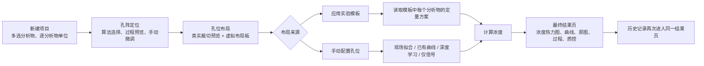

# FluoColor / FluoColorQuant

FluoColor 是一款基于 **Android + Jetpack Compose** 构建的**多模态生化检测应用**，面向 **比色检测、荧光检测、光谱检测** 三类场景，覆盖从图像采集、图像校正、深度学习识别、标准曲线定量、结果可视化到科研级报告归档的**完整端侧分析链路**。

当前用户体验回退与微流控能力保留的最终修改方向见 [用户体验回退与微流控能力保留方案](docs/2026-07-21-ux-rollback-and-microfluidic-retention-plan.md)。后续实现以实际代码、Git 基线和测试结果为准，不以外部 UI 生成记录作为验收依据。

PG-Grid 当前 Android 移植的算法等价性、合成金标准结果、真实场景风险和后续修复见 [PG-Grid Android 实现与用户可视化审计](docs/2026-07-22-pg-grid-android-audit.md)。审计后已经补齐七扰动设备语料、关键规则轴修复、帧级质量诊断和九步处理证据，并将用户提供的 6 张 10×10/15×15 实拍图纳入固定设备回归。当前 Android 仍是 Kotlin + OpenCV Java API 实现，不是迁移指南推荐的 C++ 核心 + JNI 架构；网格规格也仍由用户选择，因此不能宣称“完整复现全部内容”。

项目的核心不是给出单一“检测数值”，而是提供一条**可解释、可追溯、可复现**的实验分析流水线：所有计算（目标检测、颜色/光谱特征提取、曲线拟合、寻峰、报告生成）**全部在手机端离线完成**，无需服务器与网络依赖。

> 应用于肿瘤标志物等生化指标的智能定量检测，配套发明专利、软件著作权与 SCI 论文。

---

## 1. 亮点速览

| 维度 | 关键实现 |
| --- | --- |
| **端侧目标检测** | PyTorch Mobile（Lite Interpreter）部署 YOLOv8，**从零自研** letterbox 预处理、原始张量解码、NMS、坐标反投影全套后处理 |
| **精定位** | 96 孔板使用 YOLO + OpenCV 霍夫圆，微流控使用 PG-Grid 透视矫正与晶格平差；两者统一输出形状感知的紧致单元区域 |
| **定量内核** | 基于 Apache Commons Math3 的拟合引擎；专家模式保留近20种函数，普通自动推荐只比较加权线性、4PL、5PL，并按标准点反算误差、端点接受率、单调性和模型复杂度裁决 |
| **颜色特征** | 根据载体 `siteShape` 使用圆形/方形/自定义前景掩膜，提取 **RGB / HSV / HSL / CIE-XYZ / CIE-Lab** 五套色彩空间统计特征 |
| **光谱算法栈** | OpenCV 轮廓检测自动分离 1~10 路轨道 → 逐列强度投影 → 二次多项式波长标定 → 综合质量评分 → 寻峰（FWHM/峰面积/SNR） |
| **质量诊断** | 光谱成像质量诊断；微流控帧级过曝、欠曝、模糊、光照不均、透视与几何 RMSE 诊断。保守阈值只提示复核，不再隐藏或丢弃已经形成完整晶格的分析结果；自动标定质量评分分为优/可用/待复核三级 |
| **科研级留档** | 原生 PdfDocument 报告 + CSV/PNG 导出 + **可复现 ZIP 归档**（报告+数据+溯源清单+原图+逐孔裁切图）+ Bland–Altman 一致性分析 |
| **工程架构** | Kotlin + Compose + MVVM + Hilt + Room + CameraX + Coroutines/Flow，140+ 源文件，纯离线运行 |
| **多模态重构基础** | Room 12、10×10/15×15 PG-Grid、模态专用光度链、逐位点信号/浓度快照与阵列导出继续保留；普通用户流程已恢复为直接新建、自动拟合和直接编辑/删除 |

---

## 2. 三种检测模式

| 模式 | 目标对象 | 主要输入 | 主要输出 | 技术重点 |
| --- | --- | --- | --- | --- |
| **比色检测** | 显色反应的颜色变化 | 孔板或微流控规则阵列终点图 | 浓度、热力图、趋势图、验证分析 | 白平衡、参考校正与多色彩空间特征 |
| **荧光检测** | 荧光信号强度 | 孔板或微流控规则阵列终点图 | 浓度、热力图、趋势图、验证分析 | 暗背景抑制、背景扣除与弱信号质量控制 |
| **光谱检测** | 连续光谱信号 | 宽带光谱图像 | 波长-强度曲线、峰值指标、多视图 | 轨道分离、波长标定、寻峰分析 |

### 2.1 比色检测
- 基于 YOLOv8 孔位识别结果做单孔裁切与浓度分析
- 支持**深度学习模型预测**与**标准曲线拟合**两类定量路径
- 提供热力图、数值图、浓度趋势图、标准曲线与验证分析多视图
- 结果页集中展示实拍缩略图、分析方案、可靠范围与试剂信息

### 2.2 荧光检测
- 与比色模式共用孔位识别链路；传统光度层使用局部背景扣除后的净强度、积分强度、SNR与可配置荧光通道
- 旧96孔板深度学习链暂时与比色共用 `improved_concentration_model_lite.ptl`，两种模式都保持模型原始的128×128 RGB与ImageNet归一化输入，不在推理前逐孔改写颜色
- 后续用户上传并通过兼容校验的专用模型可分别绑定比色、荧光场景

### 2.3 光谱检测
- 支持 1~10 通道光谱采集、展示与多通道叠加对比
- 支持自动标定与手动标定，附标定质量诊断、标定对照与残差明细
- 提供原始曲线、经典曲线、基线对照、增强分析四种视图
- 支持多峰检测、峰面积、半高宽（FWHM）、信噪比（SNR）等指标
- 支持 CSV / PNG / PDF 导出

---

## 3. 核心算法详解

> 本节说明项目真正的技术深度，代码依据见每小节末尾。

### 3.1 孔位检测：YOLOv8 端侧推理全链路（自研后处理）

模型 `best_lite.ptl`（YOLOv8）通过 **PyTorch Mobile Lite Interpreter** 加载，整套推理与后处理**不依赖任何检测框架封装**，逐步手写实现：

1. **letterbox 预处理**：等比缩放 + 灰边填充到 1280×1280，记录缩放比与偏移量用于反投影
2. **张量归一化**：`TensorImageUtils.bitmapToFloat32Tensor`（mean=0，std=1/255）
3. **前向推理**：`model.forward(IValue.from(inputTensor))`
4. **原始输出解码**：按 `[center_x, center_y, w, h, confidence, class]` 格式解析张量，置信度阈值 `conf=0.25`
5. **非极大值抑制（NMS）**：自实现 IoU 计算与抑制，`IoU 阈值=0.45`
6. **坐标反投影**：将 1280 空间的检测框映射回原图坐标
7. **精定位**：叠加 OpenCV 霍夫圆变换与透视校正做亚像素级孔位对齐

> 代码：`ui/viewmodels/DetectionViewModel.kt`（`prepareInputBitmap` / `parseRawDetections` / `applyNMS` / `scaleBoxes`）、`ImageCorrectionViewModel.kt`

### 3.2 比色/荧光特征提取：多色彩空间

阵列单元不再统一假设为圆形。载体档案的 `siteShape` 会明确选择圆形、方形、点或自定义前景：96 孔板继续在内缩至孔径 0.9 的圆形掩膜内统计；方形微流控单元使用逐单元 Otsu 分割得到的紧致框；自定义形状可传入真实前景掩膜。当前覆盖五套色彩空间以适配不同显色/荧光反应：

- **RGB**：均值 R/G/B 及 RGB 平均
- **HSV / HSL**：色调、饱和度、明度/亮度
- **CIE-XYZ / CIE-Lab**：通过 OpenCV `cvtColor` 转换后在掩膜内求均值

微流控的比色/荧光基础采样已从固定圆形 ROI 升级为“紧致单元前景 + 单元外背景环”：前景只读取真实分割出的方块/圆孔本体，背景仍从独立环带估计，不会因为裁切收紧而失去背景扣除。显示增强图不进入定量。比色模式使用统一参考位白平衡、ΔE2000和相对光密度，禁止逐 ROI 灰世界归一化。旧96孔板深度学习模型当前共用统一输入，不再用临时颜色增强制造模态差异。

> 代码：`domain/detection/segmentation/`、`domain/detection/photometry/PgQuantSampler.kt`、`utils/PixelExtractionUtils.kt`

### 3.3 标准曲线拟合引擎（项目数学内核）

基于 **Apache Commons Math3 3.6.1** 的 `LevenbergMarquardtOptimizer`，实现了一个 ImageJ 级别的曲线拟合引擎，内置**近 20 种**模型，且**为每个非线性模型手工实现 `ParametricUnivariateFunction` 的解析梯度（Jacobian）** 以保证收敛稳定：

- **基础模型**：线性、多项式、指数、幂函数、对数
- **剂量-响应/生长模型**：Rodbard 4PL、Rodbard NIH、5PL Logistic、Hill、Gompertz、General Gompertz、Richards、Gamma-Variate、Custom Log
- **信号模型**：Gaussian、带偏移指数、指数恢复、插值

专家手动模式继续支持全部函数；普通“自动推荐”采用收敛的有限模型选择：比较无权重、响应倒数、响应平方倒数及重复标准点逆方差权重下的线性、4PL、5PL → 检查参数稳定性与实验范围单调性 → 解析反算每个标准点浓度 → 按端点/内部点允许偏差、有效浓度水平、反算 RMSE 和复杂度选择最简单的合格模型。5PL 只有在不对称参数明确偏离1、同权重额外平方和检验显著且反算误差实际下降时才优先于4PL；R²仅作为展示和专家结果的次级指标。

普通创建页把“自动推荐”固定在函数下拉首项；专家函数名称按当前语言本地化，候选公式和拟合结果都通过 `jlatexmath-android` 真正排版，不向用户暴露 `\\frac`、`\\cdot` 等 LaTeX 控制符源码。标准曲线图围绕真实标定点自动确定坐标范围，并明确区分标定点与拟合曲线。

> 代码：`utils/math/CalibrationModelSelector.kt`、`FittingEngine.kt`、`FittingResult.kt`、`data/enums/FittingFunctions.kt`

### 3.4 光谱算法栈

从一张宽带光谱图像到可分析的波长-强度曲线与峰值指标，完整算法链如下：

**(1) 轨道分离**
- OpenCV：灰度化 → 对比度增强 → 阈值二值化 → 膨胀 → 轮廓检测，自动分离 1~10 路光谱轨道
- 代码：`utils/math/SpectrumCVUtils.kt`（`detectSpectrumTracks`）

**(2) 强度/颜色剖面提取**
- 逐列投影提取亮度剖面，并生成红/绿/蓝/紫增强剖面
- 平滑 + 归一化到 0~1，避免局部跳变
- 代码：`SpectrumCVUtils.kt`（`extractIntensityProfileByColumns` / `extractColorProfilesByColumns` / `smoothAndNormalizeProfile`）

**(3) 波长标定**
- 自动标定：拟合二次多项式 `λ = a·t² + b·t + c`（t 为归一化纵坐标）
- 质量诊断：计算拟合 RMSE、平均/最大绝对残差、逐参考点残差明细
- **综合标定质量评分（0–100）**：融合峰匹配完整度、RMSE 分级、有效高度覆盖率与回退对齐惩罚，映射为 **优（EXCELLENT）/ 可用（USABLE）/ 待复核（REVIEW）** 三级，并汇总诊断原因
- 代码：`utils/math/SpectrumCalibrationMath.kt`（`evaluatePolynomial` / `calculateFitRmse` / `buildResidualPoints` / `calculateAutoCalibrationQualityScore` / `resolveAutoCalibrationQualityLevel`）

**(4) 寻峰与峰指标**
- 波长升序整理并合并过近点（防止曲线垂直跳变）
- **半高宽（FWHM）**：半高位置左右侧线性插值求交点波长
- **峰面积**：以基线为参考的梯形积分（保证非负）
- **信噪比（SNR）** 等指标计算
- 代码：`utils/math/SpectrumPeakMetrics.kt`、`MetricsCalculator.kt`

**(5) 成像质量门控**
- 采集后即时检测：过曝、欠曝、模糊（方差）、倾斜、通道粘连、背景不均
- 输出评分与决策 **PASS / REVIEW / RETAKE**（仅提示不强制拦截）
- 代码：`utils/math/SpectrumImageQuality.kt`

### 3.5 微流控 PG-Grid 当前 Android 实现边界

当前生产链由 `OpenCvPgGridLocator.kt` 使用 Kotlin 与 OpenCV Android Java API 执行芯片区域检测、候选提取、透视矫正、规则晶格拟合、局部定位、光度采样和帧级 QC。它已经具备可运行的 10×10/15×15 端侧主链，但与参考工程 `docs/android_migration.md` 的推荐架构仍有明确差距：

- **尚未完成 C++/JNI 迁移**：项目中没有 `libpggrid.so`、薄 JNI JSON 边界、CMake/NDK 核心或桌面 C++ parity 阶段；不能把当前 Kotlin 实现描述为迁移手册的 M1/M2 已完成。
- **OpenCV 版本尚未对齐**：Android 当前使用 OpenCV 4.5.3，未升级到迁移手册建议的 4.9+，因此仍需依靠 Android 专项回归约束形态学和数值差异。
- **规格仍需用户选择**：直接新建项目时必须选择 10×10 或 15×15；定位器已经自动裁决暗单元/亮单元极性，但尚未并行尝试两种网格规格并自动评分。
- **实拍质量采用软提示**：只要定位器已经返回通过结构契约的完整可信晶格，过曝、模糊、光照不均或透视等帧级风险会被持久化并展示给用户复核，不再直接跳转“需要重新拍摄”。图片解码失败、定位异常或坐标契约损坏仍会阻止生成结果。
- **真实回归集已建立**：`app/src/androidTest/assets/pg_grid/real_v1/` 固定保存用户提供的 2 张 10×10 和 4 张 15×15 原始 JPEG；文件字节未改，只将文件名转为 ASCII。六张图片均应自动识别为亮背景上的暗单元，并形成完整可信晶格。
- **紧致单元裁切已移植**：`OpenCvArrayUnitSegmenter` 对齐 Python `pg_unit_export.py` 的 0.45×pitch 局部窗口、极性感知 Otsu、3×3 开运算、连通域选择、两遍中位尺寸/中心偏移校验与中位几何兜底。15×15 主实拍图达到 `225/225` 真实分割、零兜底，中位尺寸 `28×29 px`；10×10 主图为 `94/100` 真实分割、6 个中位盒兜底。输出区域同时供布局预览和 PG-Quant 科学采样使用。
- **圆形/方形共用裁切契约**：旧 96 孔板继续由 YOLO＋霍夫圆负责识别，检测圆外接框适配为圆形前景掩膜；微流控方块由局部分割生成紧致边界。两类裁切统一由 `ArrayUnitBitmapCropper` 处理，孔板裁切图改为 PNG 无损保存，避免 JPEG 块效应污染后续像素特征。

该实现是本轮解决真实用户流程的功能修复，不替代后续独立的 C++/JNI 正式迁移工作包。

---

## 4. 核心业务流程

比色/荧光规则阵列统一使用下列主流程。实验模板保存的是整套实验方案；标准曲线和
深度学习模型是模板中按分析物关联的定量工具，二者不与模板形成二选一关系。



光谱检测保持独立的“轨道识别 → 自动/手动波长标定 → 曲线处理与寻峰 → 光谱结果”链路，
并与阵列结果共用 CSV、PNG、PDF 和科研归档导出能力。

---

## 5. 技术架构

分层遵循 **MVVM + Repository**，依赖注入由 Hilt 统一管理：

```
UI (Jetpack Compose) ── ViewModel (状态/业务) ── Repository ── DAO (Room) ── SQLite
        │                      │
     导航/组件            算法工具 (utils/math, utils)
```

- **UI 层**：Compose 声明式界面，40 个业务页面，配套图表/表格通用组件、主题与导航
- **ViewModel 层**：持有 UI 状态与业务编排（检测、浓度、曲线、光谱、导出等），通过 Coroutines/Flow 做异步与状态流
- **Repository / DAO 层**：Room 持久化，仓库模式隔离数据源
- **utils 层**：`utils/math`（拟合、光谱、指标、标定数学）、`utils`（像素提取、热力图配色、相机、溯源、本地化、动画）
- **DI**：Hilt 提供数据库、DAO、仓库、SessionManager 等单例

---

## 6. 数据模型与持久化

Room 本地数据库当前为 **version 12**，共 **21 个实体 + 15 个 DAO**。版本 9→10、10→11、11→12 均使用显式迁移并配套真实设备迁移测试，禁止使用破坏性回退清空历史科研数据。Room 12 在逐位点测量中新增浓度、单位、可靠范围状态、模型快照与定量 QC；旧科学信号原样保留，无法安全执行模型时只保存信号，不伪造浓度。

| 模型分组 | 说明 |
| --- | --- |
| `Project` / `DetectionRun` | 项目与单次运行；新增模板版本、不可变配置快照、实际采集元数据、处理器版本和 QC 快照字段 |
| `CarrierProfile` | 版本化实验载体档案，统一描述孔板、微流控芯片、自定义阵列的行列、位点形状、方向标记、ROI 与定位器配置 |
| `AcquisitionProfile` | 仅作为历史数据兼容结构保留，不再出现在普通设置或项目创建门槛中；真实手机与镜头参数由拍摄链自动记录 |
| `ExperimentTemplate` / `TemplateAnalyteConfig` / `TemplateSiteAssignment` | 模板主档、多分析物配置与通用阵列位点布局；普通界面使用直接保存、编辑和删除，历史项目依靠冻结快照保持不变 |
| `AnalysisModel` | 模态无关的分析模型主档，明确检测模态、输入协议、主特征、处理器版本、兼容载体/设备和可靠范围 |
| `StandardCurveDefinition` / `CalibrationPoint` | 传统标准曲线定义及其原始重复标定点；保留批次、排除标记与排除原因以支持复算 |
| `DeepLearningModelDefinition` | 端侧深度学习模型文件、校验和、输入尺寸、归一化规则与训练数据版本 |
| `CaptureArtifact` | 一次运行中的原始/派生采集附件；当前支持终点图和单图光谱，并为后续暗场、参考和 LSPR 前后配对保留明确角色 |
| `SiteMeasurement` | 统一的逐位点科学测量，分开保存原始信号、校正信号、主特征、背景、SNR、置信度、可靠性与处理器版本 |
| 旧模型 | `WellResult`、`SpectrumCalibration`、`SpectrumResult`、`CurveModel` 等继续保留，保证已有孔板和单图光谱项目兼容 |
| 基础资源 | `Analyte`、`Reagent`、`ProjectAnalyteJoin`、`User` |

新增 DAO 包括 `CarrierProfileDao`、`AcquisitionProfileDao`、`AnalysisModelDao`、`CaptureArtifactDao` 和 `SiteMeasurementDao`；`ExperimentTemplateDao` 已支持事务式替换模板的多分析物与位点子项。复杂类型继续通过 `Converters` 或具备明确契约的版本化 JSON 存储。

> 当前进度：普通用户无需模板、采集设备档案或已发布模型即可直接创建 96 孔板、10×10、15×15 和自定义规则阵列项目。创建时在项目内部冻结载体、布局与仅信号/定量配置快照，不向资源表写入一次性档案。没有可执行模型时继续完成定位、信号、热力图、QC、保存和导出，但不伪造浓度。Room 12、PG-Grid、比色/荧光专用光度链、阵列结果和科研导出继续保留。

### 6.1 标准曲线库

普通设置统一使用“标准曲线库”。深度学习模型尚未接通真实量化执行器，因此普通用户不会看到模型文件名、SHA-256、输入尺寸或参数 JSON 表单；旧 `CurveModel` 只保留在历史兼容入口。

- **科学绑定**：每条曲线显式绑定分析物、比色/荧光模式、浓度单位、适用载体、主信号和处理器版本，禁止只凭曲线名称或像素类型模糊匹配
- **输入方式**：手工录入只面向已经拥有实测信号的高级场景；CSV 支持“一列浓度 + 多列候选信号”，自动识别中英文标题，未知列由用户确认映射，重复浓度按重复标准点原样保留
- **信号分流**：比色支持 ΔE2000、光密度、灰度、R/G/B 和 RGB 平均值；荧光支持净荧光、积分荧光和 SNR。两种模式共用拟合引擎，但不共用同一条曲线实例
- **函数选择**：默认“自动推荐”比较加权线性、4PL、5PL，也可从下拉列表指定专家函数
- **移动端可读性**：中文界面显示“线性、四参数逻辑曲线（4PL）、五参数逻辑曲线（5PL）”等本地化名称；候选公式使用 `jlatexmath-android` 直接渲染为分式、上下标和指数，不显示 LaTeX 源码
- **结果展示**：自动计算参数并展示主题自适应标准曲线、LaTeX 参数公式以及 R²、RMSE、MAE、标准点接受率；ICH M10 风格裁决、权重与复杂度指标继续供内部自动择优和追溯使用，不直接增加普通用户认知负担
- **项目关联**：直接新建项目按分析物、模式、单位、载体、信号、处理器和发布状态筛选；唯一曲线自动选择，多条曲线由用户下拉选择，也可主动切换为仅信号
- **保存规则**：普通用户只执行保存、直接编辑和确认删除；项目创建时冻结函数、参数、标定点和模型元数据，因此资源库后续编辑或删除不会篡改历史结果

### 6.2 多分析物实验模板与虚拟布局

实验模板保留多分析物与虚拟阵列布局能力，但普通流程不再要求采集设备、模型发布态或版本生命周期操作。

- **载体决定几何**：模板只能选择已保存的载体档案，不能临时伪造行列；10×10、15×15 作为推荐芯片规格，4×4 与其他自定义规格位于“更多与旧规格”
- **多模态但不拆散载体**：比色、荧光默认规则位点阵列；光谱仍使用同一载体体系，只切换为光谱轨道、单区域或逐位点光谱读出
- **多分析物配置**：同一芯片可添加多个分析物；定量模型为可选项，未选择时明确保存为仅信号
- **单位与范围**：选择定量模型后才显示；单位读取检测设置中的同一列表，可靠范围实时过滤非法数字
- **阵列编辑器**：位点采用零基持久化与 `R01C01` 中性显示名；支持单点、多选、两点矩形框选、整行、整列、全选、清除和批量角色/分析物/浓度/重复组赋值
- **保存门控**：要求载体、分析物与物理位点布局完整；比色必须声明真实空白位或参考位，荧光可以使用局部背景环
- **普通操作**：新建、编辑、复制、删除；保存后立即可用于项目，历史项目读取创建时冻结的快照

---

## 7. 导出与科研级溯源

### 7.1 标准检测导出
- **CSV**：孔位与浓度结果，头部写入关键追溯信息（模板、曲线模型、像素特征等）
- **PNG**：热力图、趋势图、标准曲线、验证分析（回归 / Bland–Altman）图表
- **PDF**：封面统一复用 `res/layout/pdf_cover_page.xml`，后续内容由原生 `PdfDocument` + `Canvas` 生成；96孔板与规则阵列不再维护两套封面样式
- **ZIP 可复现归档**：一键打包
  - `report/report.pdf`、`report/results.csv`、`report/result_snapshot.png`
  - `manifest/traceability_manifest.json`（溯源清单）
  - `source/*`（原始图像）、`well_crops/*`（逐孔裁切图）

### 7.2 通用阵列快照导出
- **CSV**：每条位点测量一行，保留运行/项目/载体、行列、样本、分析物、角色、原始与校正信号、主特征、浓度、SNR、可靠性、QC、处理器和冻结模型版本；使用 UTF-8 BOM 与 RFC 4180 转义
- **PDF**：第一页使用既有 FluoColorQuant 封面模板，从第二页开始按所选运行的不可变快照生成项目/运行摘要、总览可靠性热力图、逐分析物浓度或主特征热力图、QC 统计和处理追溯
- **ZIP**：固定包含 `manifest.json`、`measurements.csv` 和运行/模板/模型/设备/QC JSON 快照；逐文件记录 SHA-256，原始或派生附件不可读时在清单中标记 `missing`
- **保存方式**：通过 Android 系统 `CreateDocument` 选择目标位置；ZIP 流式写入，避免在内存中同时保留全部附件与完整归档副本

> 代码：`domain/result/export/ArrayResultExporter.kt`、`ArrayResultPdfExporter.kt`、`ui/screens/result/array/ArrayResultExportSheet.kt`

### 7.3 光谱导出
- **CSV**：波长-强度数据（支持多通道）
- **PNG**：单通道或多通道合并曲线图
- **PDF**：封面 + 摘要页 + 单通道详情页

### 7.4 结果可追溯
- 相机拍摄参数写入图像旁路 JSON 元数据
- 结果页可回看采集、推理阈值与处理参数摘要
- 每条结果溯源到实验模板 / 曲线模型 / 像素特征 / 模型版本

> 代码：`ui/viewmodels/ExportViewModel.kt`、`utils/ResultTraceabilityUtils.kt`、`utils/camera/CameraCaptureMetadataStore.kt`

---

## 8. 关键页面

- **直接新建项目页**：恢复旧版连续表单的清晰阅读顺序，将检测方式、载体规格、分析设置和图片集中为一张实验工作单；填写项目名称、分析物、浓度单位和图片即可创建，支持 96 孔板、10×10、15×15 和自定义规则阵列；图片入口保留“从相册选择 / 拍照”，相册入口内进一步提供“系统相册 / 文件”，既可使用 Android Photo Picker，也可通过系统 Files 自由浏览文件夹
- **实验模板页**：模板为可选的快速复用工具，保留多分析物和虚拟布局；普通操作为新建、编辑、复制和删除
- **系统设置页**：普通入口保留应用设置、检测设置、光谱设置、分析物、试剂、标准曲线和实验模板；载体库与采集设备档案不再干扰普通用户
- **标准曲线库**：绑定分析物、检测方式、单位、载体和信号；支持 CSV 宽表映射、候选信号比较、自动拟合、直接编辑/删除以及新建项目自动匹配，不允许手工填写参数 JSON
- **科研仪器式极简界面**：页面标题只负责定位，不在首屏重复展示大段说明；章节使用图标和短标题建立层级，方案、载体等长选项使用全宽底部选择面板，说明文字只保留在空状态、校验错误、质量控制和用户主动展开区域
- **相机拍摄页**：CameraX 实时预览，支持固定拍摄参数、双指缩放、点击对焦、采集参数调节与元数据写入；光谱模式拍摄后即时质量检查
- **比色/荧光结果页**：项目概览卡片、实拍缩略图与放大预览、可追溯卡片、分析方案卡片、分段按钮切换多视图、工具栏统一导出入口
- **通用阵列结果页**：结果、曲线/统计、原图、过程、质控五个等宽标签；“结果”默认逐分析物显示浓度热力图、独立单位和独立色带，“曲线/统计”展示冻结曲线、LaTeX 公式、拟合指标、重复孔 CV、回收率和样本浓度表；“过程”按冻结顺序展示原图芯片区域、候选响应、透视矫正、最终晶格、ROI/背景环、背景场、校正信号、SNR 和校正颜色九张证据；支持历史运行切换、当前 runId 标记、轻量切换进度和 CSV/PDF/ZIP 冻结快照导出
- **光谱标定页**：上传标定图与参考波长，自动/手动标定，标定进度总览、质量评分、失败原因提示
- **光谱结果页**：多视图曲线切换、标定对照、残差明细、峰值结果、多通道叠加对比与快速调参
- **历史记录页**：实验留档与回看

---

## 9. 项目结构

```text
app/
├─ src/main/java/com/muc/fluocolorquant
│  ├─ data
│  │  ├─ model            21 个 Room 实体 + 结果/溯源数据模型
│  │  ├─ dao              15 个 DAO
│  │  ├─ repository       仓库层
│  │  ├─ converters       Room 类型转换器
│  │  ├─ enums            像素类型、拟合函数、载体、输入协议、采集角色等稳定枚举
│  │  └─ migration        可测试、可审查的 Room 显式迁移
│  ├─ di                  Hilt 注入模块
│  ├─ ui
│  │  ├─ components        通用 Compose 组件、图表、表格
│  │  ├─ navigation        路由与页面导航
│  │  ├─ screens           40 个业务页面（detection/spectrum/result/settings/resources…）
│  │  ├─ theme             主题、颜色、字体
│  │  └─ viewmodels        MVVM 状态与业务逻辑
│  └─ utils
│     ├─ math             FittingEngine / SpectrumCVUtils / 标定与寻峰数学
│     ├─ camera           CameraEngine 与采集元数据
│     └─ ...              像素提取、热力图配色、溯源、本地化、动画
├─ src/main/assets/models  best_lite.ptl(YOLOv8) / improved_concentration_model_lite.ptl
├─ src/test/java           单元测试
└─ src/androidTest/java    仪表测试
```

---

## 10. 技术栈与版本

| 分类 | 技术 | 版本 |
| --- | --- | --- |
| 语言 | Kotlin | 1.9.22 |
| 构建 | Android Gradle Plugin | 8.7.2 |
| UI | Jetpack Compose (BOM) / Material 3 | 2024.04.01 / 1.2.0 |
| 编译器扩展 | Compose Compiler | 1.5.8 |
| 导航 | Navigation Compose | 2.7.7 |
| DI | Hilt | 2.48 |
| 持久化 | Room | 2.6.1 |
| 配置 | DataStore Preferences | 1.0.0 |
| 相机 | CameraX (core/camera2/lifecycle/view) | 1.3.4 |
| 端侧推理 | PyTorch Mobile Lite | 1.13.1 |
| 计算机视觉 | OpenCV (quickbirdstudios) | 4.5.3.0 |
| 数学计算 | Apache Commons Math3 | 3.6.1 |
| 数学公式排版 | jlatexmath-android | 0.2.0 |
| 图像加载 | Coil | 2.5.0 |
| 图像裁剪 | uCrop | 2.2.10 |
| 权限 | Accompanist Permissions | 0.32.0 |
| EXIF | AndroidX ExifInterface | 1.3.7 |

架构：**MVVM + Repository + Hilt DI**；异步：**Kotlin Coroutines / Flow**；全离线运行。

---

## 11. 模型文件

位于 `app/src/main/assets/models`：

- `best_lite.ptl`：YOLOv8 孔位检测模型（Lite 格式）
- `improved_concentration_model_lite.ptl`：当前旧96孔板比色与荧光暂时共用的浓度预测模型（Lite 格式）；使用统一的128×128 RGB与ImageNet归一化输入

设备测试 `SharedConcentrationModelDeviceTest` 会从 APK assets 中真实提取该 PTL，构造确定性的 128×128 RGB 输入，按生产 mean/std 完成一次 PyTorch Mobile Lite 前向推理，并检查输出非空且全部为有限值；它不是只验证文件名的 JVM 假测试。

新微流控链路允许模型为空。缺少可执行定量模型时保留原始/校正信号并明确标记“仅信号”，继续提供定位、热力图、QC、保存和导出，不会自动借用旧通用模型生成浓度。用户在孔位布局页主动选择“深度学习模型”时，可以选择内置“共享浓度模型”；普通界面只显示模型名称、版本和科学信号，不暴露文件名、SHA-256 或输入尺寸。

---

## 12. 构建与测试

```powershell
.\gradlew.bat clean assembleDebug
.\gradlew.bat installDebug
.\gradlew.bat test
.\gradlew.bat connectedAndroidTest
.\gradlew.bat lint
```

建议：
- 日常逻辑改动至少执行 `test`
- UI / 权限 / 导出相关改动建议执行 `:app:compileDebugKotlin` 与 `testDebugUnitTest`
- 所有前端页面改动必须在可用虚拟机或真机上通过 ADB 覆盖安装，进入目标页面截图检查首屏、滚动区、动态展开、弹窗和底部操作；发现断行、遮挡、密度失衡或语义图标错误时，应修改后重新截图复验
- 有设备或模拟器时再执行 `connectedAndroidTest`

PG-Grid 金标准可使用以下命令独立复验：

```powershell
python tools/pg_grid/export_v2_1_goldens.py `
  --reference-dir "D:\A-lunwen\8多模态手机方案\pg_grid_remote_check" `
  --output-dir "build\pg-grid-regenerated"

python tools/pg_grid/verify_v2_1_goldens.py `
  --expected-dir "app\src\test\resources\pg_grid\v2_1" `
  --actual-dir "build\pg-grid-regenerated"
```

七扰动族 Android/Python 对照语料可使用以下命令确定性重生成：

```powershell
python tools/pg_grid/export_perturbation_corpus.py `
  --reference-dir "D:\A-lunwen\8多模态手机方案\pg_grid_remote_check" `
  --output-dir "app\src\androidTest\assets\pg_grid\perturbation_v1"
```

首批语料包含 10×10、15×15 两种主规格，以及旋转、透视、模糊、光照梯度、遮挡、
高光、噪声七个中等强度扰动，共 14 个 case。每个 case 同时冻结输入 PNG、原图真值、
Python 定位结果、PG-Quant 结果和摘要指标；设备测试会重新校验输入 SHA-256、固定点数
与顺序、原图 `%pitch` 误差、候选支撑、补位比例、信号 Spearman 和可靠位点比例。

当前回归结果：Python PG-Grid 金标准 `42/42`、Android JVM 完整单元测试、既有 API 35
设备回归、新增七扰动语料 `14/14 case`、6 张用户实拍图回归、处理证据/QC/数据库/UI 专项、算法完整专项和 Debug 构建全部通过；本次实拍相关设备专项合计 `22/22`。10×10 定位
P50/P95 为 `84.09/89.51 ms`、峰值堆增量 `5.82 MB`；15×15 为
`259.12/283.84 ms`、`9.25 MB`，均低于 `1500 ms/160 MB`
门槛。10×10/15×15 的坐标平均误差分别为 `0.00533/0.00127 pitch`，P95 为
`0.03578/0.00234 pitch`；冻结网格上的光度最大绝对差不超过 `0.362` 灰度单位。

2026-07-22 七扰动首轮测试首先发现 4 个整数格错位：10×10 模糊，以及 15×15 的
光照、遮挡和高光。Android 已把固定 K 的加权 k-means 规则轴替换为与 Python 同源的
“轴向聚簇 + 物理规则组合搜索”，并增加背景扣除后的行列投影初值；最终 14 个 case
全部通过。最终最差平均误差为 `0.00693 pitch`，最差 P95 为 `0.01492 pitch`，最低
信号 Spearman 为 `0.8277`，最低可靠位点比例为 `0.8533`。语料目录连续重生成的组合
SHA-256 均为 `F74898F3051C47180DAE801C12DAB40DA8032B0D26437487FA38559560A3E7B5`。

2026-07-20 在 API 35 模拟器完成一次用户界面端到端演示验收：模板新建项目成功进入
微流控 PG-Grid 路由，识别并保存 `100/100` 个位点，阵列结果页显示 `89` 个可靠结果和
`11` 个需关注位点，并可继续查看分析物浓度热力图、原图定位、质量控制和单点追溯。
应用启动阶段现已统一加载 OpenCV，避免测试环境正常而生产页面首次创建 `Mat` 时崩溃。

同日在 `emulator-5554` 完成快速新建重构的 ADB 验收：完成登录并进入首页后，
已发布 10×10 荧光演示方案正确显示载体、CEA 与 Green 通道摘要，整芯片样本编号映射到
`99` 个样本位；点击“复制调整”会创建独立下一版本草稿并进入模板向导，旧发布版本
继续可用。专项 Room/Compose 仪器测试与完整设备回归均无失败。

2026-07-21 再次以实验员视角完成 ADB 逐页走查：根据后续用户反馈，首页恢复原有 Banner、
分段入场动画和功能说明卡片，新建项目仍进入快速新建主流程，历史入口仍直达真实记录。
快速新建方案摘要改为自动换行，模板向导的模态、试剂、模型、荧光通道和选区工具不再出现
半截选项。分析物库改为全宽底部选择器，10×10/15×15 阵列保留可读单元格并明确提示双向
浏览；历史空状态提供直接新建入口。额外以 360 dp 小屏宽度复验快速新建，按钮与关键字段
均可完整显示；会话失效后的入口也会清除无效首页并返回登录流程。

同日继续优化顶层信息架构：首页、历史、关于统一放入同一个 Compose `HorizontalPager`，
底部导航点击使用平滑滚动，用户也可以直接左右滑动切换，并叠加轻微缩放与透明度过渡。
历史页不再从首页跳转到第二个独立页面，而是直接复用真实 `HistoryViewModel` 数据；搜索、
时间、检测模式、分析方法、分析物筛选和排序能力保持不变，列表取消日期分组并压缩为科研
摘要卡。关于页改为应用图标、品牌摘要、2×2 核心能力和紧凑信息列表，减少说明文字与重复卡片。
该改动已在 `emulator-5554` 完成 ADB 交互复验：底栏点击历史不会创建新页面，历史向左滑动
可进入关于页，底栏选中态同步更新；关于页按系统返回键会平滑回到首页而不是直接退出应用。

关于页的信息列表随后升级为单项手风琴：实验室信息、公开联系邮箱、隐私说明、第三方组件
许可和版本信息均可点击展开，箭头旋转并配合高度与透明度过渡；切换到另一项时自动收起前一项。
页面只公开 `zxgeng@muc.edu.cn`，不展示手机号。版本号从已安装包动态读取；由于当前没有在线
更新服务、正式隐私政策文件或项目级开源许可证，页面会如实说明现状，不再写死“已是最新版”。

同日继续完成科研结果页的信息减负：首页、历史和关于保持不变；旧比色/荧光结果页改为
“项目摘要 → 分析物 → 核心图表 → 验证 → 方案与追溯”，项目、方案和追溯详情默认折叠。
阵列 QC 默认只显示问题名称、严重程度和阈值，排查建议点击展开；帧级阻断信息仍保持常驻。
光谱曲线模式说明与相机高级参数分组说明改由信息按钮打开，自动标定失败建议不再重复显示。
阵列热力图把可靠范围、观测范围或仅信号语义压缩为状态标签，大阵列缩放提示可以主动关闭；
阵列总览说明进一步压缩为“规格、可靠数、关注数、分析物分开显示”的单行状态摘要。

本轮随后在 `emulator-5554` 使用项目自带的 10×10 合成芯片图重新执行完整检测：PG-Grid
成功保存 `100/100` 个位点并进入阵列结果页，首屏统计显示 `89` 个可靠结果。ADB 逐页确认
总览和分析物热力图无重叠、状态标签完整，质量控制建议默认收起且点击后平滑展开，展开内容
可继续滚动，位点详情入口保持独立。相机页同步完成实机预览：高级设置不再重复常驻两段
设备能力说明，默认压缩为单行状态，详细兼容性解释通过信息按钮查看；缩放等参数卡只保留
标题、当前值、支持范围和控件，手势说明统一收进分组信息按钮。首页、历史和关于页面未在
本轮修改。

2026-07-21 根据用户体验回退方案完成普通流程第一轮实现：首页、历史、关于及其 Pager、
底部导航和动画保持不变。首页原新建入口改为直接新建，可在没有模板、采集设备档案和
定量模型时创建项目；96 孔板、10×10、15×15 与自定义规则阵列均会冻结项目专属快照。
实验模板恢复直接编辑/删除，设备与模型不再强制，保存后立即可用。曲线模型新增流程改为
两列标定点、CSV 导入、函数下拉和自动拟合，函数参数只读展示。相机旁路元数据自动记录
手机型号、Camera ID、ISO、曝光、镜头方向、可用焦距/光圈、对焦能力和缩放范围。

2026-07-22 参考 Git 旧版新建项目页重新整理直接创建界面：保留旧版从上到下填写的连续表单
节奏，并将当前微流控规格、仅信号模式和真实比色参考位能力融入统一实验工作单。检测方式改为
三等分选择，常用载体使用 2×2 规格网格，自定义行列和比色参考位仅在需要时展开；检测图片使用
完整比例预览并恢复相册/拍照双入口。创建逻辑、项目快照和结果路由未回退，首页、历史、关于页
及其 Pager、底部导航和动画没有修改。

同日完成微流控处理证据与帧级 QC 工作包：生产协调器会把九张诊断 PNG 与终点原图在同一运行中
持久化，每张证据带 SHA-256、稳定顺序和 `diagnostic_only` 科学用途标记；写图失败不会销毁已经
完成的原始测量。结果页使用五个等宽短标签，避免“质控”入口被横向裁出屏幕，并将
`SignalOnlyCompleted`、`microfluidic-10x10` 等机器值映射为“仅信号”“微流控 10×10”等用户文案。
在 `emulator-5554` 使用项目冻结的 10×10 合成图重新完成真实应用内检测，保存 `100/100` 位点与
九张处理证据，逐步打开候选响应和 SNR 热图；截图复验未发现新的重叠、截断或底部遮挡。该图片仍是
确定性合成语料，不替代后续实验室真实芯片验证。

同日将直接新建页的图片导入改为稳定的两级来源选择：第一层继续保持“从相册选择 / 拍照”，点击
相册后显示“系统相册 / 文件”。系统相册使用 `PickVisualMedia(ImageOnly)`，文件使用
`OpenDocument(image/*)` 并进入 Android DocumentsUI，可浏览 Images、Downloads、设备存储与其他
文件提供方；两条导入路径统一进入现有 uCrop 裁剪链。ADB 复验确认系统相册启动 Photo Picker，
文件入口启动系统 Files，并从 Download 成功选择实拍 15×15 图片进入裁剪页。首页、历史、关于及其
Pager、底部导航和动画未修改。

同日使用用户在 `pg_grid_github_realcheck_20260722/examples` 提供的 6 张原始实拍图复核真实兼容性。
历史 15×15 配置把目标极性错误写成 `BRIGHT`，而当前 EL 背光实物实际是亮背景上的暗单元；定位器现会
同时检测暗/亮候选，并根据候选数量、灰度统计提示和晶格是否真正成立自动裁决极性，旧配置只能作为
最终平局偏好。6 张图片全部自动裁决为 `DARK`，候选支撑率为
`0.91 / 0.77 / 1.0 / 1.0 / 1.0 / 0.924444`。在 `emulator-5554` 从系统 Files 的 Download
目录导入真实 15×15 图片完成生产流程，保存 `225/225` 位点并得到 `211` 个可靠结果；帧级质量失败
改为风险提示和质控证据，不再强制重拍或隐藏热力图。首页、历史、关于及其 Pager、底部导航和动画
均未修改。

2026-07-23 完成多分析物统一阵列工作流：直接新建项目可同时选择多个分析物，并为每个
分析物分别冻结浓度单位；微流控检测改为“自动定位确认 → 真实芯片预览与虚拟孔位布局 →
现场自动拟合/定量 → 最终结果”。布局支持样本、标准品、空白、阴/阳性对照、参考位和禁用位，
并可批量填充未配置孔位。现场标准品达到两个不同浓度水平时，后台自动调用现有拟合引擎选择
曲线并冻结标准点、参数和单位；标准不足的分析物继续保留信号，不伪造浓度。同一运行中既有
浓度又有仅信号分析物时，结果状态显示为“部分定量”。

本轮同时修复了布局草稿恢复：孔位配置由 `GridDetectionViewModel` 持有，科学门控失败返回编辑、
页面重建和同规格重新定位均不会清空分析物、角色、标准浓度或样本编号；规格变化时才安全回到
新会话冻结布局。使用 Download 中的真实 15×15 芯片图片完成设备端复验，门控失败后 `225/225`
配置完整恢复；有效布局最终保存 `225` 个测量，CA125 生成 2 点现场线性曲线，CEA 按预期保持
仅信号，结果页显示“部分定量”和 `218` 个质量通过位点。整帧几何风险不再一票否决所有真实
观测点，模型补位仍保持不可靠标记。

结果热力图的大阵列交互也改为显式缩放模式：默认单指上下滑动继续浏览质量摘要、标准曲线和
角色分布；点击右上角缩放按钮后才启用缩放和平移，退出时恢复完整阵列。标准曲线卡使用
`jlatexmath-android` 排版运行冻结公式，并复用项目曲线组件展示真实标定点和拟合曲线。

同日继续完成微流控布局的实拍交互优化。直接新建页现在为每个分析物同时显示最大浓度和
浓度单位，二者分别保存，单位仍使用系统浓度单位下拉列表；输入只接受大于零的有限数值。
定位确认页删除“记录了 N 项保守质量提示”的占位信息。孔位布局从无增强透视矫正图按
PG-Grid 的真实定位中心裁切每个单元，10×10/15×15 阵列均使用 A1、A2……O15 坐标，
与虚拟布局板逐孔对应，不再把整张芯片图片当作“真实孔位预览”。

虚拟布局板在 15×15 及以下完整适配手机宽度，任一维度达到 16 才提供浏览/涂抹模式切换；
画笔会在一次手势结束后批量写入所有经过位点，避免连续重组和逐孔点击。分析物与样本、标准品、
空白、阴/阳性对照、参考、禁用及清除工具改为带主题色的 Compose 矢量卡片。普通结果质控页已
删除整帧失败 Banner 和帧级问题列表，只保留几何摘要和可追溯的具体位点问题；后台帧级 QC、
九张处理证据和科研导出契约不删除。

上述界面在 `emulator-5554` 使用 Downloads 中用户实拍 15×15 芯片 `2.jpg` 完成两轮 ADB
复验：225 个真实裁切完整显示，`g/ml` 单位不再截断，一次从 A1 拖到 A15 成功连续标记
`15/225` 个孔位，定位页和最终质控页均未再出现帧级恐吓提示。首页、历史列表、关于页、
Pager、底部导航和动画均未修改。

同日继续修复布局画笔的跨手势状态问题：编辑页每笔只提交经过的位点与当前工具意图，ViewModel
在草稿仓库的最新完整布局上原子合并，连续第二笔、第三笔不会再使用旧 Compose 快照覆盖前一笔。已有孔位默认受保护，
切换分析物或角色后划过已分配孔位只会跳过并提示，必须先使用清除画笔才可重新分配；完全相同
的重复划过保持幂等。快速移动时还会对相邻触点做线段插值，防止 Android 合并触摸事件造成中间
漏格。一级角色工具栏精简为样本、标准品、空白、清除和更多，阴/阳性对照、参考位、禁用位保留
在更多菜单。直接新建页的最大浓度与浓度单位改为等宽、同标签结构和同高控件，消除两列错位。

`emulator-5554` 使用用户实拍 15×15 图片完成最终交互验收：A1～A5 与 B1～B5 两笔绘制后计数
从 `5/225` 累积到 `10/225` 且两行同时保留；切换到第二分析物划过已有位点不会覆盖；清除 A1
后可由第二分析物重新分配。更多角色菜单保留阴性/阳性对照、参考位和禁用。新建页通过 UIAutomator
核对最大浓度与单位两列控件顶部坐标完全一致，底部只差 1px 的边框抗锯齿量。

同日将孔位布局底部的“实验方案与定量方式”重构为单分析物配置工作台。页面不再同时展开
CA125、CEA 等重复卡片，而是通过分析物下拉切换，并使用完成数与线性进度条显示整体状态；
现场拟合、标准曲线、深度学习、仅信号统一为 2×2 短名称选择器。标准曲线和深度学习资源改为
卡内下拉字段，只展示名称、版本、主信号与可靠范围，不再通过二次弹窗或暴露文件技术参数。

标准品浓度也从布局画笔阶段移入现场标定面板：用户可以先自由标记标准孔，再按 A1、A2 等
物理坐标查看真实紧致裁切图并逐孔输入浓度；输入自动绑定当前分析物单位和最大浓度，支持梯度
批量填写、拟合函数下拉、候选信号高级选择、LaTeX 公式、曲线和 R²/RMSE/MAE/接受率复核。
每个分析物必须明确完成配置，修改其孔位、标准浓度、方式或资源后只撤销该分析物的确认；全部
完成后才允许计算结果和保存实验模板。首页、历史列表、关于页及 Pager/底栏仍未修改。

---

## 13. 登录与会话行为

- 首页入口在检测到“未知用户”或会话失效时，会先提示重新登录，再跳转登录页
- 退出登录统一在会话清理完成后跳转登录页，避免“先变未知用户再二次退出”的异常流程
- 会话有效性以“能否获取到有效用户实体”为准；若只剩残留 `userId` 但用户记录已失效，系统会自动清理会话并停留在登录页

---

## 14. 当前优化方向

1. 将现有 6 张真实芯片回归集扩展为多手机、多批次、多曝光和旋转/透视/污渍/遮挡条件的实验室金标准，并增加人工标注坐标与颜色定量真值
2. 独立实现网格规格自动识别：并行尝试 10×10/15×15，用晶格支撑率、候选数量吻合度和几何残差裁决，同时保留 UI 手动确认与兜底
3. 按 `android_migration.md` 启动 C++17 + OpenCV C++ + 薄 JNI 正式迁移，先完成桌面 C++ parity，再接 Android；同时升级并锁定两端 OpenCV 版本，禁止 `-ffast-math`
4. 继续量化比色与荧光的专业重复性：比色侧验证白平衡、参考色、ΔE/光密度，荧光侧验证暗场、背景扣除、积分强度和 SNR
5. 为 4×4 旧规格只保留后台读取、固定点数和稳定顺序；若未来恢复为主规格，必须重新采集真实数据并单独发布定位/QC 门槛
6. 启动独立工作包 7，完成光谱/LSPR 成对采集、暗场/参考校正、波长位移标定和定量工作流
7. 持续补齐 Room 迁移与 Compose UI 回归，并逐步清理剩余硬编码文本、旧 Toast、废弃 API 和编译警告
