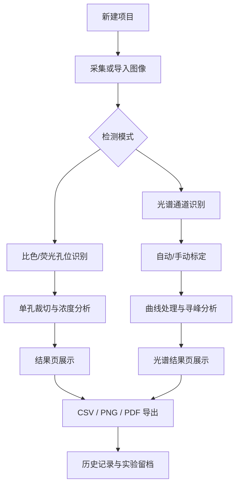

# FluoColor

FluoColor 是一款基于 Android 与 Jetpack Compose 构建的生化检测应用，面向 **比色检测、荧光检测、光谱检测** 三类场景，覆盖从图像采集、图像校正、自动识别、浓度分析、结果展示到报告导出的完整流程。

## 1. 项目定位

本项目的目标不是只给出一个“检测数值”，而是提供一条更完整的实验分析链路：

- 支持手机端完成采集、识别、分析和导出
- 支持 96 孔板比色/荧光检测
- 支持多通道光谱采集、标定、寻峰与报告导出
- 支持结果留档、历史回看和实验复核
- 持续增强结果的可解释性与可追溯性

## 2. 核心能力

### 2.1 比色检测

- 基于孔位识别结果进行单孔裁切与浓度分析
- 支持深度学习模型预测与标准曲线拟合两类分析方式
- 支持热力图、数值图、浓度趋势图、验证分析展示
- 结果页支持项目实拍图缩略图、分析方案和结果导出

### 2.2 荧光检测

- 与比色模式共用孔位识别链路，但在推理预处理和默认特征上已开始分流
- 支持暗背景抑制、亮信号增强等模式化预处理
- 支持结果展示、验证分析与导出
- 正在持续增强与比色模式的专业差异化

### 2.3 光谱检测

- 支持 1 到 10 通道光谱采集与展示
- 支持自动标定与手动标定
- 支持标定质量诊断、标定对照、残差明细
- 支持原始曲线、经典曲线、基线对照、增强分析四种视图
- 支持多峰检测、峰面积、半高宽、信噪比等指标
- 支持 CSV、PNG、PDF 导出以及多通道叠加对比

## 3. 三种检测模式差异

| 模式 | 目标对象 | 主要输入 | 主要输出 | 当前重点 |
| --- | --- | --- | --- | --- |
| 比色检测 | 颜色变化 | 孔位图像 | 浓度、热力图、趋势图 | 白平衡与颜色特征 |
| 荧光检测 | 发光强度 | 暗背景孔位图像 | 浓度、热力图、趋势图 | 信号增强与背景抑制 |
| 光谱检测 | 连续光谱信号 | 宽带光谱图像 | 波长-强度曲线、峰值指标 | 标定、寻峰与多视图分析 |

## 4. 核心流程



## 5. 项目结构

```text
app/
├─ src/main/java/com/muc/fluocolorquant
│  ├─ data                 Room 实体、DAO、仓库、枚举
│  ├─ di                   Hilt 注入模块
│  ├─ ui
│  │  ├─ components        通用 Compose 组件、图表、表格
│  │  ├─ navigation        路由与页面导航
│  │  ├─ screens           各业务页面
│  │  ├─ theme             主题、颜色、字体
│  │  └─ viewmodels        MVVM 状态与业务逻辑
│  └─ utils                数学、图像、Locale、动画、相机工具
├─ src/main/res            字符串、图标、主题资源
├─ src/main/assets/models  检测与浓度模型
├─ src/test/java           单元测试
└─ src/androidTest/java    仪表测试
```

## 6. 关键页面说明

### 6.1 新建项目页

- 配置项目名称、检测模式、分析方法、分析物
- 支持比色、荧光、光谱三种模式入口
- 光谱模式会进入专用采集、标定与结果链路

### 6.2 相机拍摄页

- 基于 CameraX 构建实时预览
- 支持固定拍摄参数、双指缩放、点击对焦
- 支持实验采集参数调节与元数据写入
- 光谱模式支持拍摄后即时质量检查

### 6.3 比色/荧光结果页

- 顶部项目概览卡片展示检测模式、分析方法、分析物、创建时间、浓度单位
- 支持实拍图缩略图、放大预览
- 支持结果可追溯卡片，回看采集、推理阈值与相机运行参数
- 支持分析方案卡片，集中展示分析方法、模板、曲线模型、像素特征、可靠范围与试剂信息
- 结果展示区已统一为分段按钮切换，支持热力图、数值图、浓度趋势图与标准曲线视图说明
- 导出入口统一收敛到顶部工具栏，避免与页面内容区产生重复操作入口
- 支持分析方案、结果展示、验证分析与多格式导出

### 6.4 光谱标定页

- 支持上传标定图并输入参考波长
- 支持自动标定和手动标定
- 支持标定进度总览、质量评分、失败原因提示

### 6.5 光谱结果页

- 支持多视图曲线切换
- 支持标定对照、残差明细、峰值结果
- 支持多通道叠加对比和快速调参

## 7. 模型与数据

### 7.1 模型文件

模型位于 `app/src/main/assets/models`，当前主要包括：

- `best_lite.ptl`
- `improved_concentration_model_lite.ptl`

项目已预留“按检测模式路由专用浓度模型”的结构：

- 荧光模式优先寻找专用浓度模型
- 比色模式优先寻找专用浓度模型
- 若专用模型不存在，则自动回退到通用模型

### 7.2 数据存储

核心持久化对象包括：

- `Project`
- `DetectionRun`
- `WellResult`
- `SpectrumCalibration`
- `SpectrumResult`
- `CurveModel`
- `ExperimentTemplate`

## 8. 导出与报告

### 8.1 标准检测导出

- CSV：孔位与浓度结果
- PNG：图表导出
- PDF：项目报告
- ZIP：科研归档包，包含 PDF、CSV、结果截图、原图、裁切图、元数据 JSON

### 8.2 光谱导出

- CSV：波长-强度数据
- PNG：单通道或合并曲线图
- PDF：封面、摘要页、单通道详情页

## 9. 结果可追溯能力

当前版本已增强从采集到结果的可追溯链路：

- 相机拍摄参数会写入图像旁路 JSON 元数据
- 结果页可查看采集、推理、处理参数摘要
- 标准检测导出的 CSV 头部会写入关键追溯信息
- 标准检测支持科研归档 ZIP 导出
- 光谱结果页支持标定对照、质量评分与残差回看

## 10. 构建与测试

### 10.1 常用命令

```powershell
.\gradlew.bat clean assembleDebug
.\gradlew.bat installDebug
.\gradlew.bat test
.\gradlew.bat connectedAndroidTest
.\gradlew.bat lint
```

### 10.2 当前建议

- 日常逻辑改动至少执行 `test`
- UI、权限、导出相关改动建议执行 `:app:compileDebugKotlin` 与 `testDebugUnitTest`
- 有设备或模拟器时再执行 `connectedAndroidTest`

## 11. 当前优化方向

接下来优先建议继续推进：

1. 补齐比色/荧光主链路的单元测试与 UI 测试
2. 进一步拉开比色与荧光的专业处理差异
3. 持续清理遗留技术债与编译警告
4. 加强实验模板、批量处理与历史趋势分析
5. 继续增强科研级留档与复现能力

## 12. 技术栈

- Kotlin
- Jetpack Compose Material 3
- MVVM
- Room
- Hilt
- PyTorch Mobile
- OpenCV

---

如需补充答辩截图、流程图或 PPT 文案，建议在此 README 基础上继续整理 `docs/` 目录，而不是把展示材料直接堆进源码目录。
