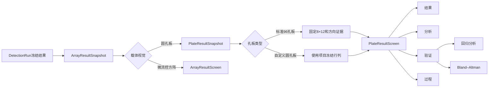

# 2026-07-25 圆孔板结果、预测验证与科研导出优化计划

## 一、计划目的

本计划用于修复新建项目、现场标定和96孔板结果页的近期交互回归，并在不破坏现代冻结快照的前提下，恢复旧结果页中有科研价值的预测精度验证、Bland–Altman分析和PNG/CSV/PDF导出能力。

本轮坚持以下原则：

1. 保留 `DetectionRun + CaptureArtifact + SiteMeasurement` 现代运行快照，不回退到旧 `WellResult` 生产链。
2. 标准96孔板继续保持行业标准8行×12列；12行×8列只代表拍摄方向，由定位阶段旋转校正。
3. 自定义4×4、6×8等圆孔板严格使用项目创建时冻结的行列，不自动交换。
4. 圆孔板与微流控结果页保持独立，但共享验证数学、格式化与导出基础设施。
5. 所有新增UI使用Jetpack Compose和Material 3；全部中英文文本进入字符串资源。
6. 视觉采用克制的科研仪器风格：紧凑、清晰、低干扰，使用图标强化识别，不堆叠说明文字。
7. 旧历史只读兼容，不重新定位、不重新拟合、不改变历史浓度结果。

---

## 二、已确认问题与根因

### 2.1 浓度单位显示为省略号

最大浓度和单位使用两个等权列，而单位字段复用了带40dp图标、较大边距和展开箭头的完整资源选择组件，导致半屏空间内文本宽度不足。

修复方向：

- 为 `ScientificSelectionField` 增加紧凑密度规格；
- 单位字段使用32dp图标、较小边距和20dp箭头；
- 最大浓度与单位宽度采用约48%/52%；
- 320～360dp窄屏自动进一步压缩装饰空间；
- 验证 `g/ml`、`ng/mL`、`μg/mL`、`μmol/L` 及英文界面。

### 2.2 现场标定函数和指标拥挤

所有函数在普通 `Row` 中使用 `weight(1f)`，七种默认函数被强制压进一行。R²、RMSE、MAE和标准点反算通过率也被强制放入四个窄卡片。

修复方向：

- 函数候选改为固定宽度的横向 `LazyRow`；
- 自动滚动到推荐或当前选择项；
- 首屏只显示R²、RMSE、MAE三项；
- 大数使用科学计数法；
- 当前信号名称和 `a.u.` 量纲保持可见；
- 反算通过率继续参与后台推荐，移入拟合详情，不占首屏。

### 2.3 新96孔板结果页能力不足

现代 `Plate96ResultScreen` 没有接入旧结果页已有的预测验证、Bland–Altman和PNG导出。同时，当前孔板分析中的行列统计仍写死为8×12，不能成为自定义圆孔板的通用结果页。

修复方向：

- 保留新版冻结快照和圆形热力图；
- 恢复旧版有价值的标准曲线、趋势、验证和导出能力；
- 将孔板结果领域逐步抽象为动态行列圆孔板；
- 微流控继续使用独立方形结果页。

---

## 三、最终结果架构



首期允许 `Plate96ResultScreen` 作为兼容包装层调用新的通用圆孔板组件，避免一次性修改全部路由和测试；领域对象稳定后再完成命名收敛。

---

## 四、圆孔板结果页设计

### 4.1 公共顶部

- 顶部应用栏：项目名称、圆孔板规格摘要、导出图标；
- 移除占用大量空间的彩色Hero卡；
- 使用紧凑元数据条显示规格、分析物数和已测孔数；
- 多分析物使用横向短标签，支持自动滚动；
- 一级页面固定为：结果、分析、验证、过程。

### 4.2 结果页

- 圆形浓度热力图/数值图切换；
- 动态行列标签；
- 项目量程色带；
- 曲线外推、低于量程、高于量程使用低干扰微标记；
- 已计算、曲线范围内、曲线外推、项目量程外统计；
- 点击孔位查看样本、浓度、信号、量程和定位摘要。

标签由可用宽度与孔径动态计算，A10～A12和双位数列号不得换行、截断或覆盖。

### 4.3 分析页

- 标准曲线与标准点；
- 浓度趋势；
- 重复孔均值和CV；
- 行方向/列方向分布；
- 边缘孔与内部孔对比；
- 标准品、空白和质控品统计；
- 唯一一处样本浓度表。

所有统计必须读取快照中的动态 `rows` 和 `columns`，不得继续写死8和12。

### 4.4 验证页

用户为样本孔输入参考浓度后，生成：

- 预测值与参考值回归图；
- R²、斜率、截距、RMSE、MAE；
- Bland–Altman散点图；
- 平均偏差；
- 95%一致性上下限；
- 一致性限内比例；
- 有效点数。

参考浓度录入行显示孔号、真实裁切缩略图、预测浓度、参考浓度输入和单位。验证属于运行后的派生分析，不修改冻结检测结果。

### 4.5 过程页

- 原图；
- EXIF和方向处理；
- 标准方向图；
- YOLO候选；
- 霍夫圆候选；
- 圆阵晶格；
- 原图定位投影；
- 圆孔裁切拼贴；
- 信号和定量证据。

旧历史缺少的步骤按实际隐藏，不重新运行算法补造证据。

---

## 五、验证数据模型

新增独立、追加式验证记录，不修改 `DetectionRun` 和 `SiteMeasurement`：

```text
ResultValidationRecord
- validationId
- runId
- analyteId
- revision
- concentrationUnit
- validationPointsJson
- regressionResultJson
- blandAltmanResultJson
- processorVersion
- inputFingerprint
- createdAt
```

设计规则：

- 用户修改参考浓度后创建新修订；
- 历史默认显示最新修订；
- 导出记录验证处理器版本和输入指纹；
- 旧 `WellResult.trueConcentration` 只读映射为验证参考值；
- 旧标准孔只有角色确实为标准品时，才映射为标准浓度；
- Room数据库由13升级到14，并提供迁移和数据库测试。

---

## 六、科研导出升级

现代结果页统一支持：

1. CSV：逐位点测量、信号、浓度、角色、量程和质量状态；
2. PNG：首期导出当前分析物的固定分辨率无损热力图；回归和Bland–Altman随PDF与ZIP验证JSON保存；
3. PDF：项目、分析物、图表、验证、样本表和追溯证据；
4. ZIP：CSV、PDF、全部PNG、验证JSON、原图、过程图、裁切图和manifest。

PNG必须由冻结数据离屏绘制，不能使用手机整页截图。圆孔板和微流控分别注入圆孔/方格绘制策略，但共享文件保存、命名、SHA-256和manifest逻辑。

---

## 七、实施阶段

### P0 安全基线

- [x] 审计当前工作区；
- [x] 排除个人PPT、设计输出、临时文件和本地配置；
- [x] 提交统一信号与拟合候选基线；
- [x] 基线提交：`65ee4d4 feat(calibration): unify signal features and fitting candidates`。

### P1 立即可见的UI修复

- [x] 修复浓度单位省略；
- [x] 函数候选改为横向滑动；
- [x] 拟合指标收敛为R²、RMSE、MAE；
- [x] 大数科学计数法和信号量纲；
- [x] 中英文、小屏Compose测试。

### P2 圆孔板结果页视觉升级

- [x] 移除大Hero卡，增加紧凑图标摘要；
- [x] 一级页面升级为结果/分析/验证/过程；
- [x] 分析物标签横向滑动；
- [x] 动态圆孔和行列标签；
- [x] 动态行列/边缘统计；
- [x] 样本表视觉升级。

### P3 验证与Bland–Altman

- [x] 抽取纯领域 `ResultValidationEngine`；
- [x] 新增验证记录实体、DAO、仓库和Room 13→14迁移；
- [x] 新增参考浓度录入和验证结果UI；
- [x] 旧96孔板验证参考值只读兼容；
- [x] 数学金标准和历史重开测试。

### P4 导出升级

- [x] 增加PNG格式；
- [x] 实现固定分辨率离屏图表渲染；
- [x] PDF加入验证和完整图表；
- [x] ZIP加入PNG和验证JSON；
- [x] 孔板与微流控分别验证视觉策略。

### P5 收尾与验收

- [x] 更新README；
- [x] 中英文字符串一一对应；
- [x] 全量JVM测试；
- [x] Android测试编译；
- [x] 360dp、英文、深色模式ADB截图自审；
- [x] 4×4、6×8、8×12和15×15结果/导出回归；
- [x] 历史结果重开不漂移。

---

## 八、最终验收标准

1. 常用浓度单位完整显示，无省略号。
2. 七个及更多函数可横向滑动，推荐项自动可见。
3. R²、RMSE、MAE无截断，原始大误差使用科学计数法。
4. 标准96孔板始终为8×12；自定义孔板严格使用项目声明行列。
5. 圆孔板所有位点视觉均为圆形，双位数标签完整。
6. 回归与Bland–Altman保存后，重启和历史重开仍存在。
7. CSV、PNG、PDF和ZIP均可导出并能够重新打开。
8. 旧历史浓度、曲线和定位结果不重新计算、不漂移。
9. 首页、历史列表、关于页、主页Pager和底部导航不受本轮影响。

---

## 九、实施记录

- 安全基线提交：`65ee4d4 feat(calibration): unify signal features and fitting candidates`。
- 数据库：Room 13→14，新增追加式验证修订表；冻结检测结果保持不可变。
- 视觉：验证页和导出面板均使用Material 3主题色及语义图标；英文一级标签压缩为 `Validate`，
  回归图固定为X轴参考浓度、Y轴预测浓度，外层卡片与图内不再重复标题。
- 导出：CSV/PNG/PDF/ZIP四入口直接完整展开；小屏和大字体使用滚动兜底。
- ADB自审：`emulator-5554`、API 35、1080×2400、density 480；已检查英文亮色验证页、
  英文亮色导出面板和英文深色验证页。
- 自动化：全量JVM共68个测试套件、347项、0失败、0跳过；设备专项覆盖Room迁移、验证修订、
  历史恢复、结果页及四格式导出，4×4、6×8、8×12圆孔和15×15方格PNG均可生成并解码。
