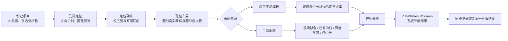
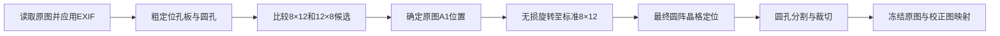

# 2026-07-25 96孔板现代化升级完整计划

## 一、计划目的

本计划用于指导旧96孔板检测流程升级。升级目标不是再复制一套与微流控相似的新代码，而是：

1. 复用当前微流控已经稳定的阵列定位会话、孔位布局、多分析物、实验模板、现场拟合和运行快照思想。
2. 为96孔板保留独立的圆孔定位、方向校正、圆形交互和独立结果页。
3. 彻底解决竖向12行×8列照片在孔位编号、布局、裁切、浓度结果和历史恢复中的错位问题。
4. 新96孔板运行停止写入旧 `WellResult` 生产链，改用可追溯的 `DetectionRun + CaptureArtifact + SiteMeasurement`。
5. 旧历史只读兼容，不重新定位、不重新拟合、不改变历史科研结果。
6. 不修改首页、历史列表、关于页、主页 Pager、底部导航和现有动画。

本计划是后续实现的主依据。实施过程中所有完成项、验证结果、ADB截图和临时偏差继续追加在本文“实施记录”部分。

---

## 二、已经确认的最终产品决策

### 2.1 96孔板标准方向固定为8行×12列

- 96孔板的行业标准科学坐标始终是8行×12列。
- 标准孔号始终是 `A1` 到 `H12`。
- 用户上传12行×8列照片只表示拍摄方向不同，不能修改项目、模板或结果的标准行列。
- 校正图、孔位布局、虚拟布局板、浓度热力图、数值图、PDF和历史结果统一显示为标准8×12。
- 原图仍保留用户拍摄方向，并通过冻结坐标矩阵与标准校正图一一对应。

### 2.2 只有96孔板自动判断8×12或12×8

- 用户选择“96孔板”时不需要输入行列，系统固定使用8×12。
- 96孔板定位阶段自动比较8×12和12×8候选，必要时自动旋转90°。
- 自定义孔板和自定义微流控载体严格使用用户在新建项目时声明的行列，不自动交换行列。
- 自定义载体若图片方向不符，只提供用户主动“旋转图片”，程序不能擅自更改其标准规格。

### 2.3 结果页不共用

96孔板和微流控具有不同的载体视觉、分析重点和科研表达，因此结果页面分别实现：

```text
Plate96ResultScreen          96孔板专用结果页
ArrayResultScreen            当前微流控结果页，首期保持不动
```

两者可以共用：

- 运行快照和逐位点测量数据；
- 分析物、浓度、单位和模型快照；
- 标准曲线图表基础组件；
- 导出基础设施；
- 通用格式化和状态解释函数。

但不共用：

- 页面布局；
- 热力图绘制；
- 载体总览；
- 位点详情表现；
- 板内分布分析；
- 过程页的载体专用步骤。

### 2.4 96孔板所有位点视觉均使用圆孔

圆孔语义必须贯穿整个用户流程：

- 定位轮廓为圆形；
- 手动调整框为圆形；
- 真实裁切预览为圆形；
- 虚拟布局板孔位为圆形；
- 结果热力图使用圆形孔位；
- 数值图使用圆形浓度底色；
- 选中状态使用圆形外环；
- 特殊状态使用低干扰的圆环、短弧或微型标记，不覆盖浓度颜色。

---

## 三、最终用户流程



### 3.1 导航原则

- 首页新建项目入口保持不变。
- 用户选择96孔板后进入新的统一孔板定位入口，不再进入旧 `LegacyWellDetectionScreen`。
- 定位完成后进入新版布局页面，不再经过旧 `CurveFittingScreen` 生产链。
- 新96孔板运行进入 `Plate96ResultScreen`。
- 历史中的新96孔板运行仍进入 `Plate96ResultScreen`。
- 旧96孔板运行经只读适配后也尽量进入 `Plate96ResultScreen`，缺失的过程证据按实际隐藏。

---

## 四、代码复用边界

### 4.1 应当复用的通用能力

建议建立以下通用阵列基础层：

```text
ArrayDetectionCoordinator
ArrayLocator
ArrayLocalizationSession
ArrayOrientationSnapshot
ArrayImageTransformSnapshot
ArraySiteGeometry
ArrayLayoutDraft
ArrayCalibrationEngine
ArrayQuantitationSnapshot
ArrayDetectionPersistenceBundle
```

这些对象不包含“孔板一定是圆形”或“微流控一定是方形”的UI假设。

### 4.2 96孔板专用能力

```text
plate96/
├── Plate96Locator
├── Plate96OrientationResolver
├── Plate96LatticeFitter
├── Plate96CircleSegmenter
├── Plate96LocalizationScreen
├── Plate96SiteVisualStyle
├── Plate96ResultScreen
├── Plate96Heatmap
├── Plate96WellDetailSheet
├── Plate96AnalysisContent
└── Plate96ProcessingContent
```

### 4.3 微流控专用能力

当前已经工作的微流控结果页首期不重写：

```text
grid/
├── PgGridLocator
├── 方块紧致分割
└── 当前ArrayResultScreen及其组件
```

后续若需要整理命名，可以将当前 `ArrayResultScreen` 改名为 `MicrofluidicResultScreen`，但这不是96孔板升级的前置条件，不能为了改名扩大本轮风险。

### 4.4 视觉策略复用

布局和定位页面通过视觉策略切换圆孔/方块，不复制整套交互：

```kotlin
data class ArraySiteVisualStyle(
    val siteShape: SiteShape,
    val clipShape: Shape,
    val selectionShape: Shape,
    val overlayStyle: ArrayOverlayStyle,
    val layoutCellStyle: ArrayLayoutCellStyle
)
```

96孔板传入 `CircleShape`，微流控传入圆角方形。

---

## 五、96孔板方向识别与图像校正

### 5.1 处理顺序

不能在完整定位和编号结束后只旋转UI图片。正确顺序为：



### 5.2 粗定位证据

方向裁决综合使用：

- YOLO检测框；
- 霍夫圆候选；
- 行列聚类数量；
- 96孔覆盖率；
- 行列间距变异系数；
- 晶格拟合残差；
- 孔板区域长宽比；
- YOLO与霍夫圆的相互支撑率。

### 5.3 候选规则

```text
8×12候选显著更优：保持方向
12×8候选显著更优：旋转90°
两者接近：显示推荐方向并允许用户确认
```

方向不确定不能直接判定图片不可用，只进入定位确认状态。

### 5.4 A1位置

对称圆阵无法单独证明A1在哪个角。A1方向优先来自：

1. 载体方向标记；
2. 可识别的缺角、文字或标志；
3. 用户确认；
4. 无证据时使用默认假设并标记来源。

用户只看到“A1位置：原图左上/右上/左下/右下”，不接触矩阵或JSON。

### 5.5 无损旋转与定量像素

- 90°整数旋转使用无插值的转置/翻转实现。
- 原始文件不修改、不重新保存为JPEG。
- 若使用透视矫正图辅助定位，必须保存正逆变换。
- 定量优先使用原始或仅做无损90°旋转的像素区域，避免透视插值悄然改变颜色和荧光信号。
- 如某处理器必须消费矫正图，必须冻结插值方法、处理器版本和输入校验和。

---

## 六、方向与坐标数据契约

### 6.1 运行方向快照

```kotlin
data class ArrayOrientationSnapshot(
    val schemaVersion: Int,
    val canonicalRows: Int = 8,
    val canonicalColumns: Int = 12,
    val sourceRows: Int,
    val sourceColumns: Int,
    val rotationDegrees: Int,
    val mirrored: Boolean,
    val a1Corner: String,
    val source: OrientationSource,
    val confidence: Double?
)
```

### 6.2 图像变换快照

```kotlin
data class ArrayImageTransformSnapshot(
    val originalWidth: Int,
    val originalHeight: Int,
    val normalizedWidth: Int,
    val normalizedHeight: Int,
    val originalToNormalizedMatrix: List<Double>,
    val normalizedToOriginalMatrix: List<Double>,
    val processorVersion: String
)
```

### 6.3 单孔几何

```kotlin
data class ArraySiteGeometry(
    val siteIndex: Int,
    val siteKey: String,
    val displayLabel: String,
    val canonicalRowIndex: Int,
    val canonicalColumnIndex: Int,
    val normalizedCenter: Point,
    val normalizedRegion: Region,
    val originalCenter: Point,
    val originalRegion: Region,
    val confidence: Double,
    val source: LocalizationSource
)
```

96孔板的稳定索引始终为：

```text
siteIndex = canonicalRowIndex × 12 + canonicalColumnIndex
```

项目、模板和 `SiteMeasurement` 都使用该标准索引，拍摄方向不能改变它。

---

## 七、圆孔定位、分割与裁切

### 7.1 定位器

建议将旧YOLO和霍夫圆逻辑封装为 `Plate96Locator`，并通过通用 `ArrayLocator` 接口输出结果。

自动算法：

```text
YOLO候选
+ 霍夫圆候选
+ 圆阵晶格拟合
+ 方向候选评分
+ 完整96孔位置生成
```

普通用户可选择：

- 自动检测；
- 目标检测；
- 圆孔检测。

页面不显示IoU、NMS、阈值或内部模型文件名。

### 7.2 圆孔分割

```text
ArrayUnitSegmenter
├── Plate96CircleSegmenter
└── MicrofluidicRectangleSegmenter
```

圆孔输出：

- 圆心；
- 半径；
- 紧致外接框；
- 圆形前景掩膜；
- 局部背景环；
- 原图区域；
- 校正图区域；
- 分割来源；
- 兜底原因。

信号提取只消费圆形前景掩膜，不得把承载Bitmap四角的背景计算进去。

### 7.3 定位兜底

依次使用：

1. YOLO框内圆形分割；
2. 霍夫圆；
3. 邻近成功圆孔的中位半径；
4. 晶格点居中的预测圆。

完整晶格已经形成时，少量兜底圆孔只作为处理证据，不直接让整帧失败或要求重拍。

---

## 八、孔阵定位页面设计

### 8.1 页面风格

页面结构向当前微流控定位页面靠齐，视觉采用克制、精确的科研仪器风格：

- Material 3；
- 使用现有主题色；
- 低饱和表面和细边框；
- 不堆积说明文字；
- 不使用大面积警告卡；
- 只在真正无法形成晶格时阻止继续。

### 8.2 页面结构

```text
顶部导航
步骤进度：1定位 → 2布局 → 3定量
方向状态卡
图像预览
校正图/原图切换
显示控制
算法选择
定位摘要
确认定位并配置孔位
```

### 8.3 方向状态卡

示例：

```text
已校正为 8 × 12
原图方向：12 × 8
A1位置：原图左下
```

操作：

- 调整方向；
- 恢复自动。

### 8.4 校正图与原图联动

使用分段控件：

```text
校正图 ｜ 原图
```

校正图：

- 固定8×12；
- 显示圆形轮廓；
- 显示A1～H12；
- 支持缩放和手动微调。

原图：

- 保持用户拍摄方向；
- 竖向照片仍显示为12×8视觉排列；
- 通过逆矩阵投影圆孔；
- 标签继续使用A1～H12。

点击校正图C7后，原图C7同步高亮并居中；点击原图孔位时，校正图同步选中。

### 8.5 显示控制

只保留：

- 孔位轮廓；
- 孔位编号；
- 手动微调。

### 8.6 手动微调

点击圆孔后打开底部面板：

```text
C7
圆孔裁切预览
调整中心
调整半径
恢复自动
完成
```

调整校正图时，原图投影同步更新。

---

## 九、孔位布局页面设计

### 9.1 共用页面骨架

复用当前微流控的：

- 分析物下拉；
- 角色工具板；
- 多笔连续画笔；
- 已分配孔位保护；
- 清除画笔；
- 实验模板；
- 每分析物定量方式；
- 配置进度。

通过 `Plate96SiteVisualStyle` 将位点改为圆形，不复制业务状态机。

### 9.2 真实孔位预览

- 始终标准8×12；
- 96张真实圆孔裁切；
- 每个裁切显示A1～H12；
- 圆形图像、圆形选择环；
- 点击可放大；
- 与虚拟布局孔位同步。

### 9.3 A10～A12截断修复

标签统一使用：

```kotlin
maxLines = 1
softWrap = false
overflow = TextOverflow.Clip
```

视觉规则：

- 6～8sp自适应字号；
- 2dp水平内边距；
- 左上角低透明度背景；
- 角色缩写与坐标不重叠；
- A10、A11、A12和H12必须完整显示；
- 96孔板12列在常见手机宽度内完整展示，不启用横向拖动。

### 9.4 圆形虚拟布局板

- 左侧A～H；
- 顶部1～12；
- 孔位为圆形；
- 分析物颜色填充圆孔；
- 角色使用简短图标或缩写；
- 选中使用细圆环。

交互必须保证：

- 支持多笔连续绘制；
- 第二笔不清空第一笔；
- 切换分析物不覆盖其他分析物；
- 必须先使用清除工具释放孔位；
- 页面重组或旋转不丢布局；
- 真实预览与虚拟板同步高亮。

---

## 十、实验模板与定量配置

96孔板复用当前微流控的完整定量配置工作台：

```text
应用实验模板
手动配置
```

每个分析物选择：

- 现场拟合；
- 已有曲线；
- 深度学习；
- 仅信号。

模板始终保存标准A1～H12布局，不保存照片方向。横拍和竖拍使用同一模板。

现场拟合共用：

```text
ArrayCalibrationEngine
CalibrationCandidateRanker
CalibrationApplicationService
```

禁止继续使用旧96孔板自己的拟合排序和最终重新拟合逻辑。

所有分析物完成后显示：

- 保存为实验模板；
- 开始分析；
- 返回复核。

---

## 十一、96孔板独立结果页

### 11.1 页面对象

新增：

```text
Plate96ResultScreen
Plate96ResultViewModel
Plate96ResultSnapshotMapper
Plate96Heatmap
Plate96WellDetailSheet
Plate96AnalysisContent
Plate96ProcessingContent
```

当前微流控 `ArrayResultScreen` 保持独立，不要求其渲染圆孔或孔板专用分析。

### 11.2 一级标签

建议96孔板结果页使用：

```text
结果
孔板分析
过程
```

不增加一级“质控”页。必要审计证据放入单孔详情、过程页和导出文件。

### 11.3 结果页

默认展示96孔板形态的圆孔浓度图：

- 标准8×12；
- 左侧A～H；
- 顶部1～12；
- 圆形孔位填充浓度颜色；
- 支持浓度热力图/数值图切换；
- 多分析物标签切换；
- 单位、色带和项目量程随分析物切换；
- 点击圆孔打开单孔详情。

特殊状态不得改变主浓度色：

- 曲线外推：低透明度短弧；
- 低于量程：轻量向下微标记；
- 高于量程：轻量向上微标记；
- 建议复核：极细中性外环；
- 真正无法计算：浅灰圆孔。

### 11.4 孔板分析页

体现96孔板特点，而不是复制微流控分析页：

- 标准曲线与样本投影；
- 样本浓度表；
- 重复孔分布与CV；
- 行方向浓度分布；
- 列方向浓度分布；
- 边缘孔与内部孔分布对比；
- 标准品、空白、质控品分组统计。

“边缘效应”只作为统计观察，不在没有足够证据时显示恐吓式质量结论。

样本浓度表只在“孔板分析”显示，不与“结果”重复。

### 11.5 过程页

96孔板专用过程顺序：

1. 上传原图；
2. EXIF方向处理；
3. 8×12/12×8方向判断；
4. 标准8×12校正图；
5. YOLO候选；
6. 霍夫圆候选；
7. 圆阵晶格定位；
8. 原图定位投影；
9. 96孔裁切拼贴；
10. 信号提取与浓度计算。

用户点击过程中的孔位时，可以查看原图位置、校正图位置、圆孔裁切、信号和浓度。

### 11.6 返回行为

- 从新完成运行进入结果页时，左上角返回首页。
- 从历史进入结果页时，也维持项目既定的结果返回策略，不额外修改历史列表UI。
- 页面恢复只读取运行快照，不重新定位或计算。

---

## 十二、结果数据层的复用方式

结果页分开不意味着复制科学数据。

建议底层继续共享：

```text
DetectionRun
CaptureArtifact
SiteMeasurement
AnalyteQuantitationSnapshot
CalibrationSnapshot
ArrayMeasurementQuality
```

再分别映射为UI领域对象：

```text
通用运行证据
├── Plate96ResultSnapshot      → Plate96ResultScreen
└── ArrayResultSnapshot        → 微流控ArrayResultScreen
```

这样既能保证历史科研数据一致，又允许两个结果页面完全不同。

---

## 十三、状态机与异步安全

建议建立：

```kotlin
sealed interface Plate96DetectionState {
    data object LoadingImage
    data class ReviewingOrientation(...)
    data class Localizing(...)
    data class ReviewingLocalization(...)
    data class EditingLayout(...)
    data class ConfiguringQuantitation(...)
    data class Analyzing(...)
    data class Completed(...)
    data class Failed(...)
}
```

方向变化必须：

- 更新输入指纹；
- 取消旧定位任务；
- 清除旧裁切缓存；
- 重建正逆矩阵；
- 重建定位会话；
- 防止旧协程覆盖新状态。

布局以标准孔号为主键，不以屏幕位置或旧检测框顺序为主键。

---

## 十四、运行保存与过程证据

新96孔板运行保存：

```text
DetectionRun
CaptureArtifact
SiteMeasurement
方向快照
坐标变换快照
布局快照
曲线/模型运行快照
```

建议的附件角色：

```text
ENDPOINT_ORIGINAL
ORIENTATION_NORMALIZED
YOLO_OVERLAY
HOUGH_CIRCLE_OVERLAY
FINAL_LOCALIZATION_OVERLAY
ORIGINAL_PROJECTION_OVERLAY
CROP_CONTACT_SHEET
```

新96孔板运行停止写入旧 `WellResult`。

历史结果只读取冻结数据，不重新执行：

- 图片方向判断；
- 圆孔定位；
- 曲线拟合；
- 浓度计算。

---

## 十五、旧项目与旧历史兼容

新增只读：

```text
LegacyPlateRunAdapter
```

负责：

```text
旧DetectionRun + WellResult
→ Plate96ResultSnapshot
→ Plate96ResultScreen
```

兼容原则：

- 按旧版本当时的8×12语义显示；
- 不重新判断历史图片方向；
- 不重新裁切；
- 不重新拟合；
- 不重新生成浓度；
- 缺少新过程证据时如实隐藏对应步骤；
- 旧表和DAO暂时只读保留。

---

## 十六、文件级改造清单

### 16.1 建议新增

```text
domain/detection/array/ArrayLocator.kt
domain/detection/array/ArrayLocalizationContracts.kt
domain/detection/array/ArrayCoordinateTransformer.kt
domain/detection/plate96/Plate96Locator.kt
domain/detection/plate96/Plate96OrientationResolver.kt
domain/detection/plate96/Plate96CircleSegmenter.kt
domain/result/plate96/Plate96ResultContracts.kt
domain/result/plate96/Plate96ResultSnapshotMapper.kt
ui/screens/detection/plate96/Plate96LocalizationScreen.kt
ui/screens/result/plate96/Plate96ResultScreen.kt
ui/screens/result/plate96/Plate96Heatmap.kt
ui/screens/result/plate96/Plate96WellDetailSheet.kt
ui/screens/result/plate96/Plate96AnalysisContent.kt
ui/screens/result/plate96/Plate96ProcessingContent.kt
ui/viewmodels/Plate96DetectionViewModel.kt
ui/viewmodels/Plate96ResultViewModel.kt
```

### 16.2 建议通用化

- 从 `GridLayoutVisualComponents.kt` 抽取通用真实裁切、画笔层、分析物选择器和角色工具板。
- 从 `GridQuantitationComponents.kt` 抽取通用模板与定量配置工作台。
- 从 `GridDetectionCoordinator.kt` 抽取定位后公共编排、信号矩阵、定量和持久化部分。
- 当前微流控调用先通过兼容包装器接入，避免大爆炸式重命名。

### 16.3 最终停止使用

- `WellDetectionScreen` 中的旧96孔板生产分支；
- `LegacyWellDetectionScreen`；
- 旧96孔板 `CurveFittingScreen` 生产入口；
- `WellLayoutComponents.kt`；
- `WellLayoutViewModel` 的旧96孔板职责；
- `WellResultRepository` 新写入接口；
- `NewResultScreen` 的96孔板入口。

删除前必须先通过旧历史适配和无调用方检查。

---

## 十七、实施阶段与检查点

### P0 安全基线

- [ ] 审核当前未提交修改，禁止覆盖无关工作。
- [ ] 创建实施前Git安全提交。
- [ ] 记录当前96孔板横向和竖向实拍基线。
- [ ] 确认首页、历史、关于页视觉基线。

### P1 坐标与方向契约

- [ ] 实现方向快照和正逆坐标矩阵。
- [ ] 实现A1四角映射。
- [ ] 固定96个标准索引。
- [ ] 补齐0°、90°、180°、270°测试。

### P2 圆孔定位与裁切

- [ ] 封装YOLO候选。
- [ ] 封装霍夫圆候选。
- [ ] 实现8×12/12×8候选评分。
- [ ] 实现标准8×12最终晶格。
- [ ] 实现圆孔前景、背景环和兜底圆。
- [ ] 输出原图与校正图坐标。

### P3 定位页面

- [ ] 实现校正图/原图切换。
- [ ] 实现圆孔轮廓和标签。
- [ ] 实现A1位置确认。
- [ ] 实现中心/半径手动调整。
- [ ] 使用ADB截图自审。

### P4 布局与定量页面

- [ ] 接入圆形真实裁切预览。
- [ ] 接入圆形虚拟布局板。
- [ ] 修复A10～A12标签。
- [ ] 复用多笔画笔和孔位保护。
- [ ] 复用模板和每分析物定量配置。
- [ ] 使用ADB截图自审。

### P5 96孔板独立结果页

- [ ] 实现 `Plate96ResultScreen`。
- [ ] 实现圆形浓度热力图和数值图。
- [ ] 实现孔板分析页。
- [ ] 实现96孔板过程页。
- [ ] 实现单孔详情。
- [ ] 完成PDF、CSV和历史恢复。
- [ ] 保持微流控 `ArrayResultScreen` 行为不变。

### P6 新运行持久化

- [ ] 新96孔板写入 `SiteMeasurement`。
- [ ] 冻结方向、坐标、布局和定量快照。
- [ ] 停止写入旧 `WellResult`。
- [ ] 验证应用重启和历史重开。

### P7 旧历史适配与退役

- [ ] 实现 `LegacyPlateRunAdapter`。
- [ ] 验证旧运行不漂移。
- [ ] 删除旧生产导航入口。
- [ ] 清理无调用方旧UI和旧写入代码。
- [ ] 更新README和最终架构文档。

---

## 十八、自动化测试矩阵

### 18.1 坐标与方向

- [ ] 横向8×12。
- [ ] 竖向12×8顺时针。
- [ ] 竖向12×8逆时针。
- [ ] 180°。
- [ ] 四种A1角。
- [ ] 正向变换后逆向返回原坐标。
- [ ] 96个孔位映射唯一且完整。

### 18.2 实拍算法

同一张96孔板实拍图生成四个旋转版本，验证：

- [ ] 最终均为标准8×12。
- [ ] A1～H12对应同一物理孔位。
- [ ] 输出96个裁切。
- [ ] 原图与校正图点击联动正确。
- [ ] 旋转前后信号和浓度在预定容差内。
- [ ] 少量兜底圆孔不会整帧失败。

### 18.3 业务闭环

```text
竖向96孔板图片
→ 自动旋转
→ 定位确认
→ 多分析物布局
→ 现场拟合/已有曲线/深度学习
→ 保存实验模板
→ 开始分析
→ Plate96ResultScreen
→ 历史重新打开
```

### 18.4 UI与ADB

覆盖：

- [ ] 360dp、393dp、411dp宽度。
- [ ] 中文和英文。
- [ ] 默认字体和1.3倍字体。
- [ ] 横向原图和竖向原图。
- [ ] 真实圆孔裁切。
- [ ] 圆形虚拟布局。
- [ ] 圆形热力图和数值图。

验收：

- [ ] A10、A11、A12、H12不换行。
- [ ] 96孔全部显示。
- [ ] 圆孔不显示成方块。
- [ ] 多笔绘制不丢失。
- [ ] 不覆盖其他分析物。
- [ ] 历史重开方向一致。
- [ ] 微流控结果页无回退。
- [ ] 首页、历史列表、关于页、Pager和底栏无变化。

---

## 十九、性能与资源约束

- 定位完成后保留一次 `Plate96LocalizationSession`，布局和定量阶段不得重复运行YOLO或霍夫圆。
- Bitmap和OpenCV Mat必须按阶段释放，避免同时长期持有原图、校正图、全部中间图和96张大尺寸裁切。
- 页面缩略图使用受控尺寸缓存，单孔详情按需读取高分辨率裁切。
- 方向切换清理旧缓存并取消旧任务。
- 处理证据异步写入长期目录，失败时不能影响已完成的主要科学结果，但必须在运行快照中记录缺失原因。

---

## 二十、风险与回滚策略

### 20.1 A1方向不确定

对称圆阵无法保证自动识别A1。必须提供轻量确认入口，并冻结用户选择。

### 20.2 旧项目方向语义混乱

不能原地重写旧数据。旧运行由适配器按旧版本语义只读恢复。

### 20.3 通用化范围过大

先抽取明确复用的布局、定量和数据能力；现有微流控结果页保持不动。禁止为了命名统一同时重写两套结果页。

### 20.4 回滚

每个实施阶段建立独立Git检查点。若96孔板新入口出现问题，只回滚当前阶段，不回滚微流控和前序定量修复。

---

## 二十一、完成定义

只有满足以下条件，96孔板升级才算完成：

1. 新96孔板不再进入旧检测、布局、拟合和结果生产链。
2. 竖向12×8照片可自动校正为标准8×12。
3. 原图与校正图的任意孔位可以双向联动。
4. 真实预览、虚拟布局、模板和运行数据统一使用A1～H12。
5. 全流程圆孔视觉一致，不出现方形孔位假象。
6. 新96孔板运行使用 `SiteMeasurement` 和冻结快照。
7. 96孔板拥有独立 `Plate96ResultScreen`。
8. 微流控结果页未被强制改造或出现回退。
9. 旧96孔板历史仍能打开且结果不漂移。
10. 固定设备闭环、单元测试、数据库测试、导出测试和ADB截图验收全部通过。
11. 首页、历史列表、关于页、Pager和底部导航未修改。

---

## 二十二、实施记录

### 2026-07-25

- 已根据用户最终决策更新架构：96孔板与微流控不共用结果页面。
- 已确定仅共用科学数据、布局与定量基础能力，96孔板新增独立圆孔结果页。
- 已确定96孔板固定标准8×12，只有96孔板自动比较8×12/12×8；自定义载体严格使用用户声明行列。
- 已确定圆孔视觉覆盖定位、真实裁切、虚拟布局、热力图和数值图。
- 当前只完成计划文档，尚未开始修改生产代码。
